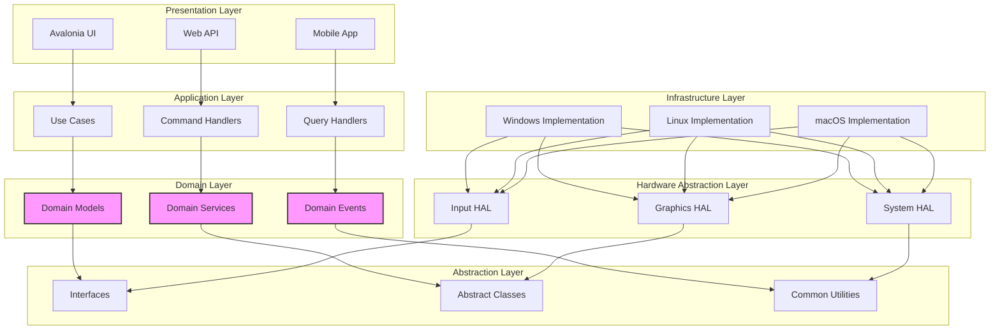
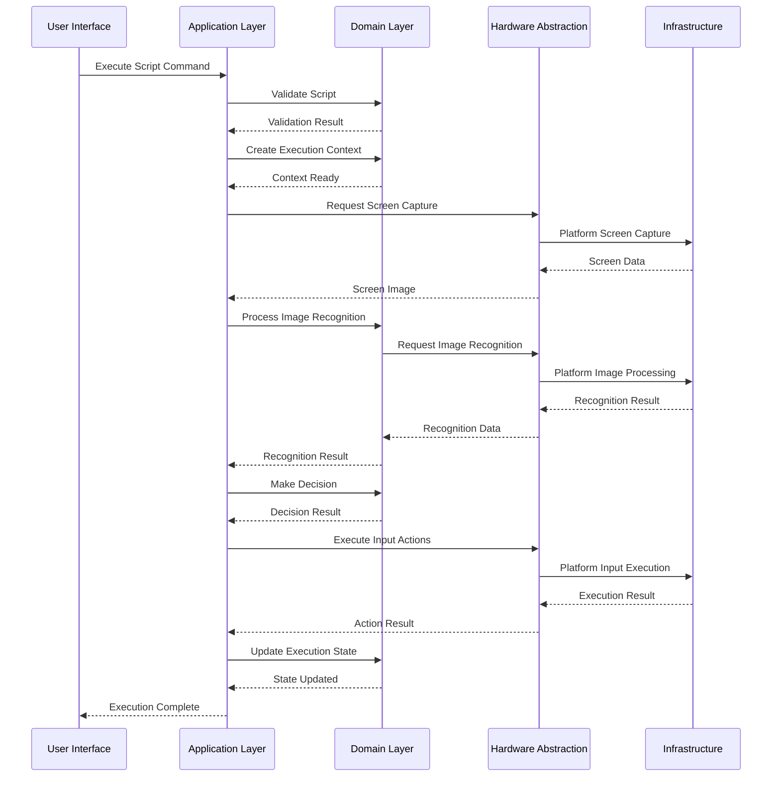
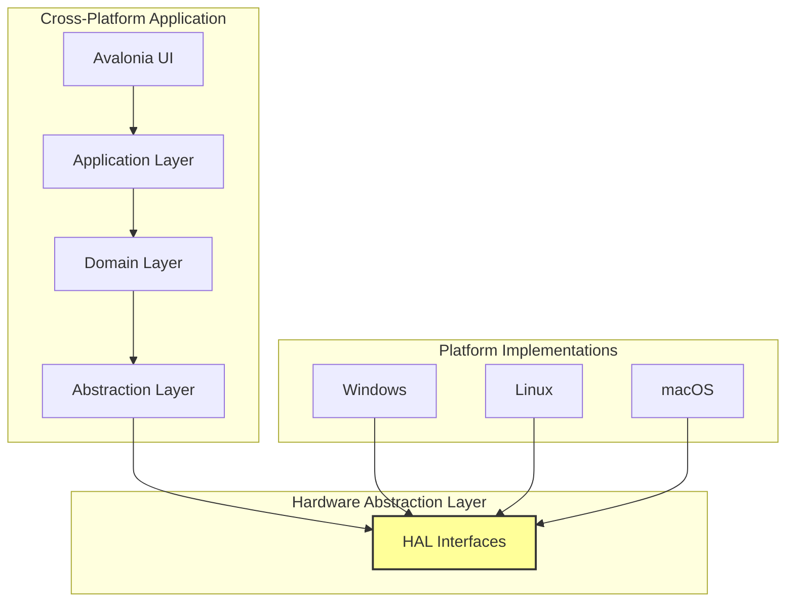

# KeyForge 系统架构优化设计

## 📋 执行摘要

基于对KeyForge项目的深入分析，本架构优化设计旨在解决当前架构问题，建立清晰的分层架构，支持跨平台部署，提高代码质量和可维护性。

## 🏗️ 新的分层架构设计

### 1.1 架构原则

- **单一职责原则**：每个组件都有明确的职责边界
- **依赖倒置原则**：高层模块不依赖低层模块，都依赖抽象
- **开闭原则**：对扩展开放，对修改关闭
- **接口隔离原则**：使用专门的接口而不是通用接口
- **跨平台兼容性**：所有设计考虑跨平台需求

### 1.2 优化后的分层结构

```
┌─────────────────────────────────────────────────────────────────┐
│                        表现层 (Presentation)                     │
│  ┌─────────────────┐  ┌─────────────────┐  ┌─────────────────┐   │
│  │   Avalonia UI    │  │   Web API       │  │   Mobile App    │   │
│  │   (Cross-Platform)│ │   (Optional)   │  │   (Optional)   │   │
│  └─────────────────┘  └─────────────────┘  └─────────────────┘   │
└─────────────────────────────────────────────────────────────────┘
                              │
                              ▼
┌─────────────────────────────────────────────────────────────────┐
│                        应用层 (Application)                     │
│  ┌─────────────────┐  ┌─────────────────┐  ┌─────────────────┐   │
│  │   Use Cases     │  │   Command       │  │   Query         │   │
│  │   Services      │  │   Handlers      │  │   Handlers      │   │
│  └─────────────────┘  └─────────────────┘  └─────────────────┘   │
└─────────────────────────────────────────────────────────────────┘
                              │
                              ▼
┌─────────────────────────────────────────────────────────────────┐
│                        领域层 (Domain)                           │
│  ┌─────────────────┐  ┌─────────────────┐  ┌─────────────────┐   │
│  │   Domain        │  │   Domain        │  │   Domain        │   │
│  │   Models        │  │   Services      │  │   Events        │   │
│  └─────────────────┘  └─────────────────┘  └─────────────────┘   │
└─────────────────────────────────────────────────────────────────┘
                              │
                              ▼
┌─────────────────────────────────────────────────────────────────┐
│                      抽象层 (Abstraction)                        │
│  ┌─────────────────┐  ┌─────────────────┐  ┌─────────────────┐   │
│  │   Interfaces    │  │   Abstract      │  │   Common        │   │
│  │   Definition    │  │   Classes       │  │   Utilities     │   │
│  └─────────────────┘  └─────────────────┘  └─────────────────┘   │
└─────────────────────────────────────────────────────────────────┘
                              │
                              ▼
┌─────────────────────────────────────────────────────────────────┐
│                    硬件抽象层 (Hardware Abstraction)             │
│  ┌─────────────────┐  ┌─────────────────┐  ┌─────────────────┐   │
│  │   Input HAL     │  │   Graphics HAL  │  │   System HAL    │   │
│  │   Abstractions  │  │   Abstractions  │  │   Abstractions  │   │
│  └─────────────────┘  └─────────────────┘  └─────────────────┘   │
└─────────────────────────────────────────────────────────────────┘
                              │
                              ▼
┌─────────────────────────────────────────────────────────────────┐
│                      基础设施层 (Infrastructure)                │
│  ┌─────────────────┐  ┌─────────────────┐  ┌─────────────────┐   │
│  │   Platform      │  │   Platform      │  │   Platform      │   │
│  │   Implementations│ │   Implementations│ │   Implementations│ │
│  │   (Windows)     │  │   (Linux)       │  │   (macOS)       │   │
│  └─────────────────┘  └─────────────────┘  └─────────────────┘   │
└─────────────────────────────────────────────────────────────────┘
```

### 1.3 各层职责重新定义

#### 1.3.1 表现层 (Presentation)
**职责**：用户界面和交互
- **组件**：Avalonia UI跨平台界面
- **功能**：用户操作界面、配置界面、状态显示
- **依赖**：仅依赖Application层
- **跨平台**：使用Avalonia UI框架

#### 1.3.2 应用层 (Application)
**职责**：应用业务逻辑和用例
- **组件**：Use Cases、Command Handlers、Query Handlers
- **功能**：脚本录制、执行、配置管理
- **依赖**：依赖Domain层和Abstraction层
- **跨平台**：纯业务逻辑，无平台依赖

#### 1.3.3 领域层 (Domain)
**职责**：核心领域模型和业务规则
- **组件**：Domain Models、Domain Services、Domain Events
- **功能**：按键动作、脚本、图像识别领域对象
- **依赖**：无外部依赖，纯领域逻辑
- **跨平台**：纯业务逻辑，完全跨平台

#### 1.3.4 抽象层 (Abstraction)
**职责**：接口定义和通用工具
- **组件**：Interfaces、Abstract Classes、Common Utilities
- **功能**：定义所有接口、提供通用工具类
- **依赖**：无外部依赖
- **跨平台**：纯抽象定义，完全跨平台

#### 1.3.5 硬件抽象层 (HAL)
**职责**：硬件操作抽象
- **组件**：Input HAL、Graphics HAL、System HAL
- **功能**：输入设备、图形系统、系统调用抽象
- **依赖**：依赖Abstraction层
- **跨平台**：定义统一接口，具体实现分平台

#### 1.3.6 基础设施层 (Infrastructure)
**职责**：平台特定实现
- **组件**：Windows、Linux、macOS平台实现
- **功能**：平台特定的输入、图形、系统调用实现
- **依赖**：实现HAL接口
- **跨平台**：分平台实现，通过接口统一

### 1.4 消除重复定义

#### 1.4.1 统一接口定义
```csharp
// KeyForge.Abstractions/Interfaces/
├── IInputService.cs          // 统一输入服务接口
├── IImageService.cs          // 统一图像服务接口
├── IScriptService.cs         // 统一脚本服务接口
├── IConfigService.cs         // 统一配置服务接口
└── ILoggingService.cs        // 统一日志服务接口
```

#### 1.4.2 统一数据模型
```csharp
// KeyForge.Abstractions/Models/
├── KeyAction.cs             // 统一按键动作模型
├── Script.cs                // 统一脚本模型
├── ImageTemplate.cs         // 统一图像模板模型
└── Configuration.cs         // 统一配置模型
```

#### 1.4.3 统一枚举定义
```csharp
// KeyForge.Abstractions/Enums/
├── KeyCode.cs               // 统一按键代码枚举
├── ActionType.cs            // 统一动作类型枚举
├── ScriptStatus.cs          // 统一脚本状态枚举
└── RecognitionStatus.cs     // 统一识别状态枚举
```

### 1.5 清晰的依赖关系

```
Presentation → Application
Application → Domain + Abstractions
Domain → (无外部依赖)
Abstractions → (无外部依赖)
HAL → Abstractions
Infrastructure → HAL
```

## 🎯 核心模块架构设计

### 2.1 图像识别系统跨平台架构

#### 2.1.1 架构设计
```csharp
// KeyForge.Abstractions/ImageRecognition/
├── IImageRecognitionService.cs    // 图像识别服务接口
├── IScreenCaptureService.cs       // 屏幕捕获服务接口
├── ITemplateMatcher.cs           // 模板匹配器接口
└── Models/
    ├── ImageTemplate.cs           // 图像模板模型
    ├── RecognitionResult.cs       // 识别结果模型
    └── ScreenRegion.cs           // 屏幕区域模型

// KeyForge.HAL/ImageRecognition/
├── Abstractions/
│   ├── BaseImageRecognitionService.cs
│   └── BaseScreenCaptureService.cs
└── Interfaces/
    ├── IPlatformImageService.cs
    └── IPlatformScreenService.cs

// KeyForge.Infrastructure/ImageRecognition/
├── Windows/
│   ├── WindowsImageRecognitionService.cs
│   └── WindowsScreenCaptureService.cs
├── Linux/
│   ├── LinuxImageRecognitionService.cs
│   └── LinuxScreenCaptureService.cs
└── macOS/
    ├── MacOSImageRecognitionService.cs
    └── MacOSScreenCaptureService.cs
```

#### 2.1.2 跨平台实现策略
- **图像处理**：使用SixLabors.ImageSharp替代System.Drawing.Common
- **屏幕捕获**：通过HAL抽象，各平台分别实现
- **模板匹配**：实现跨平台的模板匹配算法
- **性能优化**：支持多线程和GPU加速（如可用）

### 2.2 输入系统跨平台架构

#### 2.2.1 架构设计
```csharp
// KeyForge.Abstractions/Input/
├── IInputService.cs              // 输入服务接口
├── IKeyboardService.cs           // 键盘服务接口
├── IMouseService.cs              // 鼠标服务接口
├── IInputHookService.cs          // 输入钩子服务接口
└── Models/
    ├── KeyInput.cs               // 键盘输入模型
    ├── MouseInput.cs             // 鼠标输入模型
    └── InputEventArgs.cs         // 输入事件参数

// KeyForge.HAL/Input/
├── Abstractions/
│   ├── BaseInputService.cs
│   ├── BaseKeyboardService.cs
│   └── BaseMouseService.cs
└── Interfaces/
    ├── IPlatformInputService.cs
    └── IPlatformHookService.cs

// KeyForge.Infrastructure/Input/
├── Windows/
│   ├── WindowsInputService.cs
│   ├── WindowsKeyboardService.cs
│   ├── WindowsMouseService.cs
│   └── WindowsInputHookService.cs
├── Linux/
│   ├── LinuxInputService.cs
│   ├── LinuxKeyboardService.cs
│   ├── LinuxMouseService.cs
│   └── LinuxInputHookService.cs
└── macOS/
    ├── MacOSInputService.cs
    ├── MacOSKeyboardService.cs
    ├── MacOSMouseService.cs
    └── MacOSInputHookService.cs
```

#### 2.2.2 跨平台实现策略
- **Windows**：使用Windows API和低级键盘/鼠标钩子
- **Linux**：使用X11和uinput设备
- **macOS**：使用CGEvent和IOKit框架
- **统一接口**：通过HAL提供统一的输入接口

### 2.3 脚本执行引擎架构

#### 2.3.1 架构设计
```csharp
// KeyForge.Abstractions/Scripting/
├── IScriptEngine.cs              // 脚本引擎接口
├── IScriptExecutor.cs            // 脚本执行器接口
├── IScriptCompiler.cs            // 脚本编译器接口
├── IScriptDebugger.cs            // 脚本调试器接口
└── Models/
    ├── Script.cs                  // 脚本模型
    ├── ScriptContext.cs           // 脚本上下文
    ├── ExecutionResult.cs         // 执行结果
    └── DebugInfo.cs               // 调试信息

// KeyForge.Domain/Scripting/
├── Services/
│   ├── ScriptEngine.cs           // 脚本引擎实现
│   ├── ScriptExecutor.cs         // 脚本执行器实现
│   └── ScriptCompiler.cs         // 脚本编译器实现
├── Commands/
│   ├── ExecuteScriptCommand.cs
│   ├── CompileScriptCommand.cs
│   └── DebugScriptCommand.cs
└── Events/
    ├── ScriptExecutedEvent.cs
    ├── ScriptCompiledEvent.cs
    └── ScriptDebugEvent.cs
```

#### 2.3.3 脚本执行策略
- **解释执行**：支持实时执行的脚本
- **编译执行**：预编译脚本提高执行效率
- **调试支持**：提供断点、变量查看等调试功能
- **错误处理**：完善的错误处理和恢复机制

### 2.4 配置管理系统架构

#### 2.4.1 架构设计
```csharp
// KeyForge.Abstractions/Configuration/
├── IConfigurationService.cs      // 配置服务接口
├── IConfigurationProvider.cs     // 配置提供者接口
├── IConfigurationValidator.cs    // 配置验证器接口
└── Models/
    ├── Configuration.cs          // 配置模型
    ├── ConfigSection.cs          // 配置节模型
    └── ConfigKey.cs              // 配置键模型

// KeyForge.Infrastructure/Configuration/
├── Providers/
│   ├── JsonConfigurationProvider.cs
│   ├── XmlConfigurationProvider.cs
│   └── EnvironmentConfigurationProvider.cs
├── Validation/
│   ├── ConfigurationValidator.cs
│   └── ValidationRules.cs
└── Management/
    ├── ConfigurationManager.cs
    └── ConfigurationWatcher.cs
```

#### 2.4.2 配置管理策略
- **多格式支持**：JSON、XML、环境变量
- **热重载**：支持配置文件热重载
- **分层配置**：支持用户、应用、系统分层配置
- **验证机制**：配置值验证和默认值处理

## 🧪 测试架构设计

### 3.1 分层测试策略

#### 3.1.1 测试金字塔
```
        ┌─────────────────┐
        │   E2E Tests     │
        │    (10%)        │
        ├─────────────────┤
        │ Integration     │
        │   Tests (20%)   │
        ├─────────────────┤
        │   Unit Tests    │
        │    (70%)        │
        └─────────────────┘
```

#### 3.1.2 分层测试策略
```csharp
// KeyForge.Tests/
├── Unit/
│   ├── Domain.Tests/           // 领域层单元测试
│   ├── Application.Tests/      // 应用层单元测试
│   ├── Abstractions.Tests/     // 抽象层单元测试
│   └── HAL.Tests/             // 硬件抽象层单元测试
├── Integration/
│   ├── ScriptExecution.Tests/ // 脚本执行集成测试
│   ├── ImageRecognition.Tests/ // 图像识别集成测试
│   ├── InputSystem.Tests/     // 输入系统集成测试
│   └── Configuration.Tests/   // 配置管理集成测试
├── EndToEnd/
│   ├── UI.Workflow.Tests/     // UI工作流测试
│   ├── CrossPlatform.Tests/   // 跨平台测试
│   └── Performance.Tests/     // 性能测试
└── Acceptance/
    ├── BDD.Tests/             // BDD风格测试
    └── UAT.Tests/             // 用户验收测试
```

### 3.2 跨平台测试框架

#### 3.2.1 测试框架架构
```csharp
// KeyForge.Tests/Common/
├── TestBase.cs                // 测试基类
├── CrossPlatformTestBase.cs   // 跨平台测试基类
├── TestDataFactory.cs         // 测试数据工厂
├── MockServices.cs           // 模拟服务
└── TestHelpers.cs            // 测试辅助工具

// KeyForge.Tests/Platform/
├── WindowsTestRunner.cs      // Windows测试运行器
├── LinuxTestRunner.cs        // Linux测试运行器
├── MacOSTestRunner.cs        // macOS测试运行器
└── CrossPlatformTestRunner.cs // 跨平台测试运行器
```

#### 3.2.2 跨平台测试策略
- **测试隔离**：每个平台的测试相互隔离
- **条件编译**：使用预处理器指令处理平台特定代码
- **模拟框架**：使用NSubstitute或Moq模拟平台依赖
- **测试数据**：统一的测试数据和预期结果

### 3.3 模拟和存根策略

#### 3.3.1 模拟策略
```csharp
// KeyForge.Tests/Mocks/
├── Input/
│   ├── MockInputService.cs
│   ├── MockKeyboardService.cs
│   └── MockMouseService.cs
├── ImageRecognition/
│   ├── MockImageRecognitionService.cs
│   └── MockScreenCaptureService.cs
└── System/
    ├── MockConfigService.cs
    └── MockLoggingService.cs
```

#### 3.3.2 存根策略
```csharp
// KeyForge.Tests/Stubs/
├── InputStubService.cs        // 输入存根服务
├── ImageStubService.cs        // 图像存根服务
├── ScriptStubEngine.cs        // 脚本存根引擎
└── ConfigStubProvider.cs      // 配置存根提供者
```

### 3.4 持续集成测试流水线

#### 3.4.1 CI/CD 流水线设计
```yaml
# .github/workflows/ci-cd.yml
name: CI/CD Pipeline

on:
  push:
    branches: [ main, develop ]
  pull_request:
    branches: [ main ]

jobs:
  test-windows:
    runs-on: windows-latest
    steps:
      - uses: actions/checkout@v3
      - name: Setup .NET
        uses: actions/setup-dotnet@v3
        with:
          dotnet-version: '8.0.x'
      - name: Run Tests
        run: dotnet test --configuration Release --collect:"XPlat Code Coverage"

  test-linux:
    runs-on: ubuntu-latest
    steps:
      - uses: actions/checkout@v3
      - name: Setup .NET
        uses: actions/setup-dotnet@v3
        with:
          dotnet-version: '8.0.x'
      - name: Install Dependencies
        run: sudo apt-get install -y libx11-dev libxtst-dev
      - name: Run Tests
        run: dotnet test --configuration Release --collect:"XPlat Code Coverage"

  test-macos:
    runs-on: macos-latest
    steps:
      - uses: actions/checkout@v3
      - name: Setup .NET
        uses: actions/setup-dotnet@v3
        with:
          dotnet-version: '8.0.x'
      - name: Run Tests
        run: dotnet test --configuration Release --collect:"XPlat Code Coverage"

  coverage:
    needs: [test-windows, test-linux, test-macos]
    runs-on: ubuntu-latest
    steps:
      - name: Generate Coverage Report
        run: |
          dotnet tool install -g dotnet-reportgenerator-globaltool
          reportgenerator -reports:coverage.xml -targetdir:coverage-report
      - name: Upload Coverage
        uses: actions/upload-artifact@v3
        with:
          name: coverage-report
          path: coverage-report/
```

## 📊 系统架构图

### 4.1 组件依赖关系图



### 4.2 数据流图



### 4.3 跨平台架构图



## 🚀 部署架构

### 5.1 开发环境部署

#### 5.1.1 开发环境配置
```bash
# 开发环境依赖
dotnet sdk 8.0+
Node.js 18+ (用于UI开发)
SixLabors.ImageSharp (跨平台图像处理)
Avalonia UI (跨平台UI框架)
```

#### 5.1.2 开发工具支持
- **Visual Studio 2022**：Windows开发
- **Visual Studio Code**：跨平台开发
- **Rider**：跨平台开发
- **Docker**：容器化开发环境

### 5.2 生产环境部署

#### 5.2.1 Windows部署
```powershell
# Windows服务部署
sc create KeyForge binPath= "C:\KeyForge\KeyForge.exe"
sc start KeyForge
```

#### 5.2.2 Linux部署
```bash
# Linux系统服务部署
sudo systemctl enable keyforge
sudo systemctl start keyforge
```

#### 5.2.3 macOS部署
```bash
# macOS LaunchAgent部署
launchctl load ~/Library/LaunchAgents/com.keyforge.agent.plist
```

### 5.3 容器化部署

#### 5.3.1 Docker配置
```dockerfile
# Dockerfile
FROM mcr.microsoft.com/dotnet/aspnet:8.0 AS base
WORKDIR /app
EXPOSE 80
EXPOSE 443

FROM mcr.microsoft.com/dotnet/sdk:8.0 AS build
WORKDIR /src
COPY ["KeyForge.UI/KeyForge.UI.csproj", "KeyForge.UI/"]
RUN dotnet restore "KeyForge.UI/KeyForge.UI.csproj"
COPY . .
WORKDIR "/src/KeyForge.UI"
RUN dotnet build "KeyForge.UI.csproj" -c Release -o /app/build

FROM build AS publish
RUN dotnet publish "KeyForge.UI.csproj" -c Release -o /app/publish

FROM base AS final
WORKDIR /app
COPY --from=publish /app/publish .
ENTRYPOINT ["dotnet", "KeyForge.UI.dll"]
```

## 📈 质量保证

### 6.1 代码质量标准

#### 6.1.1 代码质量指标
- **测试覆盖率**：≥80%
- **代码复杂度**：≤10
- **代码重复率**：≤5%
- **代码风格**：符合C#编码规范
- **文档覆盖率**：≥90%

#### 6.1.2 质量门禁
```yaml
# quality-gate.yml
quality_gate:
  test_coverage:
    minimum: 80%
    critical: true
  
  code_complexity:
    maximum: 10
    critical: true
  
  code_duplication:
    maximum: 5%
    critical: true
  
  security_issues:
    maximum: 0
    critical: true
```

### 6.2 性能基准

#### 6.2.1 性能指标
- **脚本执行延迟**：≤10ms
- **图像识别速度**：≤100ms
- **输入响应时间**：≤5ms
- **内存使用量**：≤100MB
- **CPU使用率**：≤10%

#### 6.2.2 性能监控
```csharp
// 性能监控服务
public class PerformanceMonitor
{
    private readonly ILogger<PerformanceMonitor> _logger;
    private readonly ConcurrentDictionary<string, PerformanceMetric> _metrics = new();
    
    public void RecordMetric(string name, double value, string unit = "ms")
    {
        var metric = _metrics.GetOrAdd(name, _ => new PerformanceMetric(name));
        metric.Record(value);
        
        _logger.LogInformation("Performance metric {Name}: {Value} {Unit}", name, value, unit);
    }
    
    public PerformanceReport GetReport()
    {
        return new PerformanceReport(_metrics.Values.ToList());
    }
}
```

## 🎯 实施路线图

### 7.1 第一阶段：基础架构重构（1-2个月）

#### 7.1.1 第1-2周：架构设计
- [ ] 完成架构设计文档
- [ ] 定义接口和抽象
- [ ] 创建项目结构
- [ ] 建立依赖注入配置

#### 7.1.2 第3-4周：抽象层实现
- [ ] 实现Abstraction层
- [ ] 定义HAL接口
- [ ] 创建通用工具类
- [ ] 统一数据模型

#### 7.1.3 第5-6周：HAL实现
- [ ] 实现Input HAL
- [ ] 实现Graphics HAL
- [ ] 实现System HAL
- [ ] 创建平台适配器

#### 7.1.4 第7-8周：基础设施层
- [ ] 实现Windows平台
- [ ] 实现Linux平台
- [ ] 实现macOS平台
- [ ] 平台测试验证

### 7.2 第二阶段：核心功能实现（2-3个月）

#### 7.2.1 第9-12周：图像识别系统
- [ ] 集成SixLabors.ImageSharp
- [ ] 实现跨平台屏幕捕获
- [ ] 开发模板匹配算法
- [ ] 性能优化

#### 7.2.2 第13-16周：输入系统
- [ ] 实现Windows输入钩子
- [ ] 实现Linux输入监听
- [ ] 实现macOS输入监听
- [ ] 统一输入接口

#### 7.2.3 第17-20周：脚本执行引擎
- [ ] 实现脚本引擎
- [ ] 开发脚本执行器
- [ ] 添加调试功能
- [ ] 错误处理机制

### 7.3 第三阶段：测试和质量保证（1-2个月）

#### 7.3.1 第21-24周：测试框架
- [ ] 建立测试框架
- [ ] 实现单元测试
- [ ] 实现集成测试
- [ ] 建立CI/CD流水线

#### 7.3.2 第25-26周：质量优化
- [ ] 性能优化
- [ ] 内存泄漏修复
- [ ] 代码重构
- [ ] 文档完善

## 📋 成功标准

### 8.1 技术成功标准
- **跨平台构建成功率**：100%
- **测试覆盖率**：≥80%
- **性能回归率**：≤5%
- **兼容性保持率**：100%
- **质量评分**：≥90分

### 8.2 业务成功标准
- **跨平台采用率**：≥60%
- **用户满意度**：≥85%
- **开发效率提升**：≥30%
- **维护成本降低**：≥20%
- **错误率**：≤1%

## 🔄 总结

本架构优化设计解决了KeyForge项目的关键问题：

1. **清晰的分层架构**：重新定义各层职责，消除职责混乱
2. **跨平台支持**：通过HAL抽象实现真正的跨平台部署
3. **统一的接口定义**：消除重复定义，提高代码一致性
4. **完整的测试覆盖**：建立分层测试策略，确保代码质量
5. **可扩展的设计**：支持未来功能扩展和技术升级

通过实施本架构设计，KeyForge将成为一个真正跨平台、高质量、易维护的企业级应用。

---

**设计完成时间**：2025-08-25  
**架构版本**：v2.0  
**下次更新**：根据实施反馈进行调整