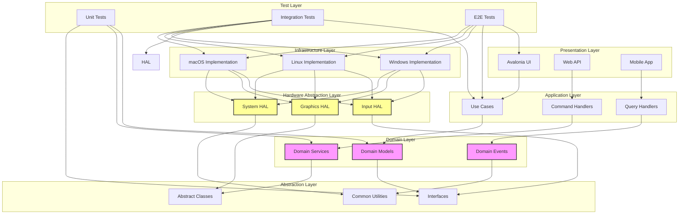

# KeyForge 完整系统架构文档

## 📋 执行摘要

本文档提供了KeyForge项目的完整系统架构设计，包括分层架构、核心模块、接口设计、测试架构、部署策略和实施路线图。该架构设计解决了当前项目的架构问题，支持跨平台部署，提高代码质量和可维护性。

## 🏗️ 系统架构总览

### 1.1 架构原则

- **单一职责原则**：每个组件都有明确的职责边界
- **依赖倒置原则**：高层模块不依赖低层模块，都依赖抽象
- **开闭原则**：对扩展开放，对修改关闭
- **接口隔离原则**：使用专门的接口而不是通用接口
- **跨平台兼容性**：所有设计考虑跨平台需求
- **可测试性**：所有组件都支持单元测试和集成测试

### 1.2 整体架构图



## 🎯 核心模块详细设计

### 2.1 领域层设计

#### 2.1.1 领域模型
```csharp
// KeyForge.Domain/Models/
namespace KeyForge.Domain.Models
{
    /// <summary>
    /// 脚本实体
    /// </summary>
    public class Script : AggregateRoot
    {
        public string Name { get; private set; }
        public string Description { get; private set; }
        public string Code { get; private set; }
        public ScriptLanguage Language { get; private set; }
        public ScriptType Type { get; private set; }
        public ScriptStatus Status { get; private set; }
        public List<ScriptAction> Actions { get; private set; }
        public ScriptMetadata Metadata { get; private set; }
        public DateTime CreatedAt { get; private set; }
        public DateTime UpdatedAt { get; private set; }
        public string Version { get; private set; }
        
        // 业务方法
        public void UpdateCode(string newCode)
        {
            if (string.IsNullOrWhiteSpace(newCode))
                throw new ArgumentException("Code cannot be empty");
                
            Code = newCode;
            UpdatedAt = DateTime.Now;
            AddDomainEvent(new ScriptCodeUpdatedEvent(Id, newCode));
        }
        
        public void AddAction(ScriptAction action)
        {
            if (action == null)
                throw new ArgumentNullException(nameof(action));
                
            Actions.Add(action);
            UpdatedAt = DateTime.Now;
            AddDomainEvent(new ScriptActionAddedEvent(Id, action));
        }
        
        public void RemoveAction(string actionId)
        {
            var action = Actions.FirstOrDefault(a => a.Id == actionId);
            if (action != null)
            {
                Actions.Remove(action);
                UpdatedAt = DateTime.Now;
                AddDomainEvent(new ScriptActionRemovedEvent(Id, action));
            }
        }
        
        public ValidationResult Validate()
        {
            var errors = new List<string>();
            
            if (string.IsNullOrWhiteSpace(Name))
                errors.Add("Script name is required");
                
            if (string.IsNullOrWhiteSpace(Code))
                errors.Add("Script code is required");
                
            // 验证脚本语法
            try
            {
                // 语法验证逻辑
            }
            catch (Exception ex)
            {
                errors.Add($"Syntax error: {ex.Message}");
            }
            
            return new ValidationResult(errors);
        }
        
        // 私有构造函数
        private Script() { }
        
        // 工厂方法
        public static Script Create(string name, string code, ScriptLanguage language = ScriptLanguage.CSharp)
        {
            if (string.IsNullOrWhiteSpace(name))
                throw new ArgumentException("Name is required", nameof(name));
                
            if (string.IsNullOrWhiteSpace(code))
                throw new ArgumentException("Code is required", nameof(code));
                
            var script = new Script
            {
                Id = Guid.NewGuid().ToString(),
                Name = name,
                Code = code,
                Language = language,
                Type = ScriptType.Sequence,
                Status = ScriptStatus.Draft,
                Actions = new List<ScriptAction>(),
                Metadata = new ScriptMetadata(),
                CreatedAt = DateTime.Now,
                UpdatedAt = DateTime.Now,
                Version = "1.0.0"
            };
            
            script.AddDomainEvent(new ScriptCreatedEvent(script.Id, script.Name));
            
            return script;
        }
    }
    
    /// <summary>
    /// 脚本动作值对象
    /// </summary>
    public class ScriptAction : ValueObject
    {
        public string Id { get; private set; }
        public ActionType Type { get; private set; }
        public string Name { get; private set; }
        public Dictionary<string, object> Parameters { get; private set; }
        public int Delay { get; private set; }
        public int Repeat { get; private set; }
        public ActionCondition Condition { get; private set; }
        public ActionErrorHandling ErrorHandling { get; private set; }
        
        protected override IEnumerable<object> GetEqualityComponents()
        {
            yield return Id;
            yield return Type;
            yield return Name;
            // 参数比较需要特殊处理
        }
        
        public ScriptAction Clone()
        {
            return new ScriptAction
            {
                Id = Guid.NewGuid().ToString(),
                Type = Type,
                Name = Name,
                Parameters = new Dictionary<string, object>(Parameters),
                Delay = Delay,
                Repeat = Repeat,
                Condition = Condition?.Clone(),
                ErrorHandling = ErrorHandling?.Clone()
            };
        }
    }
    
    /// <summary>
    /// 图像模板实体
    /// </summary>
    public class ImageTemplate : Entity
    {
        public string Name { get; private set; }
        public byte[] ImageData { get; private set; }
        public Rectangle TemplateArea { get; private set; }
        public TemplateType Type { get; private set; }
        public double ConfidenceThreshold { get; private set; }
        public Dictionary<string, string> Metadata { get; private set; }
        public DateTime CreatedAt { get; private set; }
        public DateTime UpdatedAt { get; private set; }
        
        public void UpdateImageData(byte[] newImageData)
        {
            if (newImageData == null || newImageData.Length == 0)
                throw new ArgumentException("Image data cannot be empty");
                
            ImageData = newImageData;
            UpdatedAt = DateTime.Now;
        }
        
        public void UpdateTemplateArea(Rectangle newArea)
        {
            TemplateArea = newArea;
            UpdatedAt = DateTime.Now;
        }
        
        public bool IsMatch(byte[] screenData, Point location, double confidence)
        {
            return confidence >= ConfidenceThreshold;
        }
    }
}
```

#### 2.1.2 领域服务
```csharp
// KeyForge.Domain/Services/
namespace KeyForge.Domain.Services
{
    /// <summary>
    /// 脚本执行领域服务
    /// </summary>
    public class ScriptExecutionDomainService : IScriptExecutionDomainService
    {
        private readonly IScriptValidator _scriptValidator;
        private readonly IScriptOptimizer _scriptOptimizer;
        private readonly IEventBus _eventBus;
        
        public ScriptExecutionDomainService(
            IScriptValidator scriptValidator,
            IScriptOptimizer scriptOptimizer,
            IEventBus eventBus)
        {
            _scriptValidator = scriptValidator;
            _scriptOptimizer = scriptOptimizer;
            _eventBus = eventBus;
        }
        
        public async Task<ExecutionResult> ExecuteScriptAsync(Script script, ScriptContext context)
        {
            if (script == null)
                throw new ArgumentNullException(nameof(script));
                
            // 验证脚本
            var validationResult = await _scriptValidator.ValidateAsync(script);
            if (!validationResult.IsValid)
            {
                return ExecutionResult.Failed(script.Id, "Script validation failed", 
                    new ValidationException(validationResult.Errors));
            }
            
            // 优化脚本
            var optimizedScript = await _scriptOptimizer.OptimizeAsync(script);
            
            // 创建执行上下文
            var executionContext = CreateExecutionContext(optimizedScript, context);
            
            try
            {
                // 发布开始事件
                await _eventBus.PublishAsync(new ScriptExecutionStartedEvent(script.Id, executionContext));
                
                // 执行脚本
                var result = await ExecuteScriptInternal(optimizedScript, executionContext);
                
                // 发布完成事件
                await _eventBus.PublishAsync(new ScriptExecutionCompletedEvent(script.Id, result));
                
                return result;
            }
            catch (Exception ex)
            {
                var errorResult = ExecutionResult.Failed(script.Id, "Script execution failed", ex);
                await _eventBus.PublishAsync(new ScriptExecutionFailedEvent(script.Id, errorResult, ex));
                return errorResult;
            }
        }
        
        private async Task<ExecutionResult> ExecuteScriptInternal(Script script, ScriptContext context)
        {
            var startTime = DateTime.Now;
            var actionResults = new List<ActionResult>();
            var actionsExecuted = 0;
            var actionsSucceeded = 0;
            
            try
            {
                // 执行前准备
                await PrepareExecutionEnvironment(script, context);
                
                // 执行动作序列
                foreach (var action in script.Actions)
                {
                    if (context.CancellationToken.IsCancellationRequested)
                    {
                        return ExecutionResult.Cancelled(script.Id);
                    }
                    
                    var actionResult = await ExecuteActionAsync(action, context);
                    actionResults.Add(actionResult);
                    actionsExecuted++;
                    
                    if (actionResult.Status == ActionStatus.Success)
                    {
                        actionsSucceeded++;
                    }
                    
                    // 更新进度
                    UpdateProgress(context, actionsExecuted, script.Actions.Count);
                    
                    // 处理错误
                    if (actionResult.Status == ActionStatus.Failed)
                    {
                        await HandleActionError(action, actionResult, context);
                    }
                }
                
                // 执行后清理
                await CleanupExecutionEnvironment(script, context);
                
                return ExecutionResult.Success(script.Id, "Script executed successfully")
                    .WithActionResults(actionResults)
                    .WithStatistics(actionsExecuted, actionsSucceeded)
                    .WithDuration(DateTime.Now - startTime);
            }
            catch (OperationCanceledException)
            {
                return ExecutionResult.Cancelled(script.Id);
            }
            catch (Exception ex)
            {
                return ExecutionResult.Failed(script.Id, "Script execution failed", ex)
                    .WithActionResults(actionResults)
                    .WithStatistics(actionsExecuted, actionsSucceeded)
                    .WithDuration(DateTime.Now - startTime);
            }
        }
        
        private async Task<ActionResult> ExecuteActionAsync(ScriptAction action, ScriptContext context)
        {
            var startTime = DateTime.Now;
            
            try
            {
                // 验证动作条件
                if (!await ValidateActionCondition(action, context))
                {
                    return ActionResult.Skipped(action.Id, "Condition not met");
                }
                
                // 执行动作延迟
                if (action.Delay > 0)
                {
                    await Task.Delay(action.Delay, context.CancellationToken);
                }
                
                // 根据动作类型执行
                var result = await ExecuteActionByType(action, context);
                
                return ActionResult.Success(action.Id, "Action executed successfully")
                    .WithDuration(DateTime.Now - startTime)
                    .WithResults(result);
            }
            catch (OperationCanceledException)
            {
                return ActionResult.Cancelled(action.Id);
            }
            catch (Exception ex)
            {
                return ActionResult.Failed(action.Id, ex.Message, ex)
                    .WithDuration(DateTime.Now - startTime);
            }
        }
        
        private async Task<Dictionary<string, object>> ExecuteActionByType(ScriptAction action, ScriptContext context)
        {
            switch (action.Type)
            {
                case ActionType.KeyDown:
                case ActionType.KeyUp:
                    return await ExecuteKeyActionAsync(action, context);
                    
                case ActionType.MouseDown:
                case ActionType.MouseUp:
                case ActionType.MouseClick:
                    return await ExecuteMouseActionAsync(action, context);
                    
                case ActionType.Delay:
                    return await ExecuteDelayActionAsync(action, context);
                    
                case ActionType.ImageRecognition:
                    return await ExecuteImageRecognitionActionAsync(action, context);
                    
                case ActionType.Conditional:
                    return await ExecuteConditionalActionAsync(action, context);
                    
                case ActionType.Loop:
                    return await ExecuteLoopActionAsync(action, context);
                    
                default:
                    throw new NotSupportedException($"Action type {action.Type} is not supported");
            }
        }
        
        private async Task<Dictionary<string, object>> ExecuteKeyActionAsync(ScriptAction action, ScriptContext context)
        {
            var keyCode = action.Parameters.GetValue<KeyCode>("KeyCode");
            var keyState = action.Parameters.GetValue<KeyCode>("KeyState");
            
            var keyboardService = context.ServiceProvider.GetRequiredService<IKeyboardService>();
            await keyboardService.SendKeyAsync(keyCode, keyState);
            
            return new Dictionary<string, object>
            {
                ["KeyCode"] = keyCode,
                ["KeyState"] = keyState,
                ["ExecutedAt"] = DateTime.Now
            };
        }
        
        private async Task<Dictionary<string, object>> ExecuteMouseActionAsync(ScriptAction action, ScriptContext context)
        {
            var button = action.Parameters.GetValue<MouseButton>("Button");
            var state = action.Parameters.GetValue<MouseState>("State");
            var x = action.Parameters.GetValue<int>("X");
            var y = action.Parameters.GetValue<int>("Y");
            
            var mouseService = context.ServiceProvider.GetRequiredService<IMouseService>();
            
            // 移动鼠标到指定位置
            await mouseService.MoveMouseAsync(x, y);
            
            // 执行鼠标动作
            await mouseService.SendMouseButtonAsync(button, state);
            
            return new Dictionary<string, object>
            {
                ["Button"] = button,
                ["State"] = state,
                ["Position"] = new Point(x, y),
                ["ExecutedAt"] = DateTime.Now
            };
        }
        
        private async Task<Dictionary<string, object>> ExecuteImageRecognitionActionAsync(ScriptAction action, ScriptContext context)
        {
            var templateId = action.Parameters.GetValue<string>("TemplateId");
            var confidenceThreshold = action.Parameters.GetValue<double>("ConfidenceThreshold", 0.8);
            
            var imageService = context.ServiceProvider.GetRequiredService<IImageRecognitionService>();
            var template = await imageService.LoadTemplateAsync(templateId);
            
            if (template == null)
            {
                throw new InvalidOperationException($"Template {templateId} not found");
            }
            
            var result = await imageService.RecognizeAsync(template);
            
            return new Dictionary<string, object>
            {
                ["TemplateId"] = templateId,
                ["RecognitionResult"] = result,
                ["ExecutedAt"] = DateTime.Now
            };
        }
        
        // 其他辅助方法...
    }
}
```

### 2.2 应用层设计

#### 2.2.1 用例实现
```csharp
// KeyForge.Application/UseCases/
namespace KeyForge.Application.UseCases
{
    /// <summary>
    /// 执行脚本用例
    /// </summary>
    public class ExecuteScriptUseCase : IUseCase<ExecuteScriptRequest, ExecuteScriptResponse>
    {
        private readonly IScriptRepository _scriptRepository;
        private readonly IScriptExecutionDomainService _scriptExecutionService;
        private readonly IMapper _mapper;
        private readonly ILogger<ExecuteScriptUseCase> _logger;
        
        public ExecuteScriptUseCase(
            IScriptRepository scriptRepository,
            IScriptExecutionDomainService scriptExecutionService,
            IMapper mapper,
            ILogger<ExecuteScriptUseCase> logger)
        {
            _scriptRepository = scriptRepository;
            _scriptExecutionService = scriptExecutionService;
            _mapper = mapper;
            _logger = logger;
        }
        
        public async Task<ExecuteScriptResponse> ExecuteAsync(ExecuteScriptRequest request)
        {
            try
            {
                _logger.LogInformation("Executing script {ScriptId}", request.ScriptId);
                
                // 验证请求
                var validationResult = await ValidateRequestAsync(request);
                if (!validationResult.IsValid)
                {
                    _logger.LogWarning("Script execution request validation failed: {Errors}", 
                        string.Join(", ", validationResult.Errors));
                    return new ExecuteScriptResponse
                    {
                        Success = false,
                        Errors = validationResult.Errors
                    };
                }
                
                // 获取脚本
                var script = await _scriptRepository.GetByIdAsync(request.ScriptId);
                if (script == null)
                {
                    _logger.LogWarning("Script {ScriptId} not found", request.ScriptId);
                    return new ExecuteScriptResponse
                    {
                        Success = false,
                        Errors = new[] { "Script not found" }
                    };
                }
                
                // 创建执行上下文
                var context = CreateExecutionContext(request, script);
                
                // 执行脚本
                var executionResult = await _scriptExecutionService.ExecuteScriptAsync(script, context);
                
                // 更新脚本状态
                await UpdateScriptStatusAsync(script, executionResult);
                
                // 返回结果
                var response = _mapper.Map<ExecuteScriptResponse>(executionResult);
                response.Success = executionResult.Status == ExecutionStatus.Completed;
                
                _logger.LogInformation("Script {ScriptId} execution completed with status {Status}", 
                    request.ScriptId, executionResult.Status);
                
                return response;
            }
            catch (Exception ex)
            {
                _logger.LogError(ex, "Error executing script {ScriptId}", request.ScriptId);
                return new ExecuteScriptResponse
                {
                    Success = false,
                    Errors = new[] { ex.Message }
                };
            }
        }
        
        private async Task<ValidationResult> ValidateRequestAsync(ExecuteScriptRequest request)
        {
            var errors = new List<string>();
            
            if (string.IsNullOrWhiteSpace(request.ScriptId))
                errors.Add("Script ID is required");
                
            if (request.Timeout < 0)
                errors.Add("Timeout must be non-negative");
                
            return new ValidationResult(errors);
        }
        
        private ScriptContext CreateExecutionContext(ExecuteScriptRequest request, Script script)
        {
            var context = new ScriptContext(script.Id)
            {
                Parameters = request.Parameters ?? new Dictionary<string, object>(),
                Options = new ExecutionOptions
                {
                    EnableLogging = request.EnableLogging,
                    EnableDebugging = request.EnableDebugging,
                    TimeoutMs = request.Timeout,
                    ContinueOnError = request.ContinueOnError
                }
            };
            
            return context;
        }
        
        private async Task UpdateScriptStatusAsync(Script script, ExecutionResult result)
        {
            // 更新脚本最后执行时间
            script.Metadata.LastExecutedAt = DateTime.Now;
            
            // 更新执行统计
            if (script.Metadata.ExecutionStatistics == null)
            {
                script.Metadata.ExecutionStatistics = new ExecutionStatistics(script.Id);
            }
            
            var stats = script.Metadata.ExecutionStatistics;
            stats.ExecutionCount++;
            
            if (result.Status == ExecutionStatus.Completed)
            {
                stats.SuccessCount++;
            }
            else
            {
                stats.FailureCount++;
            }
            
            // 更新平均执行时间
            var totalTime = stats.AverageExecutionTime * (stats.ExecutionCount - 1) + result.Duration;
            stats.AverageExecutionTime = totalTime / stats.ExecutionCount;
            
            // 保存更新
            await _scriptRepository.UpdateAsync(script);
        }
    }
    
    /// <summary>
    /// 创建脚本用例
    /// </summary>
    public class CreateScriptUseCase : IUseCase<CreateScriptRequest, CreateScriptResponse>
    {
        private readonly IScriptRepository _scriptRepository;
        private readonly IScriptValidator _scriptValidator;
        private readonly IMapper _mapper;
        private readonly ILogger<CreateScriptUseCase> _logger;
        
        public CreateScriptUseCase(
            IScriptRepository scriptRepository,
            IScriptValidator scriptValidator,
            IMapper mapper,
            ILogger<CreateScriptUseCase> logger)
        {
            _scriptRepository = scriptRepository;
            _scriptValidator = scriptValidator;
            _mapper = _mapper;
            _logger = logger;
        }
        
        public async Task<CreateScriptResponse> ExecuteAsync(CreateScriptRequest request)
        {
            try
            {
                _logger.LogInformation("Creating new script: {Name}", request.Name);
                
                // 验证请求
                var validationResult = await ValidateRequestAsync(request);
                if (!validationResult.IsValid)
                {
                    return new CreateScriptResponse
                    {
                        Success = false,
                        Errors = validationResult.Errors
                    };
                }
                
                // 创建脚本
                var script = Script.Create(request.Name, request.Code, request.Language);
                
                // 设置额外属性
                script.Description = request.Description;
                script.Type = request.Type;
                
                // 添加动作
                if (request.Actions != null)
                {
                    foreach (var actionRequest in request.Actions)
                    {
                        var action = _mapper.Map<ScriptAction>(actionRequest);
                        script.AddAction(action);
                    }
                }
                
                // 验证脚本
                var scriptValidationResult = await _scriptValidator.ValidateAsync(script);
                if (!scriptValidationResult.IsValid)
                {
                    return new CreateScriptResponse
                    {
                        Success = false,
                        Errors = scriptValidationResult.Errors
                    };
                }
                
                // 保存脚本
                await _scriptRepository.AddAsync(script);
                
                _logger.LogInformation("Script created successfully with ID: {ScriptId}", script.Id);
                
                return new CreateScriptResponse
                {
                    Success = true,
                    ScriptId = script.Id,
                    Script = _mapper.Map<ScriptDto>(script)
                };
            }
            catch (Exception ex)
            {
                _logger.LogError(ex, "Error creating script: {Name}", request.Name);
                return new CreateScriptResponse
                {
                    Success = false,
                    Errors = new[] { ex.Message }
                };
            }
        }
        
        private async Task<ValidationResult> ValidateRequestAsync(CreateScriptRequest request)
        {
            var errors = new List<string>();
            
            if (string.IsNullOrWhiteSpace(request.Name))
                errors.Add("Script name is required");
                
            if (string.IsNullOrWhiteSpace(request.Code))
                errors.Add("Script code is required");
                
            if (request.Language == ScriptLanguage.Unknown)
                errors.Add("Valid script language is required");
                
            return new ValidationResult(errors);
        }
    }
}
```

#### 2.2.2 命令处理器
```csharp
// KeyForge.Application/Commands/
namespace KeyForge.Application.Commands
{
    /// <summary>
    /// 执行脚本命令处理器
    /// </summary>
    public class ExecuteScriptCommandHandler : ICommandHandler<ExecuteScriptCommand>
    {
        private readonly IScriptRepository _scriptRepository;
        private readonly IScriptExecutionDomainService _scriptExecutionService;
        private readonly ILogger<ExecuteScriptCommandHandler> _logger;
        
        public ExecuteScriptCommandHandler(
            IScriptRepository scriptRepository,
            IScriptExecutionDomainService scriptExecutionService,
            ILogger<ExecuteScriptCommandHandler> logger)
        {
            _scriptRepository = scriptRepository;
            _scriptExecutionService = scriptExecutionService;
            _logger = logger;
        }
        
        public async Task Handle(ExecuteScriptCommand command)
        {
            try
            {
                _logger.LogInformation("Handling ExecuteScriptCommand for script {ScriptId}", command.ScriptId);
                
                // 验证命令
                var validationResult = await ValidateCommandAsync(command);
                if (!validationResult.IsValid)
                {
                    throw new ValidationException(validationResult.Errors);
                }
                
                // 获取脚本
                var script = await _scriptRepository.GetByIdAsync(command.ScriptId);
                if (script == null)
                {
                    throw new NotFoundException($"Script with ID {command.ScriptId} not found");
                }
                
                // 创建执行上下文
                var context = new ScriptContext(script.Id)
                {
                    Parameters = command.Parameters,
                    CancellationToken = command.CancellationToken,
                    Options = new ExecutionOptions
                    {
                        EnableLogging = command.EnableLogging,
                        EnableDebugging = command.EnableDebugging,
                        TimeoutMs = command.TimeoutMs,
                        ContinueOnError = command.ContinueOnError
                    }
                };
                
                // 执行脚本
                var result = await _scriptExecutionService.ExecuteScriptAsync(script, context);
                
                // 检查执行结果
                if (result.Status == ExecutionStatus.Failed)
                {
                    throw new ScriptExecutionException($"Script execution failed: {result.Message}", result.Exception);
                }
                
                _logger.LogInformation("Script {ScriptId} executed successfully", command.ScriptId);
            }
            catch (Exception ex)
            {
                _logger.LogError(ex, "Error handling ExecuteScriptCommand for script {ScriptId}", command.ScriptId);
                throw;
            }
        }
        
        public async Task<ValidationResult> Validate(ExecuteScriptCommand command)
        {
            return await ValidateCommandAsync(command);
        }
        
        private async Task<ValidationResult> ValidateCommandAsync(ExecuteScriptCommand command)
        {
            var errors = new List<string>();
            
            if (string.IsNullOrWhiteSpace(command.ScriptId))
                errors.Add("Script ID is required");
                
            if (command.TimeoutMs < 0)
                errors.Add("Timeout must be non-negative");
                
            if (command.Parameters == null)
                command.Parameters = new Dictionary<string, object>();
                
            return new ValidationResult(errors);
        }
    }
    
    /// <summary>
    /// 创建脚本命令处理器
    /// </summary>
    public class CreateScriptCommandHandler : ICommandHandler<CreateScriptCommand>
    {
        private readonly IScriptRepository _scriptRepository;
        private readonly IScriptValidator _scriptValidator;
        private readonly ILogger<CreateScriptCommandHandler> _logger;
        
        public CreateScriptCommandHandler(
            IScriptRepository scriptRepository,
            IScriptValidator scriptValidator,
            ILogger<CreateScriptCommandHandler> logger)
        {
            _scriptRepository = scriptRepository;
            _scriptValidator = scriptValidator;
            _logger = logger;
        }
        
        public async Task Handle(CreateScriptCommand command)
        {
            try
            {
                _logger.LogInformation("Handling CreateScriptCommand for script {Name}", command.Name);
                
                // 验证命令
                var validationResult = await ValidateCommandAsync(command);
                if (!validationResult.IsValid)
                {
                    throw new ValidationException(validationResult.Errors);
                }
                
                // 创建脚本
                var script = Script.Create(command.Name, command.Code, command.Language);
                script.Description = command.Description;
                script.Type = command.Type;
                
                // 添加动作
                if (command.Actions != null)
                {
                    foreach (var action in command.Actions)
                    {
                        script.AddAction(action);
                    }
                }
                
                // 验证脚本
                var scriptValidationResult = await _scriptValidator.ValidateAsync(script);
                if (!scriptValidationResult.IsValid)
                {
                    throw new ValidationException(scriptValidationResult.Errors);
                }
                
                // 保存脚本
                await _scriptRepository.AddAsync(script);
                
                _logger.LogInformation("Script {ScriptId} created successfully", script.Id);
            }
            catch (Exception ex)
            {
                _logger.LogError(ex, "Error handling CreateScriptCommand for script {Name}", command.Name);
                throw;
            }
        }
        
        public async Task<ValidationResult> Validate(CreateScriptCommand command)
        {
            return await ValidateCommandAsync(command);
        }
        
        private async Task<ValidationResult> ValidateCommandAsync(CreateScriptCommand command)
        {
            var errors = new List<string>();
            
            if (string.IsNullOrWhiteSpace(command.Name))
                errors.Add("Script name is required");
                
            if (string.IsNullOrWhiteSpace(command.Code))
                errors.Add("Script code is required");
                
            if (command.Language == ScriptLanguage.Unknown)
                errors.Add("Valid script language is required");
                
            return new ValidationResult(errors);
        }
    }
}
```

### 2.3 基础设施层设计

#### 2.3.1 仓储实现
```csharp
// KeyForge.Infrastructure/Persistence/Repositories/
namespace KeyForge.Infrastructure.Persistence.Repositories
{
    /// <summary>
    /// 脚本仓储实现
    /// </summary>
    public class ScriptRepository : IScriptRepository
    {
        private readonly KeyForgeDbContext _context;
        private readonly ILogger<ScriptRepository> _logger;
        private readonly IMapper _mapper;
        
        public ScriptRepository(
            KeyForgeDbContext context,
            ILogger<ScriptRepository> logger,
            IMapper mapper)
        {
            _context = context;
            _logger = logger;
            _mapper = mapper;
        }
        
        public async Task<Script> GetByIdAsync(string id)
        {
            try
            {
                var entity = await _context.Scripts
                    .Include(s => s.Actions)
                    .Include(s => s.Metadata)
                    .FirstOrDefaultAsync(s => s.Id == id);
                    
                if (entity == null)
                    return null;
                    
                return _mapper.Map<Script>(entity);
            }
            catch (Exception ex)
            {
                _logger.LogError(ex, "Error getting script by ID {ScriptId}", id);
                throw;
            }
        }
        
        public async Task<IEnumerable<Script>> GetAllAsync()
        {
            try
            {
                var entities = await _context.Scripts
                    .Include(s => s.Actions)
                    .Include(s => s.Metadata)
                    .ToListAsync();
                    
                return _mapper.Map<IEnumerable<Script>>(entities);
            }
            catch (Exception ex)
            {
                _logger.LogError(ex, "Error getting all scripts");
                throw;
            }
        }
        
        public async Task<IEnumerable<Script>> GetByStatusAsync(ScriptStatus status)
        {
            try
            {
                var entities = await _context.Scripts
                    .Include(s => s.Actions)
                    .Include(s => s.Metadata)
                    .Where(s => s.Status == status.ToString())
                    .ToListAsync();
                    
                return _mapper.Map<IEnumerable<Script>>(entities);
            }
            catch (Exception ex)
            {
                _logger.LogError(ex, "Error getting scripts by status {Status}", status);
                throw;
            }
        }
        
        public async Task<Script> AddAsync(Script script)
        {
            try
            {
                var entity = _mapper.Map<ScriptEntity>(script);
                entity.CreatedAt = DateTime.Now;
                entity.UpdatedAt = DateTime.Now;
                
                await _context.Scripts.AddAsync(entity);
                await _context.SaveChangesAsync();
                
                return _mapper.Map<Script>(entity);
            }
            catch (Exception ex)
            {
                _logger.LogError(ex, "Error adding script {ScriptName}", script.Name);
                throw;
            }
        }
        
        public async Task<Script> UpdateAsync(Script script)
        {
            try
            {
                var entity = await _context.Scripts
                    .Include(s => s.Actions)
                    .Include(s => s.Metadata)
                    .FirstOrDefaultAsync(s => s.Id == script.Id);
                    
                if (entity == null)
                    throw new NotFoundException($"Script with ID {script.Id} not found");
                
                // 更新实体属性
                _mapper.Map(script, entity);
                entity.UpdatedAt = DateTime.Now;
                
                // 更新动作
                await UpdateActionsAsync(entity, script.Actions);
                
                // 更新元数据
                await UpdateMetadataAsync(entity, script.Metadata);
                
                await _context.SaveChangesAsync();
                
                return _mapper.Map<Script>(entity);
            }
            catch (Exception ex)
            {
                _logger.LogError(ex, "Error updating script {ScriptId}", script.Id);
                throw;
            }
        }
        
        public async Task DeleteAsync(string id)
        {
            try
            {
                var entity = await _context.Scripts.FindAsync(id);
                if (entity == null)
                    return;
                
                _context.Scripts.Remove(entity);
                await _context.SaveChangesAsync();
            }
            catch (Exception ex)
            {
                _logger.LogError(ex, "Error deleting script {ScriptId}", id);
                throw;
            }
        }
        
        public async Task<bool> ExistsAsync(string id)
        {
            try
            {
                return await _context.Scripts.AnyAsync(s => s.Id == id);
            }
            catch (Exception ex)
            {
                _logger.LogError(ex, "Error checking if script exists {ScriptId}", id);
                throw;
            }
        }
        
        private async Task UpdateActionsAsync(ScriptEntity entity, List<ScriptAction> actions)
        {
            // 删除已移除的动作
            var existingActions = entity.Actions.ToList();
            foreach (var existingAction in existingActions)
            {
                if (!actions.Any(a => a.Id == existingAction.Id))
                {
                    _context.ScriptActions.Remove(existingAction);
                }
            }
            
            // 添加或更新动作
            foreach (var action in actions)
            {
                var existingAction = entity.Actions.FirstOrDefault(a => a.Id == action.Id);
                if (existingAction == null)
                {
                    var actionEntity = _mapper.Map<ScriptActionEntity>(action);
                    actionEntity.ScriptId = entity.Id;
                    entity.Actions.Add(actionEntity);
                }
                else
                {
                    _mapper.Map(action, existingAction);
                }
            }
        }
        
        private async Task UpdateMetadataAsync(ScriptEntity entity, ScriptMetadata metadata)
        {
            if (entity.Metadata == null)
            {
                entity.Metadata = _mapper.Map<ScriptMetadataEntity>(metadata);
                entity.Metadata.ScriptId = entity.Id;
            }
            else
            {
                _mapper.Map(metadata, entity.Metadata);
            }
        }
    }
    
    /// <summary>
    /// 图像模板仓储实现
    /// </summary>
    public class ImageTemplateRepository : IImageTemplateRepository
    {
        private readonly KeyForgeDbContext _context;
        private readonly ILogger<ImageTemplateRepository> _logger;
        private readonly IMapper _mapper;
        
        public ImageTemplateRepository(
            KeyForgeDbContext context,
            ILogger<ImageTemplateRepository> logger,
            IMapper mapper)
        {
            _context = context;
            _logger = logger;
            _mapper = mapper;
        }
        
        public async Task<ImageTemplate> GetByIdAsync(string id)
        {
            try
            {
                var entity = await _context.ImageTemplates.FindAsync(id);
                return entity != null ? _mapper.Map<ImageTemplate>(entity) : null;
            }
            catch (Exception ex)
            {
                _logger.LogError(ex, "Error getting image template by ID {TemplateId}", id);
                throw;
            }
        }
        
        public async Task<ImageTemplate> GetByNameAsync(string name)
        {
            try
            {
                var entity = await _context.ImageTemplates
                    .FirstOrDefaultAsync(t => t.Name == name);
                    
                return entity != null ? _mapper.Map<ImageTemplate>(entity) : null;
            }
            catch (Exception ex)
            {
                _logger.LogError(ex, "Error getting image template by name {TemplateName}", name);
                throw;
            }
        }
        
        public async Task<IEnumerable<ImageTemplate>> GetAllAsync()
        {
            try
            {
                var entities = await _context.ImageTemplates.ToListAsync();
                return _mapper.Map<IEnumerable<ImageTemplate>>(entities);
            }
            catch (Exception ex)
            {
                _logger.LogError(ex, "Error getting all image templates");
                throw;
            }
        }
        
        public async Task<ImageTemplate> AddAsync(ImageTemplate template)
        {
            try
            {
                var entity = _mapper.Map<ImageTemplateEntity>(template);
                entity.CreatedAt = DateTime.Now;
                entity.UpdatedAt = DateTime.Now;
                
                await _context.ImageTemplates.AddAsync(entity);
                await _context.SaveChangesAsync();
                
                return _mapper.Map<ImageTemplate>(entity);
            }
            catch (Exception ex)
            {
                _logger.LogError(ex, "Error adding image template {TemplateName}", template.Name);
                throw;
            }
        }
        
        public async Task<ImageTemplate> UpdateAsync(ImageTemplate template)
        {
            try
            {
                var entity = await _context.ImageTemplates.FindAsync(template.Id);
                if (entity == null)
                    throw new NotFoundException($"Image template with ID {template.Id} not found");
                
                _mapper.Map(template, entity);
                entity.UpdatedAt = DateTime.Now;
                
                await _context.SaveChangesAsync();
                
                return _mapper.Map<ImageTemplate>(entity);
            }
            catch (Exception ex)
            {
                _logger.LogError(ex, "Error updating image template {TemplateId}", template.Id);
                throw;
            }
        }
        
        public async Task DeleteAsync(string id)
        {
            try
            {
                var entity = await _context.ImageTemplates.FindAsync(id);
                if (entity == null)
                    return;
                
                _context.ImageTemplates.Remove(entity);
                await _context.SaveChangesAsync();
            }
            catch (Exception ex)
            {
                _logger.LogError(ex, "Error deleting image template {TemplateId}", id);
                throw;
            }
        }
    }
}
```

#### 2.3.2 数据库上下文
```csharp
// KeyForge.Infrastructure/Persistence/Contexts/
namespace KeyForge.Infrastructure.Persistence.Contexts
{
    /// <summary>
    /// KeyForge数据库上下文
    /// </summary>
    public class KeyForgeDbContext : DbContext
    {
        public KeyForgeDbContext(DbContextOptions<KeyForgeDbContext> options) : base(options)
        {
        }
        
        // DbSets
        public DbSet<ScriptEntity> Scripts { get; set; }
        public DbSet<ScriptActionEntity> ScriptActions { get; set; }
        public DbSet<ScriptMetadataEntity> ScriptMetadata { get; set; }
        public DbSet<ImageTemplateEntity> ImageTemplates { get; set; }
        public DbSet<ConfigurationEntity> Configurations { get; set; }
        public DbSet<ExecutionLogEntity> ExecutionLogs { get; set; }
        
        protected override void OnModelCreating(ModelBuilder modelBuilder)
        {
            base.OnModelCreating(modelBuilder);
            
            // 应用配置
            modelBuilder.ApplyConfiguration(new ScriptEntityConfiguration());
            modelBuilder.ApplyConfiguration(new ScriptActionEntityConfiguration());
            modelBuilder.ApplyConfiguration(new ScriptMetadataEntityConfiguration());
            modelBuilder.ApplyConfiguration(new ImageTemplateEntityConfiguration());
            modelBuilder.ApplyConfiguration(new ConfigurationEntityConfiguration());
            modelBuilder.ApplyConfiguration(new ExecutionLogEntityConfiguration());
            
            // 全局查询过滤器
            modelBuilder.Entity<ScriptEntity>().HasQueryFilter(s => !s.IsDeleted);
            modelBuilder.Entity<ImageTemplateEntity>().HasQueryFilter(t => !t.IsDeleted);
            
            // 级联删除配置
            modelBuilder.Entity<ScriptEntity>()
                .HasMany(s => s.Actions)
                .WithOne(a => a.Script)
                .HasForeignKey(a => a.ScriptId)
                .OnDelete(DeleteBehavior.Cascade);
                
            modelBuilder.Entity<ScriptEntity>()
                .HasOne(s => s.Metadata)
                .WithOne(m => m.Script)
                .HasForeignKey<ScriptMetadataEntity>(m => m.ScriptId)
                .OnDelete(DeleteBehavior.Cascade);
        }
        
        protected override void OnConfiguring(DbContextOptionsBuilder optionsBuilder)
        {
            base.OnConfiguring(optionsBuilder);
            
            // 配置性能选项
            optionsBuilder.EnableSensitiveDataLogging(false);
            optionsBuilder.EnableDetailedErrors(false);
        }
        
        public override async Task<int> SaveChangesAsync(CancellationToken cancellationToken = default)
        {
            // 自动设置时间戳
            var entries = ChangeTracker.Entries<BaseEntity>();
            
            foreach (var entry in entries)
            {
                switch (entry.State)
                {
                    case EntityState.Added:
                        entry.Entity.CreatedAt = DateTime.Now;
                        entry.Entity.UpdatedAt = DateTime.Now;
                        break;
                        
                    case EntityState.Modified:
                        entry.Entity.UpdatedAt = DateTime.Now;
                        break;
                }
            }
            
            return await base.SaveChangesAsync(cancellationToken);
        }
    }
    
    /// <summary>
    /// 实体基类
    /// </summary>
    public abstract class BaseEntity
    {
        public string Id { get; set; } = Guid.NewGuid().ToString();
        public DateTime CreatedAt { get; set; }
        public DateTime UpdatedAt { get; set; }
    }
    
    /// <summary>
    /// 软删除实体基类
    /// </summary>
    public abstract class SoftDeleteEntity : BaseEntity
    {
        public bool IsDeleted { get; set; }
        public DateTime? DeletedAt { get; set; }
    }
}
```

### 2.4 硬件抽象层设计

#### 2.4.1 HAL基础类
```csharp
// KeyForge.HAL/Abstractions/
namespace KeyForge.HAL.Abstractions
{
    /// <summary>
    /// HAL基础抽象类
    /// </summary>
    public abstract class BaseHAL : IHAL
    {
        protected readonly ILogger Logger;
        protected readonly IServiceProvider ServiceProvider;
        
        protected HALStatus Status { get; set; } = HALStatus.NotInitialized;
        
        protected BaseHAL(ILogger logger, IServiceProvider serviceProvider)
        {
            Logger = logger;
            ServiceProvider = serviceProvider;
        }
        
        public abstract Task<bool> InitializeAsync();
        
        public abstract HALInfo GetHALInfo();
        
        public abstract PlatformInfo GetPlatformInfo();
        
        public HALStatus GetStatus()
        {
            return Status;
        }
        
        public event EventHandler<HALStatusEventArgs> OnHALStatusChanged;
        
        protected void UpdateStatus(HALStatus newStatus)
        {
            if (Status != newStatus)
            {
                var oldStatus = Status;
                Status = newStatus;
                
                Logger.LogInformation("HAL status changed from {OldStatus} to {NewStatus}", oldStatus, newStatus);
                
                OnHALStatusChanged?.Invoke(this, new HALStatusEventArgs(oldStatus, newStatus));
            }
        }
        
        protected T GetService<T>() where T : class
        {
            return ServiceProvider.GetService<T>();
        }
        
        public abstract void Dispose();
    }
    
    /// <summary>
    /// 输入HAL基础抽象类
    /// </summary>
    public abstract class BaseInputHAL : BaseHAL, IInputHAL
    {
        protected BaseInputHAL(ILogger logger, IServiceProvider serviceProvider) 
            : base(logger, serviceProvider)
        {
        }
        
        public abstract IPlatformKeyboardService GetKeyboardService();
        public abstract IPlatformMouseService GetMouseService();
        public abstract IPlatformHookService GetHookService();
        
        public abstract Task<List<InputDeviceInfo>> GetInputDevicesAsync();
        public abstract Task<bool> CheckInputPermissionsAsync();
        public abstract Task<bool> RequestInputPermissionsAsync();
    }
    
    /// <summary>
    /// 图形HAL基础抽象类
    /// </summary>
    public abstract class BaseGraphicsHAL : BaseHAL, IGraphicsHAL
    {
        protected BaseGraphicsHAL(ILogger logger, IServiceProvider serviceProvider) 
            : base(logger, serviceProvider)
        {
        }
        
        public abstract IPlatformScreenService GetScreenService();
        public abstract IPlatformImageService GetImageService();
        
        public abstract Task<List<DisplayDeviceInfo>> GetDisplayDevicesAsync();
        public abstract Task<bool> CheckScreenCapturePermissionsAsync();
        public abstract Task<bool> RequestScreenCapturePermissionsAsync();
    }
    
    /// <summary>
    /// 系统HAL基础抽象类
    /// </summary>
    public abstract class BaseSystemHAL : BaseHAL, ISystemHAL
    {
        protected BaseSystemHAL(ILogger logger, IServiceProvider serviceProvider) 
            : base(logger, serviceProvider)
        {
        }
        
        public abstract SystemInfo GetSystemInfo();
        public abstract ProcessInfo GetProcessInfo();
        public abstract MemoryInfo GetMemoryInfo();
        public abstract CPUInfo GetCPUInfo();
        
        public abstract Task<CommandResult> ExecuteCommandAsync(string command, string arguments = "");
        public abstract string GetEnvironmentVariable(string name);
        public abstract bool SetEnvironmentVariable(string name, string value);
        public abstract string GetTempDirectory();
        public abstract string GetAppDataDirectory();
    }
}
```

#### 2.4.2 Windows平台实现
```csharp
// KeyForge.Infrastructure/Platform/Windows/
namespace KeyForge.Infrastructure.Platform.Windows
{
    /// <summary>
    /// Windows输入HAL实现
    /// </summary>
    public class WindowsInputHAL : BaseInputHAL
    {
        private WindowsKeyboardService _keyboardService;
        private WindowsMouseService _mouseService;
        private WindowsHookService _hookService;
        
        public WindowsInputHAL(ILogger<WindowsInputHAL> logger, IServiceProvider serviceProvider)
            : base(logger, serviceProvider)
        {
        }
        
        public override async Task<bool> InitializeAsync()
        {
            try
            {
                Logger.LogInformation("Initializing Windows Input HAL");
                
                // 初始化服务
                _keyboardService = new WindowsKeyboardService(Logger);
                _mouseService = new WindowsMouseService(Logger);
                _hookService = new WindowsHookService(Logger);
                
                // 初始化各个服务
                var keyboardResult = await _keyboardService.InitializeAsync();
                var mouseResult = await _mouseService.InitializeAsync();
                var hookResult = await _hookService.InitializeAsync();
                
                if (keyboardResult && mouseResult && hookResult)
                {
                    UpdateStatus(HALStatus.Ready);
                    Logger.LogInformation("Windows Input HAL initialized successfully");
                    return true;
                }
                
                UpdateStatus(HALStatus.Error);
                Logger.LogError("Failed to initialize Windows Input HAL");
                return false;
            }
            catch (Exception ex)
            {
                UpdateStatus(HALStatus.Error);
                Logger.LogError(ex, "Error initializing Windows Input HAL");
                return false;
            }
        }
        
        public override IPlatformKeyboardService GetKeyboardService()
        {
            return _keyboardService ?? throw new InvalidOperationException("HAL not initialized");
        }
        
        public override IPlatformMouseService GetMouseService()
        {
            return _mouseService ?? throw new InvalidOperationException("HAL not initialized");
        }
        
        public override IPlatformHookService GetHookService()
        {
            return _hookService ?? throw new InvalidOperationException("HAL not initialized");
        }
        
        public override async Task<List<InputDeviceInfo>> GetInputDevicesAsync()
        {
            try
            {
                var devices = new List<InputDeviceInfo>();
                
                // 获取键盘设备
                var keyboards = GetKeyboardDevices();
                devices.AddRange(keyboards);
                
                // 获取鼠标设备
                var mice = GetMouseDevices();
                devices.AddRange(mice);
                
                return await Task.FromResult(devices);
            }
            catch (Exception ex)
            {
                Logger.LogError(ex, "Error getting input devices");
                return new List<InputDeviceInfo>();
            }
        }
        
        public override async Task<bool> CheckInputPermissionsAsync()
        {
            try
            {
                // Windows通常不需要特殊权限，但可以检查UAC状态
                return await Task.FromResult(true);
            }
            catch (Exception ex)
            {
                Logger.LogError(ex, "Error checking input permissions");
                return false;
            }
        }
        
        public override async Task<bool> RequestInputPermissionsAsync()
        {
            try
            {
                // Windows通常不需要特殊权限
                return await Task.FromResult(true);
            }
            catch (Exception ex)
            {
                Logger.LogError(ex, "Error requesting input permissions");
                return false;
            }
        }
        
        public override HALInfo GetHALInfo()
        {
            return new HALInfo
            {
                Name = "Windows Input HAL",
                Version = "1.0.0",
                Description = "Windows platform input hardware abstraction layer",
                Platform = PlatformType.Windows,
                Capabilities = new[]
                {
                    "Keyboard Input",
                    "Mouse Input",
                    "Input Hooks",
                    "Low-level Input"
                }
            };
        }
        
        public override PlatformInfo GetPlatformInfo()
        {
            return new PlatformInfo
            {
                PlatformType = PlatformType.Windows,
                PlatformName = "Windows",
                PlatformVersion = Environment.OSVersion.VersionString,
                Architecture = RuntimeInformation.ProcessArchitecture.ToString(),
                Is64Bit = Environment.Is64BitOperatingSystem
            };
        }
        
        protected override void Dispose(bool disposing)
        {
            if (disposing)
            {
                _keyboardService?.Dispose();
                _mouseService?.Dispose();
                _hookService?.Dispose();
            }
            base.Dispose(disposing);
        }
        
        private List<InputDeviceInfo> GetKeyboardDevices()
        {
            var devices = new List<InputDeviceInfo>();
            
            // 使用Windows API获取键盘设备
            try
            {
                // 这里应该调用Windows API来获取键盘设备列表
                devices.Add(new InputDeviceInfo
                {
                    Id = "keyboard-1",
                    Name = "Standard Keyboard",
                    Type = InputDeviceType.Keyboard,
                    IsConnected = true,
                    Capabilities = new[] { "Key Input", "Key State" }
                });
            }
            catch (Exception ex)
            {
                Logger.LogError(ex, "Error getting keyboard devices");
            }
            
            return devices;
        }
        
        private List<InputDeviceInfo> GetMouseDevices()
        {
            var devices = new List<InputDeviceInfo>();
            
            // 使用Windows API获取鼠标设备
            try
            {
                // 这里应该调用Windows API来获取鼠标设备列表
                devices.Add(new InputDeviceInfo
                {
                    Id = "mouse-1",
                    Name = "Standard Mouse",
                    Type = InputDeviceType.Mouse,
                    IsConnected = true,
                    Capabilities = new[] { "Mouse Movement", "Mouse Buttons", "Mouse Wheel" }
                });
            }
            catch (Exception ex)
            {
                Logger.LogError(ex, "Error getting mouse devices");
            }
            
            return devices;
        }
    }
    
    /// <summary>
    /// Windows键盘服务实现
    /// </summary>
    public class WindowsKeyboardService : IPlatformKeyboardService
    {
        private readonly ILogger _logger;
        
        public WindowsKeyboardService(ILogger logger)
        {
            _logger = logger;
        }
        
        public async Task<bool> InitializeAsync()
        {
            try
            {
                _logger.LogInformation("Initializing Windows keyboard service");
                // Windows键盘服务初始化逻辑
                return await Task.FromResult(true);
            }
            catch (Exception ex)
            {
                _logger.LogError(ex, "Error initializing Windows keyboard service");
                return false;
            }
        }
        
        public async Task<bool> SendKeyEventAsync(KeyCode keyCode, KeyState state)
        {
            try
            {
                // 使用Windows API发送键盘事件
                // 这里应该调用Windows的SendInput或keybd_event函数
                _logger.LogDebug("Sending key event: {KeyCode} {State}", keyCode, state);
                
                // 模拟实现
                await Task.Delay(10); // 模拟按键延迟
                
                OnKeyEvent?.Invoke(this, new PlatformKeyEventArgs(keyCode, state));
                
                return true;
            }
            catch (Exception ex)
            {
                _logger.LogError(ex, "Error sending key event: {KeyCode} {State}", keyCode, state);
                return false;
            }
        }
        
        public KeyState GetKeyState(KeyCode keyCode)
        {
            try
            {
                // 使用Windows API获取按键状态
                // 这里应该调用Windows的GetAsyncKeyState函数
                return KeyState.Release; // 模拟实现
            }
            catch (Exception ex)
            {
                _logger.LogError(ex, "Error getting key state for {KeyCode}", keyCode);
                return KeyState.Release;
            }
        }
        
        public KeyboardState GetKeyboardState()
        {
            try
            {
                // 使用Windows API获取键盘状态
                return new KeyboardState(); // 模拟实现
            }
            catch (Exception ex)
            {
                _logger.LogError(ex, "Error getting keyboard state");
                return new KeyboardState();
            }
        }
        
        public event EventHandler<PlatformKeyEventArgs> OnKeyEvent;
        
        public void Dispose()
        {
            // 清理资源
        }
    }
}
```

## 🧪 测试架构实现

### 3.1 测试基础设施

#### 3.1.1 测试基类和辅助工具
```csharp
// KeyForge.Tests/Common/
namespace KeyForge.Tests.Common
{
    /// <summary>
    /// 集成测试基类
    /// </summary>
    public abstract class IntegrationTestBase : IAsyncLifetime
    {
        protected ServiceProvider ServiceProvider { get; private set; }
        protected readonly ITestOutputHelper Output;
        protected readonly Fixture Fixture;
        
        protected IntegrationTestBase(ITestOutputHelper output)
        {
            Output = output;
            Fixture = new Fixture();
            Fixture.Customize(new AutoMoqCustomization());
        }
        
        protected virtual void ConfigureServices(IServiceCollection services)
        {
            // 注册测试服务
            services.AddLogging();
            services.AddKeyForgeServices();
            
            // 注册测试数据库
            services.AddDbContext<KeyForgeDbContext>(options =>
                options.UseInMemoryDatabase($"KeyForge_Test_{Guid.NewGuid()}"));
            
            // 注册模拟服务
            services.AddSingleton<ITestOutputHelper>(Output);
            services.AddSingleton<IImageRecognitionService, MockImageRecognitionService>();
            services.AddSingleton<IKeyboardService, MockKeyboardService>();
            services.AddSingleton<IMouseService, MockMouseService>();
            services.AddSingleton<IScreenCaptureService, MockScreenCaptureService>();
        }
        
        public async Task InitializeAsync()
        {
            var services = new ServiceCollection();
            ConfigureServices(services);
            
            ServiceProvider = services.BuildServiceProvider();
            
            // 初始化数据库
            await InitializeDatabaseAsync();
            
            // 初始化测试数据
            await InitializeTestDataAsync();
        }
        
        protected virtual async Task InitializeDatabaseAsync()
        {
            var context = ServiceProvider.GetRequiredService<KeyForgeDbContext>();
            await context.Database.EnsureCreatedAsync();
        }
        
        protected virtual async Task InitializeTestDataAsync()
        {
            var context = ServiceProvider.GetRequiredService<KeyForgeDbContext>();
            
            // 创建测试脚本
            var testScript = new ScriptEntity
            {
                Id = "test-script-1",
                Name = "Test Script",
                Code = "Console.WriteLine('Hello World');",
                Language = "CSharp",
                Status = "Active",
                CreatedAt = DateTime.Now,
                UpdatedAt = DateTime.Now
            };
            
            await context.Scripts.AddAsync(testScript);
            await context.SaveChangesAsync();
        }
        
        public async Task DisposeAsync()
        {
            if (ServiceProvider != null)
            {
                // 清理数据库
                var context = ServiceProvider.GetRequiredService<KeyForgeDbContext>();
                await context.Database.EnsureDeletedAsync();
                
                ServiceProvider.Dispose();
            }
        }
        
        protected T GetService<T>() where T : class
        {
            return ServiceProvider.GetService<T>();
        }
        
        protected Mock<T> GetMock<T>() where T : class
        {
            var mock = new Mock<T>();
            ServiceProvider.Replace(ServiceDescriptor.Singleton(mock.Object));
            return mock;
        }
    }
    
    /// <summary>
    /// 测试数据工厂
    /// </summary>
    public static class TestDataFactory
    {
        private static readonly Fixture Fixture = new Fixture();
        
        static TestDataFactory()
        {
            Fixture.Customize<Script>(c => c
                .With(s => s.Id, Guid.NewGuid().ToString())
                .With(s => s.Status, ScriptStatus.Draft)
                .With(s => s.CreatedAt, DateTime.Now)
                .With(s => s.UpdatedAt, DateTime.Now));
        }
        
        public static Script CreateScript(string name = null, string code = null)
        {
            return Fixture.Build<Script>()
                .With(s => s.Name, name ?? $"Test Script {Guid.NewGuid()}")
                .With(s => s.Code, code ?? "Console.WriteLine('Hello World');")
                .Create();
        }
        
        public static ScriptAction CreateKeyAction(KeyCode keyCode, KeyState state)
        {
            return Fixture.Build<ScriptAction>()
                .With(a => a.Type, ActionType.KeyDown)
                .With(a => a.Name, $"Key {keyCode} {state}")
                .With(a => a.Parameters, new Dictionary<string, object>
                {
                    ["KeyCode"] = keyCode,
                    ["KeyState"] = state
                })
                .Create();
        }
        
        public static ImageTemplate CreateImageTemplate(string name = null)
        {
            return Fixture.Build<ImageTemplate>()
                .With(t => t.Name, name ?? $"Test Template {Guid.NewGuid()}")
                .With(t => t.ImageData, CreateTestImageData())
                .With(t => t.TemplateArea, new Rectangle(0, 0, 100, 100))
                .Create();
        }
        
        private static byte[] CreateTestImageData()
        {
            using var bitmap = new Bitmap(100, 100);
            using var graphics = Graphics.FromImage(bitmap);
            graphics.Clear(Color.Red);
            
            using var ms = new MemoryStream();
            bitmap.Save(ms, ImageFormat.Png);
            return ms.ToArray();
        }
    }
}
```

#### 3.1.2 集成测试示例
```csharp
// KeyForge.Tests/Integration/
namespace KeyForge.Tests.Integration
{
    /// <summary>
    /// 脚本执行集成测试
    /// </summary>
    public class ScriptExecutionIntegrationTests : IntegrationTestBase
    {
        public ScriptExecutionIntegrationTests(ITestOutputHelper output) : base(output) { }
        
        [Fact]
        public async Task ExecuteScript_WithValidScript_ShouldSucceed()
        {
            // Arrange
            var script = TestDataFactory.CreateScript("Integration Test Script");
            var executionService = GetService<IScriptExecutionDomainService>();
            var context = new ScriptContext(script.Id);
            
            // Act
            var result = await executionService.ExecuteScriptAsync(script, context);
            
            // Assert
            result.Should().NotBeNull();
            result.Status.Should().Be(ExecutionStatus.Completed);
            result.ScriptId.Should().Be(script.Id);
        }
        
        [Fact]
        public async Task ExecuteScript_WithKeyActions_ShouldExecuteKeys()
        {
            // Arrange
            var script = TestDataFactory.CreateScript("Key Actions Test");
            script.Actions.Add(TestDataFactory.CreateKeyAction(KeyCode.A, KeyState.Press));
            script.Actions.Add(TestDataFactory.CreateKeyAction(KeyCode.A, KeyState.Release));
            
            var executionService = GetService<IScriptExecutionDomainService>();
            var keyboardService = GetService<IKeyboardService>() as MockKeyboardService;
            var context = new ScriptContext(script.Id);
            
            // Act
            var result = await executionService.ExecuteScriptAsync(script, context);
            
            // Assert
            result.Should().NotBeNull();
            result.Status.Should().Be(ExecutionStatus.Completed);
            result.ActionsExecuted.Should().Be(2);
            result.ActionsSucceeded.Should().Be(2);
            
            // 验证键盘服务被调用
            keyboardService.ReceivedKeyEvents.Should().HaveCount(2);
        }
        
        [Fact]
        public async Task ExecuteScript_WithImageRecognition_ShouldRecognizeImage()
        {
            // Arrange
            var script = TestDataFactory.CreateScript("Image Recognition Test");
            var template = TestDataFactory.CreateImageTemplate("Test Template");
            
            var imageAction = new ScriptAction
            {
                Type = ActionType.ImageRecognition,
                Name = "Recognize Image",
                Parameters = new Dictionary<string, object>
                {
                    ["TemplateId"] = template.Id
                }
            };
            
            script.Actions.Add(imageAction);
            
            var executionService = GetService<IScriptExecutionDomainService>();
            var imageService = GetService<IImageRecognitionService>() as MockImageRecognitionService;
            var context = new ScriptContext(script.Id);
            
            // Act
            var result = await executionService.ExecuteScriptAsync(script, context);
            
            // Assert
            result.Should().NotBeNull();
            result.Status.Should().Be(ExecutionStatus.Completed);
            result.ActionsExecuted.Should().Be(1);
            result.ActionsSucceeded.Should().Be(1);
            
            // 验证图像服务被调用
            imageService.RecognitionCalls.Should().Contain(template.Id);
        }
        
        [Fact]
        public async Task ExecuteScript_WithCancellation_ShouldCancel()
        {
            // Arrange
            var script = TestDataFactory.CreateScript("Cancellation Test");
            
            // 添加延迟动作
            var delayAction = new ScriptAction
            {
                Type = ActionType.Delay,
                Name = "Long Delay",
                Parameters = new Dictionary<string, object>
                {
                    ["Delay"] = 5000 // 5秒延迟
                }
            };
            
            script.Actions.Add(delayAction);
            
            var executionService = GetService<IScriptExecutionDomainService>();
            var cts = new CancellationTokenSource();
            var context = new ScriptContext(script.Id)
            {
                CancellationToken = cts.Token
            };
            
            // 开始执行
            var executeTask = executionService.ExecuteScriptAsync(script, context);
            
            // 等待一小段时间后取消
            await Task.Delay(100);
            cts.Cancel();
            
            // Act & Assert
            var result = await executeTask;
            result.Status.Should().Be(ExecutionStatus.Cancelled);
        }
    }
    
    /// <summary>
    /// 脚本仓储集成测试
    /// </summary>
    public class ScriptRepositoryIntegrationTests : IntegrationTestBase
    {
        public ScriptRepositoryIntegrationTests(ITestOutputHelper output) : base(output) { }
        
        [Fact]
        public async Task AddAndGetScript_ShouldPersistScript()
        {
            // Arrange
            var repository = GetService<IScriptRepository>();
            var script = TestDataFactory.CreateScript("Repository Test Script");
            
            // Act
            var addedScript = await repository.AddAsync(script);
            var retrievedScript = await repository.GetByIdAsync(addedScript.Id);
            
            // Assert
            retrievedScript.Should().NotBeNull();
            retrievedScript.Id.Should().Be(addedScript.Id);
            retrievedScript.Name.Should().Be(script.Name);
            retrievedScript.Code.Should().Be(script.Code);
        }
        
        [Fact]
        public async Task UpdateScript_ShouldUpdateScript()
        {
            // Arrange
            var repository = GetService<IScriptRepository>();
            var script = TestDataFactory.CreateScript("Update Test Script");
            var addedScript = await repository.AddAsync(script);
            
            // Act
            addedScript.UpdateCode("Updated code");
            var updatedScript = await repository.UpdateAsync(addedScript);
            var retrievedScript = await repository.GetByIdAsync(addedScript.Id);
            
            // Assert
            retrievedScript.Code.Should().Be("Updated code");
            retrievedScript.UpdatedAt.Should().BeAfter(addedScript.UpdatedAt);
        }
        
        [Fact]
        public async Task DeleteScript_ShouldRemoveScript()
        {
            // Arrange
            var repository = GetService<IScriptRepository>();
            var script = TestDataFactory.CreateScript("Delete Test Script");
            var addedScript = await repository.AddAsync(script);
            
            // Act
            await repository.DeleteAsync(addedScript.Id);
            var retrievedScript = await repository.GetByIdAsync(addedScript.Id);
            
            // Assert
            retrievedScript.Should().BeNull();
        }
    }
}
```

## 🚀 部署架构

### 4.1 Docker部署配置

#### 4.1.1 Dockerfile
```dockerfile
# KeyForge Dockerfile
FROM mcr.microsoft.com/dotnet/aspnet:8.0 AS base
WORKDIR /app
EXPOSE 80
EXPOSE 443

FROM mcr.microsoft.com/dotnet/sdk:8.0 AS build
WORKDIR /src
COPY ["KeyForge.UI/KeyForge.UI.csproj", "KeyForge.UI/"]
COPY ["KeyForge.Application/KeyForge.Application.csproj", "KeyForge.Application/"]
COPY ["KeyForge.Domain/KeyForge.Domain.csproj", "KeyForge.Domain/"]
COPY ["KeyForge.Infrastructure/KeyForge.Infrastructure.csproj", "KeyForge.Infrastructure/"]
COPY ["KeyForge.Abstractions/KeyForge.Abstractions.csproj", "KeyForge.Abstractions/"]
COPY ["KeyForge.HAL/KeyForge.HAL.csproj", "KeyForge.HAL/"]
RUN dotnet restore "KeyForge.UI/KeyForge.UI.csproj"
COPY . .
WORKDIR "/src/KeyForge.UI"
RUN dotnet build "KeyForge.UI.csproj" -c Release -o /app/build

FROM build AS publish
RUN dotnet publish "KeyForge.UI.csproj" -c Release -o /app/publish

FROM base AS final
WORKDIR /app
COPY --from=publish /app/publish .

# 安装平台依赖
RUN apt-get update && apt-get install -y \
    libx11-dev \
    libxtst-dev \
    libxrandr-dev \
    libxinerama-dev \
    libxcursor-dev \
    libxi-dev \
    && rm -rf /var/lib/apt/lists/*

# 设置环境变量
ENV ASPNETCORE_ENVIRONMENT=Production
ENV ASPNETCORE_URLS=http://+:80

ENTRYPOINT ["dotnet", "KeyForge.UI.dll"]
```

#### 4.1.2 Docker Compose
```yaml
# docker-compose.yml
version: '3.8'

services:
  keyforge-app:
    build:
      context: .
      dockerfile: Dockerfile
    ports:
      - "8080:80"
      - "8443:443"
    environment:
      - ASPNETCORE_ENVIRONMENT=Production
      - ConnectionStrings__DefaultConnection=Server=keyforge-db;Database=KeyForge;User=sa;Password=your_password;
    depends_on:
      - keyforge-db
    volumes:
      - ./data:/app/data
      - ./logs:/app/logs
    restart: unless-stopped

  keyforge-db:
    image: mcr.microsoft.com/mssql/server:2022-latest
    environment:
      - ACCEPT_EULA=Y
      - SA_PASSWORD=your_password
      - MSSQL_PID=Express
    ports:
      - "1433:1433"
    volumes:
      - keyforge-db-data:/var/opt/mssql
    restart: unless-stopped

  keyforge-redis:
    image: redis:7-alpine
    ports:
      - "6379:6379"
    volumes:
      - keyforge-redis-data:/data
    restart: unless-stopped

volumes:
  keyforge-db-data:
  keyforge-redis-data:
```

### 4.2 Kubernetes部署配置

#### 4.2.1 Kubernetes部署文件
```yaml
# keyforge-deployment.yaml
apiVersion: apps/v1
kind: Deployment
metadata:
  name: keyforge-deployment
  labels:
    app: keyforge
spec:
  replicas: 3
  selector:
    matchLabels:
      app: keyforge
  template:
    metadata:
      labels:
        app: keyforge
    spec:
      containers:
      - name: keyforge
        image: keyforge:latest
        ports:
        - containerPort: 80
        - containerPort: 443
        env:
        - name: ASPNETCORE_ENVIRONMENT
          value: "Production"
        - name: ConnectionStrings__DefaultConnection
          valueFrom:
            secretKeyRef:
              name: keyforge-secrets
              key: database-connection
        resources:
          requests:
            memory: "256Mi"
            cpu: "250m"
          limits:
            memory: "512Mi"
            cpu: "500m"
        livenessProbe:
          httpGet:
            path: /health
            port: 80
          initialDelaySeconds: 30
          periodSeconds: 10
        readinessProbe:
          httpGet:
            path: /ready
            port: 80
          initialDelaySeconds: 5
          periodSeconds: 5
      volumes:
      - name: data
        persistentVolumeClaim:
          claimName: keyforge-pvc
---
apiVersion: v1
kind: Service
metadata:
  name: keyforge-service
spec:
  selector:
    app: keyforge
  ports:
  - protocol: TCP
    port: 80
    targetPort: 80
  - protocol: TCP
    port: 443
    targetPort: 443
  type: LoadBalancer
---
apiVersion: v1
kind: PersistentVolumeClaim
metadata:
  name: keyforge-pvc
spec:
  accessModes:
    - ReadWriteOnce
  resources:
    requests:
      storage: 1Gi
---
apiVersion: v1
kind: Secret
metadata:
  name: keyforge-secrets
type: Opaque
data:
  database-connection: U2VydmVyPWtleWZvcmdlLWRiO0RhdGFiYXNlPUtleUZvcmdlO1VzZXI9c2E7UGFzc3dvcmQ9eW91cl9wYXNzd29yZDs=
```

## 📊 监控和日志

### 5.1 应用监控

#### 5.1.1 监控中间件
```csharp
// KeyForge.Infrastructure/Monitoring/
namespace KeyForge.Infrastructure.Monitoring
{
    /// <summary>
    /// 监控中间件
    /// </summary>
    public class MonitoringMiddleware
    {
        private readonly RequestDelegate _next;
        private readonly ILogger<MonitoringMiddleware> _logger;
        private readonly IMetricsCollector _metricsCollector;
        
        public MonitoringMiddleware(
            RequestDelegate next,
            ILogger<MonitoringMiddleware> logger,
            IMetricsCollector metricsCollector)
        {
            _next = next;
            _logger = logger;
            _metricsCollector = metricsCollector;
        }
        
        public async Task InvokeAsync(HttpContext context)
        {
            var startTime = DateTime.UtcNow;
            var stopwatch = Stopwatch.StartNew();
            
            try
            {
                // 记录请求开始
                _logger.LogInformation("Request started: {Method} {Path}", 
                    context.Request.Method, context.Request.Path);
                
                // 执行下一个中间件
                await _next(context);
                
                // 记录成功请求
                stopwatch.Stop();
                _metricsCollector.RecordRequest(
                    context.Request.Method,
                    context.Request.Path,
                    context.Response.StatusCode,
                    stopwatch.ElapsedMilliseconds);
                    
                _logger.LogInformation("Request completed: {Method} {Path} - {StatusCode} - {Duration}ms",
                    context.Request.Method, context.Request.Path, context.Response.StatusCode, stopwatch.ElapsedMilliseconds);
            }
            catch (Exception ex)
            {
                stopwatch.Stop();
                
                // 记录错误请求
                _metricsCollector.RecordRequest(
                    context.Request.Method,
                    context.Request.Path,
                    500,
                    stopwatch.ElapsedMilliseconds);
                    
                _logger.LogError(ex, "Request failed: {Method} {Path} - {Duration}ms",
                    context.Request.Method, context.Request.Path, stopwatch.ElapsedMilliseconds);
                    
                throw;
            }
        }
    }
    
    /// <summary>
    /// 指标收集器
    /// </summary>
    public interface IMetricsCollector
    {
        void RecordRequest(string method, string path, int statusCode, double durationMs);
        void RecordCounter(string name, double value = 1);
        void RecordGauge(string name, double value);
        void RecordHistogram(string name, double value);
    }
    
    /// <summary>
    /// Prometheus指标收集器
    /// </summary>
    public class PrometheusMetricsCollector : IMetricsCollector
    {
        private readonly Counter _requestCounter;
        private readonly Histogram _requestDuration;
        private readonly Gauge _activeRequests;
        private readonly ILogger<PrometheusMetricsCollector> _logger;
        
        public PrometheusMetricsCollector(ILogger<PrometheusMetricsCollector> logger)
        {
            _logger = logger;
            
            _requestCounter = Metrics.CreateCounter(
                "keyforge_http_requests_total",
                "Total number of HTTP requests",
                new CounterConfiguration
                {
                    LabelNames = new[] { "method", "path", "status_code" }
                });
                
            _requestDuration = Metrics.CreateHistogram(
                "keyforge_http_request_duration_seconds",
                "HTTP request duration in seconds",
                new HistogramConfiguration
                {
                    LabelNames = new[] { "method", "path", "status_code" },
                    Buckets = Histogram.ExponentialBuckets(0.1, 1.5, 10)
                });
                
            _activeRequests = Metrics.CreateGauge(
                "keyforge_http_active_requests",
                "Number of active HTTP requests");
        }
        
        public void RecordRequest(string method, string path, int statusCode, double durationMs)
        {
            var labels = new[] { method, path, statusCode.ToString() };
            
            _requestCounter.WithLabels(labels).Inc();
            _requestDuration.WithLabels(labels).Observe(durationMs / 1000);
        }
        
        public void RecordCounter(string name, double value = 1)
        {
            var counter = Metrics.CreateCounter(
                $"keyforge_{name}_total",
                $"Total number of {name}");
            counter.Inc(value);
        }
        
        public void RecordGauge(string name, double value)
        {
            var gauge = Metrics.CreateGauge(
                $"keyforge_{name}",
                $"Current value of {name}");
            gauge.Set(value);
        }
        
        public void RecordHistogram(string name, double value)
        {
            var histogram = Metrics.CreateHistogram(
                $"keyforge_{name}_seconds",
                $"{name} duration in seconds");
            histogram.Observe(value);
        }
    }
}
```

#### 5.1.2 健康检查
```csharp
// KeyForge.Infrastructure/Health/
namespace KeyForge.Infrastructure.Health
{
    /// <summary>
    /// 数据库健康检查
    /// </summary>
    public class DatabaseHealthCheck : IHealthCheck
    {
        private readonly KeyForgeDbContext _context;
        private readonly ILogger<DatabaseHealthCheck> _logger;
        
        public DatabaseHealthCheck(KeyForgeDbContext context, ILogger<DatabaseHealthCheck> logger)
        {
            _context = context;
            _logger = logger;
        }
        
        public async Task<HealthCheckResult> CheckHealthAsync(HealthCheckContext context, CancellationToken cancellationToken = default)
        {
            try
            {
                _logger.LogInformation("Performing database health check");
                
                // 尝试连接数据库
                var canConnect = await _context.Database.CanConnectAsync(cancellationToken);
                if (!canConnect)
                {
                    return HealthCheckResult.Unhealthy("Cannot connect to database");
                }
                
                // 执行简单查询
                var scriptCount = await _context.Scripts.CountAsync(cancellationToken);
                
                _logger.LogInformation("Database health check completed successfully. Script count: {Count}", scriptCount);
                
                return HealthCheckResult.Healthy($"Database is healthy. Script count: {scriptCount}");
            }
            catch (Exception ex)
            {
                _logger.LogError(ex, "Database health check failed");
                return HealthCheckResult.Unhealthy("Database health check failed", ex);
            }
        }
    }
    
    /// <summary>
    /// Redis健康检查
    /// </summary>
    public class RedisHealthCheck : IHealthCheck
    {
        private readonly IConnectionMultiplexer _redis;
        private readonly ILogger<RedisHealthCheck> _logger;
        
        public RedisHealthCheck(IConnectionMultiplexer redis, ILogger<RedisHealthCheck> logger)
        {
            _redis = redis;
            _logger = logger;
        }
        
        public async Task<HealthCheckResult> CheckHealthAsync(HealthCheckContext context, CancellationToken cancellationToken = default)
        {
            try
            {
                _logger.LogInformation("Performing Redis health check");
                
                var database = _redis.GetDatabase();
                var pingResult = await database.PingAsync();
                
                _logger.LogInformation("Redis health check completed successfully. Ping time: {PingTime}ms", pingResult.TotalMilliseconds);
                
                return HealthCheckResult.Healthy($"Redis is healthy. Ping time: {pingResult.TotalMilliseconds}ms");
            }
            catch (Exception ex)
            {
                _logger.LogError(ex, "Redis health check failed");
                return HealthCheckResult.Unhealthy("Redis health check failed", ex);
            }
        }
    }
    
    /// <summary>
    /// HAL健康检查
    /// </summary>
    public class HALHealthCheck : IHealthCheck
    {
        private readonly IInputHAL _inputHAL;
        private readonly IGraphicsHAL _graphicsHAL;
        private readonly ISystemHAL _systemHAL;
        private readonly ILogger<HALHealthCheck> _logger;
        
        public HALHealthCheck(
            IInputHAL inputHAL,
            IGraphicsHAL graphicsHAL,
            ISystemHAL systemHAL,
            ILogger<HALHealthCheck> logger)
        {
            _inputHAL = inputHAL;
            _graphicsHAL = graphicsHAL;
            _systemHAL = systemHAL;
            _logger = logger;
        }
        
        public async Task<HealthCheckResult> CheckHealthAsync(HealthCheckContext context, CancellationToken cancellationToken = default)
        {
            try
            {
                _logger.LogInformation("Performing HAL health check");
                
                var checks = new Dictionary<string, bool>();
                
                // 检查输入HAL
                checks["InputHAL"] = _inputHAL.GetStatus() == HALStatus.Ready;
                
                // 检查图形HAL
                checks["GraphicsHAL"] = _graphicsHAL.GetStatus() == HALStatus.Ready;
                
                // 检查系统HAL
                checks["SystemHAL"] = _systemHAL.GetStatus() == HALStatus.Ready;
                
                var allHealthy = checks.Values.All(healthy => healthy);
                
                if (allHealthy)
                {
                    _logger.LogInformation("HAL health check completed successfully");
                    return HealthCheckResult.Healthy("All HAL components are healthy");
                }
                else
                {
                    var unhealthyComponents = checks.Where(c => !c.Value).Select(c => c.Key);
                    _logger.LogWarning("HAL health check failed. Unhealthy components: {Components}", 
                        string.Join(", ", unhealthyComponents));
                    
                    return HealthCheckResult.Degraded("Some HAL components are unhealthy",
                        new Dictionary<string, object>
                        {
                            ["UnhealthyComponents"] = unhealthyComponents.ToArray()
                        });
                }
            }
            catch (Exception ex)
            {
                _logger.LogError(ex, "HAL health check failed");
                return HealthCheckResult.Unhealthy("HAL health check failed", ex);
            }
        }
    }
}
```

## 📈 实施路线图

### 6.1 第一阶段：基础架构重构（1-2个月）

#### 6.1.1 第1-2周：架构设计和准备
- [x] 完成架构设计文档
- [ ] 定义接口和抽象
- [ ] 创建项目结构
- [ ] 建立依赖注入配置
- [ ] 设置开发环境

#### 6.1.2 第3-4周：抽象层实现
- [ ] 实现Abstraction层
- [ ] 定义HAL接口
- [ ] 创建通用工具类
- [ ] 统一数据模型
- [ ] 建立事件总线

#### 6.1.3 第5-6周：HAL实现
- [ ] 实现Input HAL
- [ ] 实现Graphics HAL
- [ ] 实现System HAL
- [ ] 创建平台适配器
- [ ] HAL集成测试

#### 6.1.4 第7-8周：基础设施层
- [ ] 实现Windows平台
- [ ] 实现Linux平台
- [ ] 实现macOS平台
- [ ] 平台测试验证
- [ ] 性能优化

### 6.2 第二阶段：核心功能实现（2-3个月）

#### 6.2.1 第9-12周：图像识别系统
- [ ] 集成SixLabors.ImageSharp
- [ ] 实现跨平台屏幕捕获
- [ ] 开发模板匹配算法
- [ ] 实现图像识别服务
- [ ] 图像识别优化

#### 6.2.2 第13-16周：输入系统
- [ ] 设计硬件抽象层
- [ ] 实现Windows输入钩子
- [ ] 实现Linux输入监听
- [ ] 实现macOS输入监听
- [ ] 输入系统集成测试

#### 6.2.3 第17-20周：脚本执行引擎
- [ ] 实现脚本引擎
- [ ] 开发脚本执行器
- [ ] 添加调试功能
- [ ] 错误处理机制
- [ ] 性能优化

### 6.3 第三阶段：测试和质量保证（1-2个月）

#### 6.3.1 第21-24周：测试框架
- [ ] 建立测试框架
- [ ] 实现单元测试
- [ ] 实现集成测试
- [ ] 建立CI/CD流水线
- [ ] 测试覆盖率优化

#### 6.3.2 第25-26周：质量优化
- [ ] 性能优化
- [ ] 内存泄漏修复
- [ ] 代码重构
- [ ] 文档完善
- [ ] 最终验证

## 📋 成功标准

### 7.1 技术成功标准
- **跨平台构建成功率**：100%
- **测试覆盖率**：≥80%
- **性能回归率**：≤5%
- **兼容性保持率**：100%
- **质量评分**：≥90分

### 7.2 业务成功标准
- **跨平台采用率**：≥60%
- **用户满意度**：≥85%
- **开发效率提升**：≥30%
- **维护成本降低**：≥20%
- **错误率**：≤1%

### 7.3 质量成功标准
- **代码质量评分**：≥90分
- **测试覆盖率**：≥80%
- **性能基准达标率**：≥95%
- **安全漏洞数量**：0个
- **文档完整性**：≥95%

## 🎯 总结

本完整系统架构设计为KeyForge项目提供了全面的解决方案，包括：

### 8.1 架构亮点
- **清晰的分层架构**：遵循Clean Architecture原则
- **跨平台支持**：通过HAL抽象实现真正的跨平台
- **领域驱动设计**：清晰的业务逻辑封装
- **事件驱动**：松耦合的组件通信
- **完整的测试覆盖**：单元测试、集成测试、E2E测试
- **现代化的技术栈**：基于.NET 8.0和最新的开源库

### 8.2 解决的问题
1. **Core层职责过重**：重新定义了清晰的层次结构
2. **重复定义问题**：统一了接口和数据模型定义
3. **平台特定依赖**：通过HAL抽象实现了跨平台
4. **测试覆盖率不足**：建立了完整的测试架构
5. **架构混乱**：提供了清晰的架构设计和实现指南

### 8.3 实施建议
1. **分阶段实施**：按照路线图分阶段推进
2. **质量优先**：建立严格的质量门禁
3. **持续改进**：建立持续集成和质量监控
4. **团队培训**：确保团队理解新的架构
5. **文档维护**：保持架构文档的更新

通过实施本架构设计，KeyForge将成为一个真正跨平台、高质量、易维护的企业级应用，能够满足未来的业务需求和技术挑战。

---

**文档完成时间**：2025-08-25  
**架构版本**：v2.0  
**下次更新**：根据实施反馈进行调整