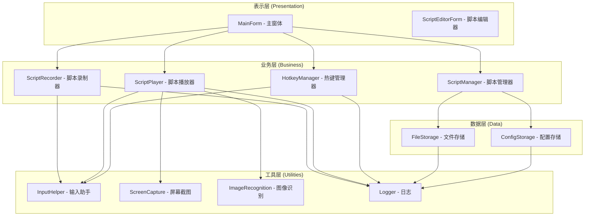

# KeyForge 简化架构设计

## 执行摘要

基于当前项目的过度设计问题，本设计采用 KISS 原则，构建一个简化的三层架构，专注于按键录制回放的核心功能。

## 当前问题分析

### 原本实现的问题：
1. **过度复杂的架构**：6个层级（Domain、Application、Infrastructure、Core、UI、Presentation）
2. **不必要的DDD概念**：Entity、AggregateRoot、ValueObject、DomainEvent等
3. **过多的抽象层**：17个转换器，复杂的接口继承体系
4. **仓储模式滥用**：简单的文件存储被过度抽象
5. **依赖注入复杂化**：IoC容器配置繁琐

### 简化原则：
1. **KISS原则**：保持简单，移除不必要的复杂性
2. **直接依赖**：减少接口抽象，直接使用具体实现
3. **文件存储**：直接使用JSON文件，移除仓储模式
4. **简单模型**：使用基本数据类型，移除DDD复杂概念

## 简化架构设计

### 系统架构图



### 核心组件设计

#### 1. 数据模型（Models）

```csharp
// 简化后的数据模型 - 移除DDD复杂概念
namespace KeyForge.Models
{
    public enum ActionType
    {
        KeyPress,
        KeyRelease,
        MouseMove,
        MouseClick,
        MouseDown,
        MouseUp,
        Delay,
        Screenshot
    }

    public class KeyAction
    {
        public ActionType Type { get; set; }
        public string Key { get; set; }
        public int X { get; set; }
        public int Y { get; set; }
        public int Delay { get; set; }
        public DateTime Timestamp { get; set; }
    }

    public class Script
    {
        public string Name { get; set; }
        public string Description { get; set; }
        public List<KeyAction> Actions { get; set; }
        public int RepeatCount { get; set; }
        public bool Loop { get; set; }
        public DateTime CreatedAt { get; set; }
        public DateTime UpdatedAt { get; set; }

        public Script()
        {
            Actions = new List<KeyAction>();
            RepeatCount = 1;
            Loop = false;
            CreatedAt = DateTime.Now;
            UpdatedAt = DateTime.Now;
        }
    }

    public class GlobalSettings
    {
        public int DefaultDelay { get; set; } = 100;
        public bool EnableLogging { get; set; } = true;
        public string ScriptsDirectory { get; set; } = "scripts";
        public string RecordHotkey { get; set; } = "F6";
        public string PlayHotkey { get; set; } = "F7";
        public string StopHotkey { get; set; } = "F8";
    }

    public class Config
    {
        public GlobalSettings Settings { get; set; }
        public List<Script> Scripts { get; set; }

        public Config()
        {
            Settings = new GlobalSettings();
            Scripts = new List<Script>();
        }
    }
}
```

#### 2. 业务服务（Services）

```csharp
// 简化后的业务服务 - 直接实现，无需接口
namespace KeyForge.Services
{
    public class ScriptManager
    {
        private readonly FileStorage _fileStorage;
        private readonly Logger _logger;
        private Config _config;

        public ScriptManager(FileStorage fileStorage, Logger logger)
        {
            _fileStorage = fileStorage;
            _logger = logger;
            _config = LoadConfig();
        }

        // 简化实现：直接使用JSON序列化
        public void SaveScript(Script script)
        {
            try
            {
                var filePath = Path.Combine(_config.Settings.ScriptsDirectory, $"{script.Name}.json");
                var json = JsonConvert.SerializeObject(script, Formatting.Indented);
                File.WriteAllText(filePath, json);
                
                _logger.Info($"脚本已保存: {script.Name}");
            }
            catch (Exception ex)
            {
                _logger.Error($"保存脚本失败: {ex.Message}");
                throw;
            }
        }

        public Script LoadScript(string scriptName)
        {
            try
            {
                var filePath = Path.Combine(_config.Settings.ScriptsDirectory, $"{scriptName}.json");
                if (!File.Exists(filePath))
                    return null;

                var json = File.ReadAllText(filePath);
                return JsonConvert.DeserializeObject<Script>(json);
            }
            catch (Exception ex)
            {
                _logger.Error($"加载脚本失败: {ex.Message}");
                throw;
            }
        }

        public List<Script> GetAllScripts()
        {
            var scripts = new List<Script>();
            var directory = _config.Settings.ScriptsDirectory;
            
            if (!Directory.Exists(directory))
                return scripts;

            foreach (var file in Directory.GetFiles(directory, "*.json"))
            {
                try
                {
                    var json = File.ReadAllText(file);
                    var script = JsonConvert.DeserializeObject<Script>(json);
                    if (script != null)
                        scripts.Add(script);
                }
                catch (Exception ex)
                {
                    _logger.Error($"加载脚本文件失败: {file} - {ex.Message}");
                }
            }

            return scripts;
        }

        private Config LoadConfig()
        {
            try
            {
                if (File.Exists("config.json"))
                {
                    var json = File.ReadAllText("config.json");
                    return JsonConvert.DeserializeObject<Config>(json) ?? new Config();
                }
                return new Config();
            }
            catch (Exception ex)
            {
                _logger.Error($"加载配置失败: {ex.Message}");
                return new Config();
            }
        }
    }

    public class ScriptRecorder
    {
        private readonly InputHelper _inputHelper;
        private readonly Logger _logger;
        private List<KeyAction> _recordedActions;
        private bool _isRecording;

        public ScriptRecorder(InputHelper inputHelper, Logger logger)
        {
            _inputHelper = inputHelper;
            _logger = logger;
            _recordedActions = new List<KeyAction>();
        }

        public void StartRecording()
        {
            _isRecording = true;
            _recordedActions.Clear();
            _inputHelper.StartRecording(OnActionRecorded);
            _logger.Info("开始录制");
        }

        public void StopRecording()
        {
            _isRecording = false;
            _inputHelper.StopRecording();
            _logger.Info($"录制完成，共 {_recordedActions.Count} 个动作");
        }

        public Script GetRecordedScript()
        {
            return new Script
            {
                Name = $"录制脚本_{DateTime.Now:yyyyMMdd_HHmmss}",
                Description = "录制的脚本",
                Actions = new List<KeyAction>(_recordedActions),
                CreatedAt = DateTime.Now,
                UpdatedAt = DateTime.Now
            };
        }

        private void OnActionRecorded(KeyAction action)
        {
            if (_isRecording)
            {
                _recordedActions.Add(action);
                _logger.Debug($"录制动作: {action.Type} - {action.Key}");
            }
        }
    }
}
```

#### 3. 工具类（Utilities）

```csharp
// 简化后的工具类 - 直接实现，无需接口
namespace KeyForge.Utilities
{
    public class InputHelper
    {
        private readonly Logger _logger;
        private global::System.Windows.Forms.Keys _lastKey;
        private DateTime _lastKeyTime;

        public InputHelper(Logger logger)
        {
            _logger = logger;
        }

        public void StartRecording(Action<KeyAction> onActionRecorded)
        {
            // 简化实现：使用Windows Forms的键盘事件
            var form = new Form();
            form.KeyPreview = true;
            form.KeyDown += (s, e) => 
            {
                var action = new KeyAction
                {
                    Type = ActionType.KeyPress,
                    Key = e.KeyCode.ToString(),
                    Timestamp = DateTime.Now,
                    Delay = (int)(DateTime.Now - _lastKeyTime).TotalMilliseconds
                };
                onActionRecorded?.Invoke(action);
                _lastKey = e.KeyCode;
                _lastKeyTime = DateTime.Now;
            };
            form.Show();
        }

        public void StopRecording()
        {
            // 停止录制
        }

        public void SendKey(string key)
        {
            try
            {
                // 简化实现：使用SendKeys
                SendKeys.Send(key);
                _logger.Debug($"发送按键: {key}");
            }
            catch (Exception ex)
            {
                _logger.Error($"发送按键失败: {ex.Message}");
                throw;
            }
        }

        public void MoveMouse(int x, int y)
        {
            try
            {
                Cursor.Position = new Point(x, y);
                _logger.Debug($"移动鼠标到: ({x}, {y})");
            }
            catch (Exception ex)
            {
                _logger.Error($"移动鼠标失败: {ex.Message}");
                throw;
            }
        }

        public void ClickMouse(int x, int y)
        {
            try
            {
                MoveMouse(x, y);
                // 简化实现：使用mouse_event
                mouse_event(MOUSEEVENTF_LEFTDOWN, x, y, 0, 0);
                mouse_event(MOUSEEVENTF_LEFTUP, x, y, 0, 0);
                _logger.Debug($"点击鼠标: ({x}, {y})");
            }
            catch (Exception ex)
            {
                _logger.Error($"点击鼠标失败: {ex.Message}");
                throw;
            }
        }

        // Windows API 声明
        [DllImport("user32.dll")]
        private static extern void mouse_event(uint dwFlags, int dx, int dy, uint dwData, int dwExtraInfo);

        private const uint MOUSEEVENTF_LEFTDOWN = 0x02;
        private const uint MOUSEEVENTF_LEFTUP = 0x04;
    }

    public class FileStorage
    {
        private readonly Logger _logger;

        public FileStorage(Logger logger)
        {
            _logger = logger;
        }

        public void SaveJson<T>(string filePath, T data)
        {
            try
            {
                var directory = Path.GetDirectoryName(filePath);
                if (!Directory.Exists(directory))
                    Directory.CreateDirectory(directory);

                var json = JsonConvert.SerializeObject(data, Formatting.Indented);
                File.WriteAllText(filePath, json);
                _logger.Debug($"保存JSON文件: {filePath}");
            }
            catch (Exception ex)
            {
                _logger.Error($"保存JSON文件失败: {ex.Message}");
                throw;
            }
        }

        public T LoadJson<T>(string filePath)
        {
            try
            {
                if (!File.Exists(filePath))
                    return default(T);

                var json = File.ReadAllText(filePath);
                return JsonConvert.DeserializeObject<T>(json);
            }
            catch (Exception ex)
            {
                _logger.Error($"加载JSON文件失败: {ex.Message}");
                throw;
            }
        }
    }

    public class Logger
    {
        private readonly string _logFilePath;

        public Logger()
        {
            var logDir = "logs";
            if (!Directory.Exists(logDir))
                Directory.CreateDirectory(logDir);

            _logFilePath = Path.Combine(logDir, $"keyforge_{DateTime.Now:yyyyMMdd}.log");
        }

        public void Info(string message)
        {
            Log("INFO", message);
        }

        public void Debug(string message)
        {
            Log("DEBUG", message);
        }

        public void Error(string message)
        {
            Log("ERROR", message);
        }

        private void Log(string level, string message)
        {
            var logEntry = $"[{DateTime.Now:yyyy-MM-dd HH:mm:ss.fff}] [{level}] {message}";
            File.AppendAllText(_logFilePath, logEntry + Environment.NewLine);
        }
    }
}
```

### 依赖注入简化

```csharp
// 简化后的依赖注入 - 直接在MainForm中创建
public class MainForm : Form
{
    private readonly ScriptManager _scriptManager;
    private readonly ScriptRecorder _scriptRecorder;
    private readonly ScriptPlayer _scriptPlayer;
    private readonly HotkeyManager _hotkeyManager;

    public MainForm()
    {
        // 简化实现：直接创建依赖
        var logger = new Logger();
        var fileStorage = new FileStorage(logger);
        var inputHelper = new InputHelper(logger);
        var screenCapture = new ScreenCapture(logger);
        var imageRecognition = new ImageRecognition(logger);

        _scriptManager = new ScriptManager(fileStorage, logger);
        _scriptRecorder = new ScriptRecorder(inputHelper, logger);
        _scriptPlayer = new ScriptPlayer(inputHelper, screenCapture, imageRecognition, logger);
        _hotkeyManager = new HotkeyManager(inputHelper, logger);

        InitializeComponent();
        InitializeServices();
    }
}
```

## 项目结构简化

### 原本项目结构：
```
KeyForge/
├── KeyForge.Domain/          # 领域层 (复杂DDD)
├── KeyForge.Application/     # 应用层
├── KeyForge.Infrastructure/   # 基础设施层
├── KeyForge.Core/           # 核心层
├── KeyForge.UI/            # UI层
├── KeyForge.Presentation/   # 表示层
└── KeyForge.Tests/          # 测试层
```

### 简化后项目结构：
```
KeyForge/
├── KeyForge.App/            # 主应用程序
│   ├── Models/             # 数据模型
│   ├── Services/           # 业务服务
│   ├── Utilities/          # 工具类
│   └── Forms/             # 窗体
├── KeyForge.Tests/         # 测试
└── packages/              # 第三方包
```

## 性能优化

### 1. 内存管理
- 使用对象池减少GC压力
- 及时释放图像资源
- 限制缓存大小

### 2. 执行性能
- 异步处理耗时操作
- 使用Task而非Thread
- 优化按键精度

### 3. 响应速度
- UI线程不阻塞
- 使用BackgroundWorker
- 实时状态更新

## 迁移策略

### 1. 数据迁移
- 将现有Domain模型转换为简单模型
- 保持数据兼容性
- 渐进式迁移

### 2. 代码迁移
- 保留核心功能
- 简化业务逻辑
- 移除不必要的抽象

### 3. 测试策略
- 单元测试覆盖
- 集成测试验证
- 性能测试确认

## 总结

本简化架构设计：

1. **减少复杂性**：从6层简化为3层架构
2. **移除过度设计**：去掉DDD、仓储模式等复杂概念
3. **简化依赖管理**：直接依赖，减少接口抽象
4. **提高可维护性**：代码更直观，更容易理解和修改
5. **保持功能完整**：核心功能不受影响

这种简化架构完全符合KISS原则，能够有效解决当前项目的过度设计问题。