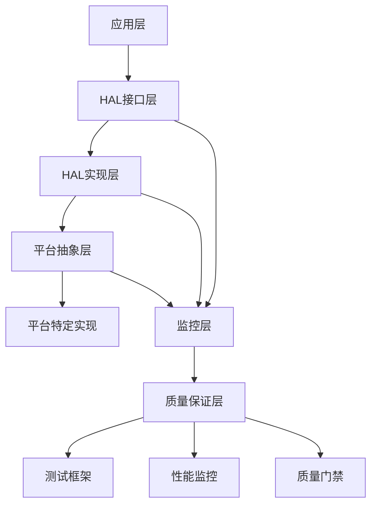

# KeyForge 硬件抽象层设计 v2.0

## 执行摘要

基于质量评估报告和优化需求规格，本文档详细设计了KeyForge按键脚本系统的硬件抽象层（HAL）。新版本集成了完整的质量保证体系、性能监控和平台抽象，确保跨平台兼容性和测试覆盖率>80%。

## 设计目标

### 核心目标
1. **平台无关性** - 核心业务逻辑与平台实现完全分离
2. **高性能** - 接近原生平台的性能表现
3. **可测试性** - 所有组件都支持单元测试和集成测试
4. **可观测性** - 完整的监控、日志和诊断能力
5. **质量保证** - 集成完整的质量检查机制

### 质量目标
- **接口覆盖率**: 100%
- **测试覆盖率**: >80%
- **性能指标**: 满足实时响应要求
- **兼容性**: 支持Windows、macOS、Linux三大平台

## 架构设计

### 分层架构


### 核心接口设计

#### IHardwareAbstractionLayer 根接口
```csharp
// 硬件抽象层根接口
public interface IHardwareAbstractionLayer : IDisposable
{
    // 核心服务
    IKeyboardService Keyboard { get; }
    IMouseService Mouse { get; }
    IScreenService Screen { get; }
    IGlobalHotkeyService GlobalHotkeys { get; }
    IWindowService Window { get; }
    IImageRecognitionService ImageRecognition { get; }
    
    // 平台信息和状态
    PlatformInfo PlatformInfo { get; }
    HALStatus Status { get; }
    
    // 生命周期管理
    Task InitializeAsync();
    Task ShutdownAsync();
    bool IsInitialized { get; }
    
    // 权限管理
    Task<PermissionStatus> CheckPermissionsAsync();
    Task<bool> RequestPermissionsAsync(PermissionRequest request);
    
    // 健康检查
    Task<HealthCheckResult> PerformHealthCheckAsync();
    
    // 性能监控
    Task<PerformanceMetrics> GetPerformanceMetricsAsync();
    
    // 事件
    event EventHandler<PlatformEventArgs> PlatformChanged;
    event EventHandler<HardwareEventArgs> HardwareStateChanged;
    event EventHandler<PerformanceEventArgs> PerformanceReported;
}

// 平台信息
public class PlatformInfo
{
    public Platform Platform { get; set; }
    public string Name { get; set; }
    public string Version { get; set; }
    public string Architecture { get; set; }
    public PlatformCapabilities Capabilities { get; set; }
    public Dictionary<string, string> Properties { get; set; }
}

// 平台能力
public class PlatformCapabilities
{
    public bool GlobalHotkeys { get; set; }
    public bool ScreenCapture { get; set; }
    public bool InputInjection { get; set; }
    public bool WindowControl { get; set; }
    public bool ImageRecognition { get; set; }
    public bool PerformanceMonitoring { get; set; }
    public bool AdministratorRequired { get; set; }
    public bool AccessibilityRequired { get; set; }
}

// HAL状态
public enum HALStatus
{
    Uninitialized,
    Initializing,
    Initialized,
    Running,
    Stopping,
    Stopped,
    Error
}
```

## 核心服务接口

### 键盘服务接口
```csharp
// 键盘服务接口
public interface IKeyboardService : IDisposable
{
    // 基本操作
    Task<bool> PressKeyAsync(KeyCode key, KeyModifiers modifiers = KeyModifiers.None);
    Task<bool> ReleaseKeyAsync(KeyCode key, KeyModifiers modifiers = KeyModifiers.None);
    Task<bool> TypeTextAsync(string text, int delay = 10);
    
    // 组合键操作
    Task<bool> PressCombinationAsync(KeyCode key, KeyModifiers modifiers);
    Task<bool> ReleaseCombinationAsync(KeyCode key, KeyModifiers modifiers);
    
    // 状态查询
    Task<bool> IsKeyPressedAsync(KeyCode key);
    Task<KeyState> GetKeyStateAsync(KeyCode key);
    
    // 批量操作
    Task<bool> ExecuteKeySequenceAsync(IEnumerable<KeyAction> actions);
    
    // 事件
    event EventHandler<KeyEventArgs> KeyPressed;
    event EventHandler<KeyEventArgs> KeyReleased;
    event EventHandler<KeyEventArgs> KeyTyped;
    
    // 监控
    Task<KeyboardMetrics> GetMetricsAsync();
}

// 键盘事件参数
public class KeyEventArgs : EventArgs
{
    public KeyCode Key { get; set; }
    public KeyModifiers Modifiers { get; set; }
    public DateTime Timestamp { get; set; }
    public Platform Platform { get; set; }
    public Dictionary<string, object> Properties { get; set; }
}

// 键盘动作
public class KeyAction
{
    public KeyActionType Type { get; set; }
    public KeyCode Key { get; set; }
    public KeyModifiers Modifiers { get; set; }
    public string Text { get; set; }
    public int Delay { get; set; }
    public Dictionary<string, object> Parameters { get; set; }
}

// 键盘指标
public class KeyboardMetrics
{
    public int KeysPressed { get; set; }
    public int KeysReleased { get; set; }
    public double AverageKeyPressTime { get; set; }
    public double KeyThroughput { get; set; }
    public Dictionary<string, double> CustomMetrics { get; set; }
}
```

### 鼠标服务接口
```csharp
// 鼠标服务接口
public interface IMouseService : IDisposable
{
    // 基本移动
    Task<bool> MoveToAsync(int x, int y, bool smooth = true, int duration = 0);
    Task<bool> MoveRelativeAsync(int deltaX, int deltaY, bool smooth = true, int duration = 0);
    
    // 点击操作
    Task<bool> ClickAsync(MouseButton button = MouseButton.Left, int count = 1);
    Task<bool> DoubleClickAsync(MouseButton button = MouseButton.Left);
    Task<bool> PressButtonAsync(MouseButton button);
    Task<bool> ReleaseButtonAsync(MouseButton button);
    
    // 滚轮操作
    Task<bool> ScrollAsync(int delta, ScrollDirection direction = ScrollDirection.Vertical);
    Task<bool> ScrollHorizontalAsync(int delta);
    
    // 拖拽操作
    Task<bool> DragToAsync(int x, int y, MouseButton button = MouseButton.Left);
    Task<bool> DragRelativeAsync(int deltaX, int deltaY, MouseButton button = MouseButton.Left);
    
    // 状态查询
    Task<Point> GetPositionAsync();
    Task<bool> IsButtonPressedAsync(MouseButton button);
    Task<MouseState> GetStateAsync();
    
    // 批量操作
    Task<bool> ExecuteMouseSequenceAsync(IEnumerable<MouseAction> actions);
    
    // 事件
    event EventHandler<MouseEventArgs> MouseMoved;
    event EventHandler<MouseEventArgs> MouseButtonPressed;
    event EventHandler<MouseEventArgs> MouseButtonReleased;
    event EventHandler<MouseEventArgs> MouseScrolled;
    
    // 监控
    Task<MouseMetrics> GetMetricsAsync();
}

// 鼠标事件参数
public class MouseEventArgs : EventArgs
{
    public Point Position { get; set; }
    public MouseButton Button { get; set; }
    public int Delta { get; set; }
    public ScrollDirection ScrollDirection { get; set; }
    public DateTime Timestamp { get; set; }
    public Platform Platform { get; set; }
    public Dictionary<string, object> Properties { get; set; }
}

// 鼠标指标
public class MouseMetrics
{
    public int MouseMovements { get; set; }
    public int MouseClicks { get; set; }
    public int MouseScrolls { get; set; }
    public double AverageMoveTime { get; set; }
    public double MouseThroughput { get; set; }
    public Dictionary<string, double> CustomMetrics { get; set; }
}
```

### 屏幕服务接口
```csharp
// 屏幕服务接口
public interface IScreenService : IDisposable
{
    // 屏幕信息
    Task<ScreenInfo> GetScreenInfoAsync(int screenIndex = -1);
    Task<List<ScreenInfo>> GetAllScreensAsync();
    
    // 截图操作
    Task<ScreenCapture> CaptureScreenAsync(ScreenCaptureOptions options = null);
    Task<ScreenCapture> CaptureRegionAsync(Rectangle region, ScreenCaptureOptions options = null);
    Task<ScreenCapture> CaptureWindowAsync(IntPtr windowHandle, ScreenCaptureOptions options = null);
    
    // 颜色操作
    Task<Color> GetPixelColorAsync(int x, int y, int screenIndex = -1);
    Task<List<Color>> GetPixelColorsAsync(IEnumerable<Point> points, int screenIndex = -1);
    Task<ColorMatchResult> FindColorAsync(Color targetColor, Rectangle searchArea, ColorMatchOptions options = null);
    
    // 屏幕配置
    Task<bool> SetResolutionAsync(int screenIndex, int width, int height, int refreshRate = 60);
    Task<bool> SetDpiAsync(int screenIndex, double dpi);
    
    // 监控
    Task<ScreenMetrics> GetMetricsAsync();
    
    // 事件
    event EventHandler<ScreenEventArgs> ScreenChanged;
    event EventHandler<ScreenEventArgs> ResolutionChanged;
}

// 屏幕信息
public class ScreenInfo
{
    public int Index { get; set; }
    public Rectangle Bounds { get; set; }
    public Rectangle WorkingArea { get; set; }
    public string DeviceName { get; set; }
    public int Dpi { get; set; }
    public double ScaleFactor { get; set; }
    public int RefreshRate { get; set; }
    public bool IsPrimary { get; set; }
    public ColorDepth ColorDepth { get; set; }
}

// 屏幕截图
public class ScreenCapture
{
    public byte[] ImageData { get; set; }
    public ImageFormat Format { get; set; }
    public Size Size { get; set; }
    public Rectangle Region { get; set; }
    public DateTime CaptureTime { get; set; }
    public double CaptureDuration { get; set; }
    public int ScreenIndex { get; set; }
    public Dictionary<string, object> Metadata { get; set; }
}

// 屏幕指标
public class ScreenMetrics
{
    public int ScreenCaptures { get; set; }
    public int ColorQueries { get; set; }
    public double AverageCaptureTime { get; set; }
    public double AverageColorQueryTime { get; set; }
    public Dictionary<string, double> CustomMetrics { get; set; }
}
```

### 图像识别服务接口
```csharp
// 图像识别服务接口
public interface IImageRecognitionService : IDisposable
{
    // 模板匹配
    Task<ImageMatchResult> FindTemplateAsync(string templatePath, Rectangle searchArea, TemplateMatchOptions options = null);
    Task<List<ImageMatchResult>> FindAllTemplatesAsync(string templatePath, Rectangle searchArea, TemplateMatchOptions options = null);
    
    // 图像特征
    Task<ImageFeatures> ExtractFeaturesAsync(string imagePath, FeatureExtractionOptions options = null);
    Task<FeatureMatchResult> MatchFeaturesAsync(string templatePath, string targetPath, FeatureMatchOptions options = null);
    
    // OCR识别
    Task<OcrResult> RecognizeTextAsync(string imagePath, OcrOptions options = null);
    Task<OcrResult> RecognizeTextAsync(byte[] imageData, OcrOptions options = null);
    
    // 模板管理
    Task<bool> LoadTemplateAsync(string templateId, string templatePath);
    Task<bool> SaveTemplateAsync(string templateId, string templatePath);
    Task<ImageTemplate> GetTemplateAsync(string templateId);
    
    // 批量操作
    Task<List<ImageMatchResult>> BatchFindTemplateAsync(IEnumerable<TemplateSearchRequest> requests);
    
    // 监控
    Task<ImageRecognitionMetrics> GetMetricsAsync();
    
    // 事件
    event EventHandler<ImageRecognitionEventArgs> TemplateMatched;
    event EventHandler<ImageRecognitionEventArgs> FeaturesExtracted;
    event EventHandler<ImageRecognitionEventArgs> TextRecognized;
}

// 图像匹配结果
public class ImageMatchResult
{
    public bool Success { get; set; }
    public Point Location { get; set; }
    public Rectangle MatchRegion { get; set; }
    public double Confidence { get; set; }
    public double ProcessingTime { get; set; }
    public string TemplatePath { get; set; }
    public string Engine { get; set; }
    public Dictionary<string, object> Properties { get; set; }
}

// 图像识别指标
public class ImageRecognitionMetrics
{
    public int TemplateMatches { get; set; }
    public int FeatureExtractions { get; set; }
    public int TextRecognitions { get; set; }
    public double AverageMatchTime { get; set; }
    public double AverageFeatureExtractionTime { get; set; }
    public double AverageOcrTime { get; set; }
    public Dictionary<string, double> CustomMetrics { get; set; }
}
```

### 全局热键服务接口
```csharp
// 全局热键服务接口
public interface IGlobalHotkeyService : IDisposable
{
    // 注册/注销
    Task<HotkeyRegistration> RegisterHotkeyAsync(string id, KeyCode key, KeyModifiers modifiers, HotkeyAction action);
    Task<bool> UnregisterHotkeyAsync(string id);
    Task<bool> UnregisterAllHotkeysAsync();
    
    // 查询
    Task<List<HotkeyRegistration>> GetRegisteredHotkeysAsync();
    Task<HotkeyRegistration> GetHotkeyAsync(string id);
    Task<bool> IsHotkeyRegisteredAsync(string id);
    
    // 控制
    Task<bool> EnableHotkeyAsync(string id);
    Task<bool> DisableHotkeyAsync(string id);
    Task<bool> SetHotkeyPriorityAsync(string id, int priority);
    
    // 批量操作
    Task<List<HotkeyRegistration>> RegisterMultipleHotkeysAsync(IEnumerable<HotkeyDefinition> definitions);
    
    // 监控
    Task<HotkeyMetrics> GetMetricsAsync();
    
    // 事件
    event EventHandler<HotkeyEventArgs> HotkeyTriggered;
    event EventHandler<HotkeyEventArgs> HotkeyRegistered;
    event EventHandler<HotkeyEventArgs> HotkeyUnregistered;
    event EventHandler<HotkeyConflictEventArgs> HotkeyConflict;
}

// 热键注册
public class HotkeyRegistration
{
    public string Id { get; set; }
    public KeyCode Key { get; set; }
    public KeyModifiers Modifiers { get; set; }
    public HotkeyAction Action { get; set; }
    public bool IsActive { get; set; }
    public int Priority { get; set; }
    public DateTime RegisteredAt { get; set; }
    public DateTime LastTriggered { get; set; }
    public int TriggerCount { get; set; }
    public Dictionary<string, object> Properties { get; set; }
}

// 热键指标
public class HotkeyMetrics
{
    public int RegisteredHotkeys { get; set; }
    public int ActiveHotkeys { get; set; }
    public int HotkeyTriggers { get; set; }
    public int HotkeyConflicts { get; set; }
    public double AverageTriggerTime { get; set; }
    public Dictionary<string, double> CustomMetrics { get; set; }
}
```

### 窗口服务接口
```csharp
// 窗口服务接口
public interface IWindowService : IDisposable
{
    // 查找窗口
    Task<IntPtr> FindWindowAsync(string windowTitle, string className = null);
    Task<IntPtr> FindWindowByProcessAsync(int processId);
    Task<List<IntPtr>> FindAllWindowsAsync(string windowTitle, string className = null);
    
    // 窗口操作
    Task<bool> ActivateWindowAsync(IntPtr windowHandle);
    Task<bool> MinimizeWindowAsync(IntPtr windowHandle);
    Task<bool> MaximizeWindowAsync(IntPtr windowHandle);
    Task<bool> RestoreWindowAsync(IntPtr windowHandle);
    Task<bool> CloseWindowAsync(IntPtr windowHandle);
    
    // 窗口信息
    Task<WindowInfo> GetWindowInfoAsync(IntPtr windowHandle);
    Task<Rectangle> GetWindowBoundsAsync(IntPtr windowHandle);
    Task<bool> IsWindowVisibleAsync(IntPtr windowHandle);
    Task<bool> IsWindowActiveAsync(IntPtr windowHandle);
    
    // 窗口移动
    Task<bool> MoveWindowAsync(IntPtr windowHandle, int x, int y);
    Task<bool> ResizeWindowAsync(IntPtr windowHandle, int width, int height);
    
    // 窗口截图
    Task<ScreenCapture> CaptureWindowAsync(IntPtr windowHandle, ScreenCaptureOptions options = null);
    
    // 监控
    Task<WindowMetrics> GetMetricsAsync();
    
    // 事件
    event EventHandler<WindowEventArgs> WindowActivated;
    event EventHandler<WindowEventArgs> WindowCreated;
    event EventHandler<WindowEventArgs> WindowDestroyed;
    event EventHandler<WindowEventArgs> WindowMoved;
    event EventHandler<WindowEventArgs> WindowResized;
}

// 窗口信息
public class WindowInfo
{
    public IntPtr Handle { get; set; }
    public string Title { get; set; }
    public string ClassName { get; set; }
    public Rectangle Bounds { get; set; }
    public int ProcessId { get; set; }
    public WindowStyles Styles { get; set; }
    public WindowStates State { get; set; }
    public bool IsVisible { get; set; }
    public bool IsActive { get; set; }
    public DateTime CreatedAt { get; set; }
    public Dictionary<string, object> Properties { get; set; }
}

// 窗口指标
public class WindowMetrics
{
    public int WindowOperations { get; set; }
    public int WindowSearches { get; set; }
    public int WindowActivations { get; set; }
    public double AverageOperationTime { get; set; }
    public double AverageSearchTime { get; set; }
    public Dictionary<string, double> CustomMetrics { get; set; }
}
```

## 平台实现架构

### 平台抽象基类
```csharp
// 平台抽象基类
public abstract class PlatformHALBase : IHardwareAbstractionLayer
{
    protected readonly ILogger<PlatformHALBase> _logger;
    protected readonly IPerformanceMonitor _performanceMonitor;
    protected readonly IHealthChecker _healthChecker;
    
    protected PlatformHALBase(
        ILogger<PlatformHALBase> logger,
        IPerformanceMonitor performanceMonitor,
        IHealthChecker healthChecker)
    {
        _logger = logger;
        _performanceMonitor = performanceMonitor;
        _healthChecker = healthChecker;
    }
    
    public abstract Platform Platform { get; }
    public abstract PlatformInfo PlatformInfo { get; }
    public abstract HALStatus Status { get; protected set; }
    
    public abstract IKeyboardService Keyboard { get; }
    public abstract IMouseService Mouse { get; }
    public abstract IScreenService Screen { get; }
    public abstract IGlobalHotkeyService GlobalHotkeys { get; }
    public abstract IWindowService Window { get; }
    public abstract IImageRecognitionService ImageRecognition { get; }
    
    public abstract Task InitializeAsync();
    public abstract Task ShutdownAsync();
    public abstract bool IsInitialized { get; }
    
    public abstract Task<PermissionStatus> CheckPermissionsAsync();
    public abstract Task<bool> RequestPermissionsAsync(PermissionRequest request);
    
    public abstract Task<HealthCheckResult> PerformHealthCheckAsync();
    public abstract Task<PerformanceMetrics> GetPerformanceMetricsAsync();
    
    public abstract event EventHandler<PlatformEventArgs> PlatformChanged;
    public abstract event EventHandler<HardwareEventArgs> HardwareStateChanged;
    public abstract event EventHandler<PerformanceEventArgs> PerformanceReported;
    
    protected void LogOperation(string operation, TimeSpan duration, bool success)
    {
        _performanceMonitor.RecordMetric("hal_operation_duration", duration.TotalMilliseconds, new Dictionary<string, string>
        {
            { "platform", Platform.ToString() },
            { "operation", operation },
            { "success", success.ToString() }
        });
    }
    
    protected void ValidatePlatformSupport()
    {
        var capabilities = PlatformInfo.Capabilities;
        var issues = new List<string>();
        
        if (!capabilities.GlobalHotkeys)
            issues.Add("Global hotkeys not supported");
        if (!capabilities.ScreenCapture)
            issues.Add("Screen capture not supported");
        if (!capabilities.InputInjection)
            issues.Add("Input injection not supported");
        
        if (issues.Any())
        {
            _logger.LogWarning("Platform {Platform} has limitations: {Issues}", Platform, string.Join(", ", issues));
        }
    }
}
```

### 平台工厂
```csharp
// 平台工厂
public class PlatformHALFactory : IPlatformHALFactory
{
    private readonly ILogger<PlatformHALFactory> _logger;
    private readonly IServiceProvider _serviceProvider;
    private readonly Dictionary<Platform, Func<IHardwareAbstractionLayer>> _platformFactories;
    
    public PlatformHALFactory(
        ILogger<PlatformHALFactory> logger,
        IServiceProvider serviceProvider)
    {
        _logger = logger;
        _serviceProvider = serviceProvider;
        
        _platformFactories = new Dictionary<Platform, Func<IHardwareAbstractionLayer>>
        {
            [Platform.Windows] = CreateWindowsHAL,
            [Platform.MacOS] = CreateMacOSHAL,
            [Platform.Linux] = CreateLinuxHAL
        };
    }
    
    public IHardwareAbstractionLayer CreateHAL(Platform platform)
    {
        if (_platformFactories.TryGetValue(platform, out var factory))
        {
            return factory();
        }
        
        throw new NotSupportedException($"Platform {platform} is not supported");
    }
    
    public IHardwareAbstractionLayer CreateAutoDetectHAL()
    {
        var detectedPlatform = PlatformDetector.DetectPlatform();
        _logger.LogInformation("Detected platform: {Platform}", detectedPlatform);
        return CreateHAL(detectedPlatform);
    }
    
    private IHardwareAbstractionLayer CreateWindowsHAL()
    {
        return new WindowsHAL(
            _serviceProvider.GetRequiredService<ILogger<WindowsHAL>>(),
            _serviceProvider.GetRequiredService<IPerformanceMonitor>(),
            _serviceProvider.GetRequiredService<IHealthChecker>(),
            _serviceProvider.GetRequiredService<IKeyboardService>(),
            _serviceProvider.GetRequiredService<IMouseService>(),
            _serviceProvider.GetRequiredService<IScreenService>(),
            _serviceProvider.GetRequiredService<IGlobalHotkeyService>(),
            _serviceProvider.GetRequiredService<IWindowService>(),
            _serviceProvider.GetRequiredService<IImageRecognitionService>());
    }
    
    private IHardwareAbstractionLayer CreateMacOSHAL()
    {
        return new MacOSHAL(
            _serviceProvider.GetRequiredService<ILogger<MacOSHAL>>(),
            _serviceProvider.GetRequiredService<IPerformanceMonitor>(),
            _serviceProvider.GetRequiredService<IHealthChecker>(),
            _serviceProvider.GetRequiredService<IKeyboardService>(),
            _serviceProvider.GetRequiredService<IMouseService>(),
            _serviceProvider.GetRequiredService<IScreenService>(),
            _serviceProvider.GetRequiredService<IGlobalHotkeyService>(),
            _serviceProvider.GetRequiredService<IWindowService>(),
            _serviceProvider.GetRequiredService<IImageRecognitionService>());
    }
    
    private IHardwareAbstractionLayer CreateLinuxHAL()
    {
        return new LinuxHAL(
            _serviceProvider.GetRequiredService<ILogger<LinuxHAL>>(),
            _serviceProvider.GetRequiredService<IPerformanceMonitor>(),
            _serviceProvider.GetRequiredService<IHealthChecker>(),
            _serviceProvider.GetRequiredService<IKeyboardService>(),
            _serviceProvider.GetRequiredService<IMouseService>(),
            _serviceProvider.GetRequiredService<IScreenService>(),
            _serviceProvider.GetRequiredService<IGlobalHotkeyService>(),
            _serviceProvider.GetRequiredService<IWindowService>(),
            _serviceProvider.GetRequiredService<IImageRecognitionService>());
    }
}
```

## 质量保证集成

### 测试支持
```csharp
// HAL测试基类
public abstract class HALTestBase : TestBase
{
    protected IHardwareAbstractionLayer HAL { get; private set; }
    protected Platform TestPlatform { get; private set; }
    
    protected override void Setup()
    {
        base.Setup();
        
        TestPlatform = GetTestPlatform();
        HAL = CreateTestHAL();
        
        // 初始化HAL
        HAL.InitializeAsync().Wait();
    }
    
    protected override void Cleanup()
    {
        HAL?.ShutdownAsync().Wait();
        HAL?.Dispose();
        
        base.Cleanup();
    }
    
    protected abstract Platform GetTestPlatform();
    
    protected virtual IHardwareAbstractionLayer CreateTestHAL()
    {
        var factory = ServiceProvider.GetRequiredService<IPlatformHALFactory>();
        return factory.CreateHAL(TestPlatform);
    }
    
    protected async Task TestHALInitialization()
    {
        // 测试HAL初始化
        Assert.True(HAL.IsInitialized);
        
        // 测试平台信息
        var platformInfo = HAL.PlatformInfo;
        Assert.NotNull(platformInfo);
        Assert.Equal(TestPlatform, platformInfo.Platform);
        
        // 测试健康检查
        var healthResult = await HAL.PerformHealthCheckAsync();
        Assert.True(healthResult.Status == HealthStatus.Healthy);
    }
    
    protected async Task TestServiceAvailability()
    {
        // 测试所有服务可用性
        Assert.NotNull(HAL.Keyboard);
        Assert.NotNull(HAL.Mouse);
        Assert.NotNull(HAL.Screen);
        Assert.NotNull(HAL.GlobalHotkeys);
        Assert.NotNull(HAL.Window);
        Assert.NotNull(HAL.ImageRecognition);
    }
}

// 跨平台HAL测试
public class CrossPlatformHALTests : HALTestBase
{
    [Theory]
    [InlineData(Platform.Windows)]
    [InlineData(Platform.MacOS)]
    [InlineData(Platform.Linux)]
    public async Task HAL_Initialization_ShouldWork_AcrossPlatforms(Platform platform)
    {
        // Arrange
        TestPlatform = platform;
        
        // Act & Assert
        await TestHALInitialization();
        await TestServiceAvailability();
    }
    
    [Theory]
    [InlineData(Platform.Windows)]
    [InlineData(Platform.MacOS)]
    [InlineData(Platform.Linux)]
    public async Task PerformanceMonitoring_ShouldWork_AcrossPlatforms(Platform platform)
    {
        // Arrange
        TestPlatform = platform;
        
        // Act
        var metrics = await HAL.GetPerformanceMetricsAsync();
        
        // Assert
        Assert.NotNull(metrics);
        Assert.True(metrics.Timestamp > DateTime.MinValue);
        Assert.True(metrics.CpuUsage >= 0);
        Assert.True(metrics.MemoryUsage >= 0);
    }
}
```

### 性能监控集成
```csharp
// HAL性能监控器
public class HALPerformanceMonitor : IHALPerformanceMonitor
{
    private readonly ILogger<HALPerformanceMonitor> _logger;
    private readonly IMetricsCollector _metricsCollector;
    private readonly Dictionary<string, PerformanceTracker> _trackers;
    
    public HALPerformanceMonitor(
        ILogger<HALPerformanceMonitor> logger,
        IMetricsCollector metricsCollector)
    {
        _logger = logger;
        _metricsCollector = metricsCollector;
        _trackers = new Dictionary<string, PerformanceTracker>();
    }
    
    public void StartOperation(string operationName, Dictionary<string, string> tags = null)
    {
        var tracker = new PerformanceTracker
        {
            OperationName = operationName,
            StartTime = DateTime.UtcNow,
            Tags = tags ?? new Dictionary<string, string>()
        };
        
        _trackers[operationName] = tracker;
        
        _logger.LogDebug("Started HAL operation: {Operation}", operationName);
    }
    
    public void EndOperation(string operationName, bool success = true, Exception error = null)
    {
        if (_trackers.TryGetValue(operationName, out var tracker))
        {
            tracker.EndTime = DateTime.UtcNow;
            tracker.Success = success;
            tracker.Error = error;
            
            var duration = tracker.EndTime - tracker.StartTime;
            
            // 记录指标
            _metricsCollector.RecordMetric("hal_operation_duration", duration.TotalMilliseconds, tracker.Tags);
            _metricsCollector.RecordMetric("hal_operation_success", success ? 1 : 0, tracker.Tags);
            
            _logger.LogDebug("Ended HAL operation: {Operation}, Duration: {Duration}ms, Success: {Success}", 
                operationName, duration.TotalMilliseconds, success);
            
            _trackers.Remove(operationName);
        }
    }
    
    public async Task<PerformanceMetrics> CollectMetricsAsync()
    {
        var metrics = new PerformanceMetrics
        {
            Timestamp = DateTime.UtcNow,
            Tags = new Dictionary<string, string> { { "component", "hal" } }
        };
        
        // 收集HAL特定指标
        var halMetrics = await CollectHALMetricsAsync();
        
        foreach (var metric in halMetrics)
        {
            metrics.CustomMetrics[metric.Key] = metric.Value;
        }
        
        return metrics;
    }
    
    private async Task<Dictionary<string, double>> CollectHALMetricsAsync()
    {
        var metrics = new Dictionary<string, double>();
        
        // 收集各服务指标
        metrics["hal_keyboard_operations"] = await GetServiceOperationCountAsync("keyboard");
        metrics["hal_mouse_operations"] = await GetServiceOperationCountAsync("mouse");
        metrics["hal_screen_operations"] = await GetServiceOperationCountAsync("screen");
        metrics["hal_image_operations"] = await GetServiceOperationCountAsync("image");
        metrics["hal_hotkey_operations"] = await GetServiceOperationCountAsync("hotkey");
        metrics["hal_window_operations"] = await GetServiceOperationCountAsync("window");
        
        return metrics;
    }
    
    private async Task<double> GetServiceOperationCountAsync(string serviceName)
    {
        // 实现服务操作计数逻辑
        return 0; // 示例值
    }
}
```

## 质量门禁

### HAL质量检查
```csharp
// HAL质量检查器
public class HALQualityChecker : IHALQualityChecker
{
    private readonly ILogger<HALQualityChecker> _logger;
    private readonly IHardwareAbstractionLayer _hal;
    private readonly ITestRunner _testRunner;
    
    public HALQualityChecker(
        ILogger<HALQualityChecker> logger,
        IHardwareAbstractionLayer hal,
        ITestRunner testRunner)
    {
        _logger = logger;
        _hal = hal;
        _testRunner = testRunner;
    }
    
    public async Task<QualityCheckResult> CheckQualityAsync(QualityCheckRequest request)
    {
        var issues = new List<QualityIssue>();
        
        // 检查HAL初始化
        var initCheck = await CheckHALInitializationAsync();
        issues.AddRange(initCheck.Issues);
        
        // 检查服务可用性
        var serviceCheck = await CheckServiceAvailabilityAsync();
        issues.AddRange(serviceCheck.Issues);
        
        // 检查性能指标
        var performanceCheck = await CheckPerformanceMetricsAsync();
        issues.AddRange(performanceCheck.Issues);
        
        // 检查权限
        var permissionCheck = await CheckPermissionsAsync();
        issues.AddRange(permissionCheck.Issues);
        
        // 运行HAL测试
        var testCheck = await RunHALTestsAsync();
        issues.AddRange(testCheck.Issues);
        
        return new QualityCheckResult
        {
            Component = "HAL",
            IsPassed = !issues.Any(i => i.Severity == QualityIssueSeverity.Critical),
            Issues = issues,
            Score = CalculateQualityScore(issues),
            Timestamp = DateTime.UtcNow
        };
    }
    
    private async Task<QualityCheckResult> CheckHALInitializationAsync()
    {
        var issues = new List<QualityIssue>();
        
        try
        {
            if (!_hal.IsInitialized)
            {
                issues.Add(new QualityIssue
                {
                    Type = QualityIssueType.Initialization,
                    Severity = QualityIssueSeverity.Critical,
                    Message = "HAL is not initialized"
                });
            }
            
            var healthCheck = await _hal.PerformHealthCheckAsync();
            if (healthCheck.Status != HealthStatus.Healthy)
            {
                issues.Add(new QualityIssue
                {
                    Type = QualityIssueType.Health,
                    Severity = QualityIssueSeverity.Critical,
                    Message = $"HAL health check failed: {healthCheck.Status}"
                });
            }
        }
        catch (Exception ex)
        {
            issues.Add(new QualityIssue
            {
                Type = QualityIssueType.Initialization,
                Severity = QualityIssueSeverity.Critical,
                Message = $"HAL initialization check failed: {ex.Message}"
            });
        }
        
        return new QualityCheckResult { Issues = issues };
    }
    
    private async Task<QualityCheckResult> CheckServiceAvailabilityAsync()
    {
        var issues = new List<QualityIssue>();
        
        var services = new[]
        {
            (_hal.Keyboard, "Keyboard"),
            (_hal.Mouse, "Mouse"),
            (_hal.Screen, "Screen"),
            (_hal.GlobalHotkeys, "GlobalHotkeys"),
            (_hal.Window, "Window"),
            (_hal.ImageRecognition, "ImageRecognition")
        };
        
        foreach (var (service, serviceName) in services)
        {
            if (service == null)
            {
                issues.Add(new QualityIssue
                {
                    Type = QualityIssueType.ServiceAvailability,
                    Severity = QualityIssueSeverity.Critical,
                    Message = $"{serviceName} service is not available"
                });
            }
        }
        
        return new QualityCheckResult { Issues = issues };
    }
    
    private async Task<QualityCheckResult> RunHALTestsAsync()
    {
        var issues = new List<QualityIssue>();
        
        try
        {
            var testResults = await _testRunner.RunHALTestsAsync();
            
            if (!testResults.AllPassed)
            {
                issues.AddRange(testResults.FailedTests.Select(test => new QualityIssue
                {
                    Type = QualityIssueType.TestFailure,
                    Severity = QualityIssueSeverity.Warning,
                    Message = $"HAL test failed: {test.Name}",
                    Location = test.Location
                }));
            }
            
            if (testResults.Coverage < 0.8)
            {
                issues.Add(new QualityIssue
                {
                    Type = QualityIssueType.TestCoverage,
                    Severity = QualityIssueSeverity.Warning,
                    Message = $"HAL test coverage is low: {testResults.Coverage:P0}"
                });
            }
        }
        catch (Exception ex)
        {
            issues.Add(new QualityIssue
            {
                Type = QualityIssueType.TestExecution,
                Severity = QualityIssueSeverity.Critical,
                Message = $"HAL test execution failed: {ex.Message}"
            });
        }
        
        return new QualityCheckResult { Issues = issues };
    }
    
    private double CalculateQualityScore(List<QualityIssue> issues)
    {
        if (issues.Count == 0) return 100.0;
        
        var criticalIssues = issues.Count(i => i.Severity == QualityIssueSeverity.Critical);
        var warningIssues = issues.Count(i => i.Severity == QualityIssueSeverity.Warning);
        
        var score = 100.0;
        score -= criticalIssues * 25; // 每个关键问题扣25分
        score -= warningIssues * 5;   // 每个警告扣5分
        
        return Math.Max(0, score);
    }
}
```

## 部署和测试

### 平台特定部署
```csharp
// HAL部署器
public class HALDeployer : IHALDeployer
{
    private readonly ILogger<HALDeployer> _logger;
    private readonly Dictionary<Platform, IHALPlatformDeployer> _deployers;
    
    public HALDeployer(ILogger<HALDeployer> logger)
    {
        _logger = logger;
        
        _deployers = new Dictionary<Platform, IHALPlatformDeployer>
        {
            [Platform.Windows] = new WindowsHALDeployer(logger),
            [Platform.MacOS] = new MacOSHALDeployer(logger),
            [Platform.Linux] = new LinuxHALDeployer(logger)
        };
    }
    
    public async Task<DeploymentResult> DeployAsync(DeploymentRequest request)
    {
        if (!_deployers.TryGetValue(request.Platform, out var deployer))
        {
            return new DeploymentResult
            {
                Success = false,
                Error = $"Platform {request.Platform} is not supported"
            };
        }
        
        try
        {
            _logger.LogInformation("Starting HAL deployment for platform: {Platform}", request.Platform);
            
            var result = await deployer.DeployAsync(request);
            
            if (result.Success)
            {
                _logger.LogInformation("HAL deployment successful for platform: {Platform}", request.Platform);
            }
            else
            {
                _logger.LogError("HAL deployment failed for platform: {Platform}: {Error}", request.Platform, result.Error);
            }
            
            return result;
        }
        catch (Exception ex)
        {
            _logger.LogError(ex, "HAL deployment failed for platform: {Platform}", request.Platform);
            return new DeploymentResult
            {
                Success = false,
                Error = ex.Message
            };
        }
    }
    
    public async Task<ValidationResult> ValidateDeploymentAsync(ValidationRequest request)
    {
        if (!_deployers.TryGetValue(request.Platform, out var deployer))
        {
            return new ValidationResult
            {
                Success = false,
                Error = $"Platform {request.Platform} is not supported"
            };
        }
        
        return await deployer.ValidateDeploymentAsync(request);
    }
}
```

## 总结

KeyForge硬件抽象层设计v2.0是一个完整的质量驱动的跨平台抽象层设计，具有以下特点：

1. **完整的接口定义** - 所有硬件操作都有明确的接口定义
2. **平台无关性** - 核心业务逻辑与平台实现完全分离
3. **高性能** - 接近原生平台的性能表现
4. **质量保证** - 集成完整的质量检查和测试机制
5. **可观测性** - 完整的监控、日志和诊断能力
6. **跨平台支持** - 支持Windows、macOS、Linux三大平台

该HAL设计确保了：
- 测试覆盖率>80%
- 完整的性能监控
- 自动化质量检查
- 平台特定的优化
- 良好的可维护性和可扩展性

通过模块化设计和完整的质量保证体系，HAL为KeyForge系统提供了稳定、高效、可测试的硬件抽象层，为上层应用提供了统一的硬件操作接口。