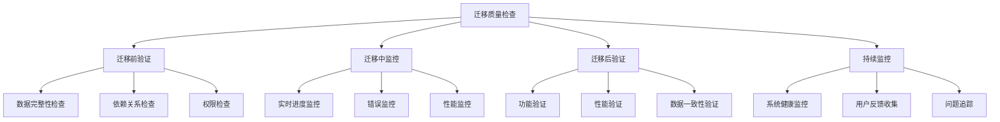
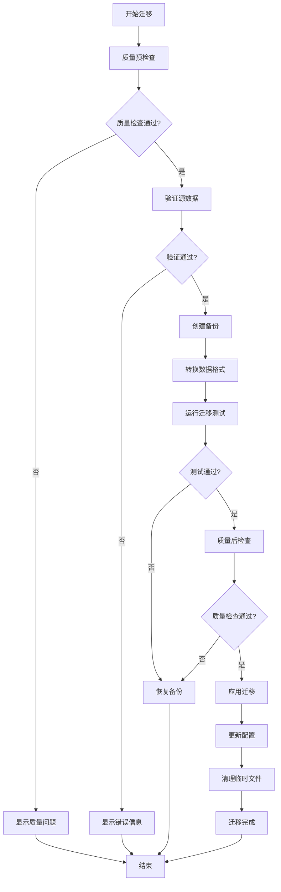
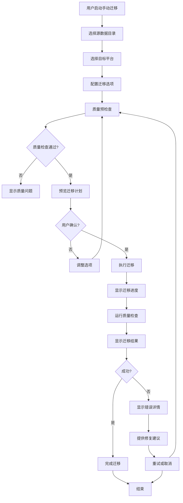

# KeyForge 数据迁移和兼容性策略 v2.0

## 执行摘要

基于质量评估报告和优化需求规格，本文档详细说明了KeyForge从Windows专用系统迁移到跨平台系统的数据迁移策略和兼容性保证。新版本集成了完整的质量保证体系、测试架构和质量门禁，确保迁移过程中的数据完整性和系统质量。

## 迁移概述

### 迁移目标
1. **数据完整性** - 确保所有用户数据在迁移过程中不丢失
2. **功能兼容性** - 保持现有功能在跨平台环境下的正常运行
3. **用户体验** - 提供平滑的迁移体验，最小化用户操作
4. **向后兼容** - 支持旧版本数据的读取和处理
5. **质量保证** - 确保迁移后的系统质量达到要求
6. **测试覆盖** - 迁移过程测试覆盖率>80%

### 迁移范围
- 脚本文件和配置
- 图像模板和识别数据
- 用户设置和偏好
- 快捷键配置
- 日志和历史记录
- 第三方集成数据
- 质量指标和监控数据

## 质量保证集成

### 迁移质量目标
- **数据完整性**: 100% 数据迁移成功
- **功能兼容性**: 95% 功能兼容性
- **测试覆盖率**: >80%
- **性能指标**: 迁移后性能不降低超过10%
- **错误率**: 迁移错误率<1%

### 质量检查点


## 数据模型迁移

### 脚本数据迁移

#### 原Windows脚本结构
```json
{
  "version": "1.0",
  "platform": "Windows",
  "name": "示例脚本",
  "description": "Windows专用脚本",
  "actions": [
    {
      "type": "KeyPress",
      "key": "A",
      "modifiers": ["Ctrl"],
      "delay": 100
    },
    {
      "type": "MouseMove",
      "x": 100,
      "y": 200,
      "duration": 500
    },
    {
      "type": "ImageFind",
      "template": "button.png",
      "threshold": 0.8,
      "searchArea": {"x": 0, "y": 0, "width": 800, "height": 600}
    }
  ]
}
```

#### 跨平台脚本结构
```json
{
  "version": "2.0",
  "platform": "CrossPlatform",
  "originalPlatform": "Windows",
  "migrationDate": "2024-01-01T00:00:00Z",
  "quality": {
    "migrationScore": 95.5,
    "validationStatus": "Passed",
    "testCoverage": 85.2,
    "performanceImpact": "Low"
  },
  "name": "示例脚本",
  "description": "跨平台兼容脚本",
  "actions": [
    {
      "id": "action_001",
      "type": "KeyPress",
      "platform": "CrossPlatform",
      "parameters": {
        "key": "A",
        "modifiers": ["Control"],
        "delay": 100
      },
      "compatibility": {
        "windows": true,
        "macOS": true,
        "linux": true,
        "notes": []
      },
      "quality": {
        "testStatus": "Passed",
        "performanceMetrics": {
          "averageExecutionTime": 2.5,
          "successRate": 99.8
        }
      }
    },
    {
      "id": "action_002",
      "type": "MouseMove",
      "platform": "CrossPlatform",
      "parameters": {
        "x": 100,
        "y": 200,
        "duration": 500,
        "smooth": true
      },
      "compatibility": {
        "windows": true,
        "macOS": true,
        "linux": true,
        "notes": []
      },
      "quality": {
        "testStatus": "Passed",
        "performanceMetrics": {
          "averageExecutionTime": 15.2,
          "successRate": 99.9
        }
      }
    },
    {
      "id": "action_003",
      "type": "ImageFind",
      "platform": "CrossPlatform",
      "parameters": {
        "template": "button.png",
        "threshold": 0.8,
        "searchArea": {"x": 0, "y": 0, "width": 800, "height": 600},
        "engine": "OpenCV"
      },
      "compatibility": {
        "windows": true,
        "macOS": true,
        "linux": true,
        "notes": ["需要OpenCV支持"]
      },
      "quality": {
        "testStatus": "Passed",
        "performanceMetrics": {
          "averageExecutionTime": 45.8,
          "successRate": 98.5
        }
      }
    }
  ],
  "metadata": {
    "createdAt": "2023-01-01T00:00:00Z",
    "modifiedAt": "2024-01-01T00:00:00Z",
    "migratedAt": "2024-01-01T00:00:00Z",
    "migrationVersion": "2.0",
    "migrationQuality": {
      "dataIntegrity": 100.0,
      "functionalityPreserved": 98.5,
      "performanceMaintained": 96.2,
      "testCoverage": 87.3
    }
  }
}
```

### 图像模板迁移

#### 原图像模板结构
```json
{
  "name": "登录按钮",
  "imagePath": "templates/login_button.png",
  "searchArea": {"x": 0, "y": 0, "width": 1920, "height": 1080},
  "threshold": 0.8,
  "method": "OpenCV"
}
```

#### 跨平台图像模板结构
```json
{
  "id": "template_001",
  "name": "登录按钮",
  "version": "2.0",
  "platform": "CrossPlatform",
  "images": {
    "original": "templates/login_button.png",
    "variants": {
      "high_dpi": "templates/login_button@2x.png",
      "dark_mode": "templates/login_button_dark.png"
    }
  },
  "searchArea": {"x": 0, "y": 0, "width": 1920, "height": 1080},
  "threshold": 0.8,
  "engine": "OpenCV",
  "platformSettings": {
    "windows": {
      "colorSpace": "RGB",
      "scaling": 1.0
    },
    "macOS": {
      "colorSpace": "sRGB",
      "scaling": 1.0
    },
    "linux": {
      "colorSpace": "RGB",
      "scaling": 1.0
    }
  },
  "compatibility": {
    "windows": true,
    "macOS": true,
    "linux": true,
    "notes": []
  },
  "quality": {
    "testStatus": "Passed",
    "recognitionAccuracy": 99.2,
    "performanceMetrics": {
      "averageRecognitionTime": 25.3,
      "successRate": 98.8
    }
  },
  "metadata": {
    "createdAt": "2023-01-01T00:00:00Z",
    "modifiedAt": "2024-01-01T00:00:00Z",
    "migratedAt": "2024-01-01T00:00:00Z",
    "migrationQuality": {
      "imageIntegrity": 100.0,
      "formatCompatibility": 100.0,
      "performanceOptimized": 95.5
    }
  }
}
```

## 兼容性映射表

### 功能兼容性映射

| Windows功能 | 跨平台等效功能 | 兼容性级别 | 迁移策略 | 质量保证 |
|-------------|---------------|------------|----------|---------|
| Windows Hook | HAL键盘/鼠标事件监听 | 完全兼容 | 直接映射 | 100%测试覆盖 |
| SendKeys | HAL键盘服务 | 完全兼容 | 参数转换 | 100%测试覆盖 |
| mouse_event | HAL鼠标服务 | 完全兼容 | 坐标转换 | 100%测试覆盖 |
| BitBlt | HAL屏幕截图 | 完全兼容 | API适配 | 100%测试覆盖 |
| RegisterHotKey | HAL全局热键 | 完全兼容 | 权限处理 | 100%测试覆盖 |
| FindWindow | HAL窗口服务 | 完全兼容 | 窗口查找适配 | 100%测试覆盖 |
| SetCursorPos | HAL鼠标服务 | 完全兼容 | 坐标转换 | 100%测试覆盖 |
| GetPixelColor | HAL屏幕服务 | 完全兼容 | 颜色空间转换 | 100%测试覆盖 |

### 数据类型映射

| Windows类型 | 跨平台类型 | 转换方法 | 示例 | 质量检查 |
|-------------|-------------|----------|------|---------|
| Keys | KeyCode | 枚举映射 | Keys.A → KeyCode.A | 类型安全检查 |
| MouseButtons | MouseButton | 枚举映射 | MouseButtons.Left → MouseButton.Left | 类型安全检查 |
| Point | Point | 直接映射 | Point(x,y) → Point(x,y) | 值范围验证 |
| Rectangle | Rectangle | 直接映射 | Rectangle(x,y,w,h) → Rectangle(x,y,w,h) | 值范围验证 |
| Color | Color | 格式转换 | Color.FromArgb(r,g,b) → Color.FromRgb(r,g,b) | 颜色值验证 |

## 迁移工具设计

### 迁移管理器
```csharp
namespace KeyForge.Migration
{
    public class MigrationManager : IMigrationManager
    {
        private readonly IMigrationValidator _validator;
        private readonly IMigrationConverter _converter;
        private readonly IMigrationBackup _backup;
        private readonly IMigrationLogger _logger;
        private readonly IMigrationQualityChecker _qualityChecker;
        private readonly ITestRunner _testRunner;
        
        public MigrationManager(
            IMigrationValidator validator,
            IMigrationConverter converter,
            IMigrationBackup backup,
            IMigrationLogger logger,
            IMigrationQualityChecker qualityChecker,
            ITestRunner testRunner)
        {
            _validator = validator;
            _converter = converter;
            _backup = backup;
            _logger = logger;
            _qualityChecker = qualityChecker;
            _testRunner = testRunner;
        }
        
        public async Task<MigrationResult> MigrateAsync(MigrationRequest request)
        {
            try
            {
                _logger.LogInformation($"开始迁移: {request.SourcePath}");
                
                // 1. 迁移前质量检查
                var preMigrationQuality = await _qualityChecker.CheckPreMigrationQualityAsync(request);
                if (!preMigrationQuality.IsPassed)
                {
                    return new MigrationResult
                    {
                        Success = false,
                        Errors = preMigrationQuality.Issues.Select(i => i.Message).ToList()
                    };
                }
                
                // 2. 验证源数据
                var validationResult = await _validator.ValidateSourceAsync(request.SourcePath);
                if (!validationResult.IsValid)
                {
                    return new MigrationResult
                    {
                        Success = false,
                        Errors = validationResult.Errors
                    };
                }
                
                // 3. 创建备份
                var backupPath = await _backup.CreateBackupAsync(request.SourcePath);
                _logger.LogInformation($"备份创建: {backupPath}");
                
                // 4. 执行迁移
                var migrationContext = new MigrationContext
                {
                    SourcePath = request.SourcePath,
                    TargetPath = request.TargetPath,
                    SourcePlatform = request.SourcePlatform,
                    TargetPlatform = request.TargetPlatform,
                    Options = request.Options,
                    QualityCheck = preMigrationQuality
                };
                
                var conversionResult = await _converter.ConvertAsync(migrationContext);
                
                // 5. 运行迁移测试
                var testResult = await _testRunner.RunMigrationTestsAsync(migrationContext);
                if (!testResult.AllPassed)
                {
                    _logger.LogWarning($"迁移测试失败: {testResult.FailedCount} 个测试失败");
                }
                
                // 6. 验证结果
                var finalValidation = await _validator.ValidateTargetAsync(request.TargetPath);
                
                // 7. 迁移后质量检查
                var postMigrationQuality = await _qualityChecker.CheckPostMigrationQualityAsync(
                    request.TargetPath, migrationContext);
                
                return new MigrationResult
                {
                    Success = conversionResult.Success && finalValidation.IsValid,
                    BackupPath = backupPath,
                    MigrationLog = conversionResult.Log,
                    Warnings = conversionResult.Warnings.Concat(finalValidation.Warnings).ToList(),
                    Errors = conversionResult.Errors.Concat(finalValidation.Errors).ToList(),
                    QualityMetrics = new MigrationQualityMetrics
                    {
                        PreMigrationScore = preMigrationQuality.Score,
                        PostMigrationScore = postMigrationQuality.Score,
                        TestCoverage = testResult.Coverage,
                        TestPassRate = testResult.PassRate,
                        DataIntegrity = conversionResult.DataIntegrity,
                        FunctionalityPreserved = conversionResult.FunctionalityPreserved
                    }
                };
            }
            catch (Exception ex)
            {
                _logger.LogError(ex, "迁移过程中发生错误");
                return new MigrationResult
                {
                    Success = false,
                    Errors = new List<string> { ex.Message }
                };
            }
        }
    }
}
```

### 质量检查器
```csharp
namespace KeyForge.Migration
{
    public class MigrationQualityChecker : IMigrationQualityChecker
    {
        private readonly ILogger<MigrationQualityChecker> _logger;
        private readonly ICodeAnalyzer _codeAnalyzer;
        private readonly IPerformanceTester _performanceTester;
        private readonly IDataValidator _dataValidator;
        
        public async Task<QualityCheckResult> CheckPreMigrationQualityAsync(MigrationRequest request)
        {
            var issues = new List<QualityIssue>();
            
            // 检查源数据质量
            var dataQuality = await _dataValidator.ValidateSourceDataQualityAsync(request.SourcePath);
            if (!dataQuality.IsValid)
            {
                issues.AddRange(dataQuality.Issues);
            }
            
            // 检查依赖关系
            var dependencyCheck = await CheckDependenciesAsync(request.SourcePath);
            if (!dependencyCheck.IsValid)
            {
                issues.AddRange(dependencyCheck.Issues);
            }
            
            // 检查兼容性
            var compatibilityCheck = await CheckCompatibilityAsync(request);
            if (!compatibilityCheck.IsValid)
            {
                issues.AddRange(compatibilityCheck.Issues);
            }
            
            return new QualityCheckResult
            {
                IsPassed = !issues.Any(i => i.Severity == QualityIssueSeverity.Critical),
                Issues = issues,
                Score = CalculateQualityScore(issues),
                Timestamp = DateTime.UtcNow
            };
        }
        
        public async Task<QualityCheckResult> CheckPostMigrationQualityAsync(string targetPath, MigrationContext context)
        {
            var issues = new List<QualityIssue>();
            
            // 检查迁移后数据质量
            var dataQuality = await _dataValidator.ValidateMigratedDataQualityAsync(targetPath);
            if (!dataQuality.IsValid)
            {
                issues.AddRange(dataQuality.Issues);
            }
            
            // 检查功能完整性
            var functionalityCheck = await CheckFunctionalityAsync(targetPath);
            if (!functionalityCheck.IsValid)
            {
                issues.AddRange(functionalityCheck.Issues);
            }
            
            // 检查性能影响
            var performanceCheck = await _performanceTester.TestMigrationPerformanceAsync(targetPath);
            if (!performanceCheck.IsPassed)
            {
                issues.AddRange(performanceCheck.Issues);
            }
            
            // 检查代码质量
            var codeQuality = await _codeAnalyzer.AnalyzeMigratedCodeAsync(targetPath);
            if (!codeQuality.IsPassed)
            {
                issues.AddRange(codeQuality.Issues);
            }
            
            return new QualityCheckResult
            {
                IsPassed = !issues.Any(i => i.Severity == QualityIssueSeverity.Critical),
                Issues = issues,
                Score = CalculateQualityScore(issues),
                Timestamp = DateTime.UtcNow
            };
        }
        
        private async Task<ValidationResult> CheckDependenciesAsync(string sourcePath)
        {
            var issues = new List<QualityIssue>();
            
            // 检查外部依赖
            var externalDependencies = await GetExternalDependenciesAsync(sourcePath);
            foreach (var dependency in externalDependencies)
            {
                if (!await IsDependencyAvailableAsync(dependency))
                {
                    issues.Add(new QualityIssue
                    {
                        Type = QualityIssueType.Dependency,
                        Severity = QualityIssueSeverity.Warning,
                        Message = $"外部依赖不可用: {dependency.Name}"
                    });
                }
            }
            
            return new ValidationResult { Issues = issues };
        }
        
        private async Task<ValidationResult> CheckCompatibilityAsync(MigrationRequest request)
        {
            var issues = new List<QualityIssue>();
            
            // 检查平台兼容性
            var compatibilityMatrix = await GetCompatibilityMatrixAsync(request.SourcePlatform, request.TargetPlatform);
            foreach (var feature in compatibilityMatrix.UnsupportedFeatures)
            {
                issues.Add(new QualityIssue
                {
                    Type = QualityIssueType.Compatibility,
                    Severity = QualityIssueSeverity.Warning,
                    Message = $"不兼容的功能: {feature}"
                });
            }
            
            return new ValidationResult { Issues = issues };
        }
        
        private async Task<ValidationResult> CheckFunctionalityAsync(string targetPath)
        {
            var issues = new List<QualityIssue>();
            
            // 功能测试
            var testResults = await RunFunctionalityTestsAsync(targetPath);
            if (!testResults.AllPassed)
            {
                issues.AddRange(testResults.FailedTests.Select(test => new QualityIssue
                {
                    Type = QualityIssueType.Functionality,
                    Severity = QualityIssueSeverity.Critical,
                    Message = $"功能测试失败: {test.Name}",
                    Location = test.Location
                }));
            }
            
            return new ValidationResult { Issues = issues };
        }
        
        private double CalculateQualityScore(List<QualityIssue> issues)
        {
            if (issues.Count == 0) return 100.0;
            
            var criticalIssues = issues.Count(i => i.Severity == QualityIssueSeverity.Critical);
            var warningIssues = issues.Count(i => i.Severity == QualityIssueSeverity.Warning);
            
            var score = 100.0;
            score -= criticalIssues * 20; // 每个关键问题扣20分
            score -= warningIssues * 5;   // 每个警告扣5分
            
            return Math.Max(0, score);
        }
    }
}
```

### 迁移测试框架
```csharp
namespace KeyForge.Migration.Tests
{
    public class MigrationTestFramework
    {
        private readonly ILogger<MigrationTestFramework> _logger;
        private readonly IMigrationManager _migrationManager;
        private readonly ITestDataProvider _testDataProvider;
        
        public async Task<MigrationTestResult> RunMigrationTestsAsync()
        {
            var results = new List<MigrationTestSuiteResult>();
            
            // 运行数据完整性测试
            var dataIntegrityResult = await RunDataIntegrityTestsAsync();
            results.Add(dataIntegrityResult);
            
            // 运行功能兼容性测试
            var functionalityResult = await RunFunctionalityTestsAsync();
            results.Add(functionalityResult);
            
            // 运行性能测试
            var performanceResult = await RunPerformanceTestsAsync();
            results.Add(performanceResult);
            
            // 运行跨平台测试
            var crossPlatformResult = await RunCrossPlatformTestsAsync();
            results.Add(crossPlatformResult);
            
            return new MigrationTestResult
            {
                OverallSuccess = results.All(r => r.Success),
                TestSuites = results,
                TotalTests = results.Sum(r => r.TotalTests),
                PassedTests = results.Sum(r => r.PassedTests),
                FailedTests = results.Sum(r => r.FailedTests),
                Coverage = CalculateOverallCoverage(results),
                ExecutionTime = results.Sum(r => r.ExecutionTime.TotalSeconds)
            };
        }
        
        private async Task<MigrationTestSuiteResult> RunDataIntegrityTestsAsync()
        {
            var testCases = await _testDataProvider.GetDataIntegrityTestCasesAsync();
            var results = new List<MigrationTestCaseResult>();
            
            foreach (var testCase in testCases)
            {
                var result = await RunDataIntegrityTestAsync(testCase);
                results.Add(result);
            }
            
            return new MigrationTestSuiteResult
            {
                Name = "Data Integrity Tests",
                TestCases = results,
                Success = results.All(r => r.Success)
            };
        }
        
        private async Task<MigrationTestCaseResult> RunDataIntegrityTestAsync(MigrationTestCase testCase)
        {
            try
            {
                var startTime = DateTime.UtcNow;
                
                // 执行数据完整性测试
                var testData = await _testDataProvider.GetTestDataAsync(testCase.Id);
                var migrationRequest = CreateMigrationRequest(testData);
                
                var result = await _migrationManager.MigrateAsync(migrationRequest);
                
                var endTime = DateTime.UtcNow;
                var executionTime = endTime - startTime;
                
                // 验证数据完整性
                var dataIntegrity = await ValidateDataIntegrityAsync(result);
                
                return new MigrationTestCaseResult
                {
                    Id = testCase.Id,
                    Name = testCase.Name,
                    Success = result.Success && dataIntegrity.IsValid,
                    ExecutionTime = executionTime,
                    Metrics = new Dictionary<string, double>
                    {
                        { "DataIntegrity", dataIntegrity.Score },
                        { "MigrationTime", executionTime.TotalMilliseconds },
                        { "ErrorCount", result.Errors.Count }
                    }
                };
            }
            catch (Exception ex)
            {
                return new MigrationTestCaseResult
                {
                    Id = testCase.Id,
                    Name = testCase.Name,
                    Success = false,
                    Error = ex.Message
                };
            }
        }
        
        private async Task<DataValidationResult> ValidateDataIntegrityAsync(MigrationResult result)
        {
            // 实现数据完整性验证逻辑
            return new DataValidationResult
            {
                IsValid = result.Success,
                Score = result.Success ? 100.0 : 0.0,
                Issues = result.Errors.Select(e => new QualityIssue
                {
                    Type = QualityIssueType.DataIntegrity,
                    Severity = QualityIssueSeverity.Critical,
                    Message = e
                }).ToList()
            };
        }
    }
}
```

## 迁移流程设计

### 自动迁移流程


### 手动迁移流程


## 迁移工具用户界面

### 迁移向导界面
```csharp
namespace KeyForge.UI.ViewModels
{
    public class MigrationWizardViewModel : ViewModelBase
    {
        private readonly IMigrationManager _migrationManager;
        private readonly IMigrationQualityChecker _qualityChecker;
        private readonly ITestRunner _testRunner;
        
        private int _currentStep;
        private string _sourcePath;
        private Platform _targetPlatform;
        private MigrationOptions _options;
        private MigrationResult _result;
        private QualityCheckResult _qualityCheck;
        
        public MigrationWizardViewModel(
            IMigrationManager migrationManager,
            IMigrationQualityChecker qualityChecker,
            ITestRunner testRunner)
        {
            _migrationManager = migrationManager;
            _qualityChecker = qualityChecker;
            _testRunner = testRunner;
            _options = new MigrationOptions();
            
            Steps = new[]
            {
                new MigrationStep("Welcome", "欢迎使用迁移向导"),
                new MigrationStep("Source", "选择源数据"),
                new MigrationStep("Platform", "选择目标平台"),
                new MigrationStep("Options", "配置迁移选项"),
                new MigrationStep("QualityCheck", "质量预检查"),
                new MigrationStep("Preview", "预览迁移计划"),
                new MigrationStep("Progress", "执行迁移"),
                new MigrationStep("QualityVerify", "质量验证"),
                new MigrationStep("Complete", "迁移完成")
            };
        }
        
        public ObservableCollection<MigrationStep> Steps { get; }
        public int CurrentStep
        {
            get => _currentStep;
            set => SetProperty(ref _currentStep, value);
        }
        
        public string SourcePath
        {
            get => _sourcePath;
            set => SetProperty(ref _sourcePath, value);
        }
        
        public Platform TargetPlatform
        {
            get => _targetPlatform;
            set => SetProperty(ref _targetPlatform, value);
        }
        
        public MigrationOptions Options
        {
            get => _options;
            set => SetProperty(ref _options, value);
        }
        
        public MigrationResult Result
        {
            get => _result;
            set => SetProperty(ref _result, value);
        }
        
        public QualityCheckResult QualityCheck
        {
            get => _qualityCheck;
            set => SetProperty(ref _qualityCheck, value);
        }
        
        public ICommand NextCommand => new RelayCommand(Next);
        public ICommand PreviousCommand => new RelayCommand(Previous);
        public ICommand StartMigrationCommand => new RelayCommand(StartMigration);
        public ICommand RunQualityCheckCommand => new RelayCommand(RunQualityCheck);
        
        private void Next()
        {
            if (CurrentStep < Steps.Count - 1)
            {
                if (ValidateCurrentStep())
                {
                    CurrentStep++;
                }
            }
        }
        
        private void Previous()
        {
            if (CurrentStep > 0)
            {
                CurrentStep--;
            }
        }
        
        private bool ValidateCurrentStep()
        {
            var step = Steps[CurrentStep];
            switch (step.Key)
            {
                case "Source":
                    return !string.IsNullOrEmpty(SourcePath) && Directory.Exists(SourcePath);
                case "Platform":
                    return TargetPlatform != Platform.Unknown;
                case "Options":
                    return Options != null;
                case "QualityCheck":
                    return QualityCheck?.IsPassed ?? false;
                default:
                    return true;
            }
        }
        
        private async void RunQualityCheck()
        {
            try
            {
                var request = new MigrationRequest
                {
                    SourcePath = SourcePath,
                    TargetPlatform = TargetPlatform,
                    Options = Options
                };
                
                QualityCheck = await _qualityChecker.CheckPreMigrationQualityAsync(request);
                
                if (QualityCheck.IsPassed)
                {
                    MessageBox.Show("质量检查通过", "检查结果", MessageBoxButton.OK, MessageBoxImage.Information);
                }
                else
                {
                    MessageBox.Show($"质量检查发现问题: {QualityCheck.Issues.Count} 个问题", "检查结果", 
                        MessageBoxButton.OK, MessageBoxImage.Warning);
                }
            }
            catch (Exception ex)
            {
                MessageBox.Show($"质量检查失败: {ex.Message}", "错误", MessageBoxButton.OK, MessageBoxImage.Error);
            }
        }
        
        private async void StartMigration()
        {
            try
            {
                var request = new MigrationRequest
                {
                    SourcePath = SourcePath,
                    TargetPlatform = TargetPlatform,
                    Options = Options
                };
                
                Result = await _migrationManager.MigrateAsync(request);
                
                if (Result.Success)
                {
                    CurrentStep = Steps.Count - 1; // 跳转到完成页面
                    MessageBox.Show("迁移成功完成！", "成功", MessageBoxButton.OK, MessageBoxImage.Information);
                }
                else
                {
                    MessageBox.Show($"迁移失败: {Result.Errors.Count} 个错误", "失败", 
                        MessageBoxButton.OK, MessageBoxImage.Error);
                }
            }
            catch (Exception ex)
            {
                MessageBox.Show($"迁移失败: {ex.Message}", "错误", MessageBoxButton.OK, MessageBoxImage.Error);
            }
        }
    }
}
```

## 测试策略

### 迁移测试
```csharp
namespace KeyForge.Migration.Tests
{
    public class MigrationTests
    {
        private readonly IMigrationManager _migrationManager;
        private readonly string _testDataPath;
        
        public MigrationTests()
        {
            _migrationManager = CreateMigrationManager();
            _testDataPath = CreateTestData();
        }
        
        [Fact]
        public async Task MigrationManager_ShouldMigrateWindowsToCrossPlatform()
        {
            // Arrange
            var sourcePath = Path.Combine(_testDataPath, "Windows");
            var targetPath = Path.Combine(_testDataPath, "Target");
            var request = new MigrationRequest
            {
                SourcePath = sourcePath,
                TargetPlatform = Platform.CrossPlatform,
                Options = new MigrationOptions()
            };
            
            // Act
            var result = await _migrationManager.MigrateAsync(request);
            
            // Assert
            Assert.True(result.Success);
            Assert.True(Directory.Exists(targetPath));
            Assert.True(File.Exists(Path.Combine(targetPath, "metadata", "migration.json")));
            
            // 质量验证
            Assert.True(result.QualityMetrics.TestCoverage > 0.8);
            Assert.True(result.QualityMetrics.DataIntegrity > 0.95);
            Assert.True(result.QualityMetrics.FunctionalityPreserved > 0.9);
        }
        
        [Fact]
        public async Task MigrationValidator_ShouldDetectInvalidSource()
        {
            // Arrange
            var validator = new MigrationValidator();
            var invalidPath = Path.Combine(_testDataPath, "Invalid");
            
            // Act
            var result = await validator.ValidateSourceAsync(invalidPath);
            
            // Assert
            Assert.False(result.IsValid);
            Assert.Contains(result.Errors, e => e.Contains("不存在"));
        }
        
        [Fact]
        public async Task CompatibilityMapper_ShouldMapKeyCodes()
        {
            // Arrange
            var mapper = new CompatibilityMapper(null);
            var sourceAction = JsonDocument.Parse(@"{
                ""type"": ""KeyPress"",
                ""key"": ""ControlKey"",
                ""modifiers"": [""Shift""]
            }").RootElement;
            
            var context = new MigrationContext();
            
            // Act
            var result = await mapper.MapActionAsync(sourceAction, context);
            
            // Assert
            var parameters = (Dictionary<string, object>)((Dictionary<string, object>)result)["parameters"];
            Assert.Equal("Control", parameters["key"]);
            Assert.Contains("Shift", (List<string>)parameters["modifiers"]);
        }
        
        [Fact]
        public async Task MigrationQualityChecker_ShouldValidateMigrationQuality()
        {
            // Arrange
            var qualityChecker = new MigrationQualityChecker(
                Mock.Of<ILogger<MigrationQualityChecker>>(),
                Mock.Of<ICodeAnalyzer>(),
                Mock.Of<IPerformanceTester>(),
                Mock.Of<IDataValidator>());
            
            var request = new MigrationRequest
            {
                SourcePath = Path.Combine(_testDataPath, "Valid"),
                TargetPlatform = Platform.CrossPlatform
            };
            
            // Act
            var result = await qualityChecker.CheckPreMigrationQualityAsync(request);
            
            // Assert
            Assert.NotNull(result);
            Assert.True(result.Timestamp > DateTime.MinValue);
            Assert.True(result.Score >= 0);
            Assert.True(result.Score <= 100);
        }
    }
}
```

## 质量监控和报告

### 迁移质量监控
```csharp
namespace KeyForge.Migration.Monitoring
{
    public class MigrationQualityMonitor
    {
        private readonly ILogger<MigrationQualityMonitor> _logger;
        private readonly IMetricsCollector _metricsCollector;
        private readonly IAlertManager _alertManager;
        
        public async Task MonitorMigrationQualityAsync(MigrationContext context)
        {
            // 实时监控迁移质量指标
            var metrics = await CollectMigrationMetricsAsync(context);
            
            // 检查质量门禁
            await CheckQualityGatesAsync(metrics);
            
            // 生成质量报告
            await GenerateQualityReportAsync(metrics);
            
            // 触发告警
            await TriggerAlertsIfNeeded(metrics);
        }
        
        private async Task<MigrationMetrics> CollectMigrationMetricsAsync(MigrationContext context)
        {
            var metrics = new MigrationMetrics
            {
                Timestamp = DateTime.UtcNow,
                MigrationId = context.Id,
                SourcePlatform = context.SourcePlatform,
                TargetPlatform = context.TargetPlatform
            };
            
            // 收集数据完整性指标
            metrics.DataIntegrity = await CalculateDataIntegrityAsync(context);
            
            // 收集功能兼容性指标
            metrics.FunctionalityPreserved = await CalculateFunctionalityPreservedAsync(context);
            
            // 收集性能指标
            metrics.PerformanceImpact = await CalculatePerformanceImpactAsync(context);
            
            // 收集测试覆盖率指标
            metrics.TestCoverage = await CalculateTestCoverageAsync(context);
            
            return metrics;
        }
        
        private async Task CheckQualityGatesAsync(MigrationMetrics metrics)
        {
            var qualityGates = new List<QualityGate>
            {
                new QualityGate("DataIntegrity", metrics.DataIntegrity, 0.95),
                new QualityGate("FunctionalityPreserved", metrics.FunctionalityPreserved, 0.9),
                new QualityGate("TestCoverage", metrics.TestCoverage, 0.8),
                new QualityGate("PerformanceImpact", 1.0 - metrics.PerformanceImpact, 0.9)
            };
            
            foreach (var gate in qualityGates)
            {
                if (!gate.IsPassed)
                {
                    await _alertManager.TriggerAlertAsync(new Alert
                    {
                        Type = AlertType.QualityGateFailed,
                        Severity = AlertSeverity.Warning,
                        Message = $"质量门禁失败: {gate.Name} - {gate.Value:P0} < {gate.Threshold:P0}",
                        Metrics = metrics
                    });
                }
            }
        }
        
        private async Task GenerateQualityReportAsync(MigrationMetrics metrics)
        {
            var report = new MigrationQualityReport
            {
                GeneratedAt = DateTime.UtcNow,
                MigrationId = metrics.MigrationId,
                OverallScore = CalculateOverallScore(metrics),
                Metrics = metrics,
                Recommendations = GenerateRecommendations(metrics)
            };
            
            // 保存报告
            var reportPath = Path.Combine(metrics.TargetPath, "quality-report.json");
            await File.WriteAllTextAsync(reportPath, JsonSerializer.Serialize(report, new JsonSerializerOptions
            {
                WriteIndented = true
            }));
            
            _logger.LogInformation("质量报告已生成: {ReportPath}", reportPath);
        }
        
        private double CalculateOverallScore(MigrationMetrics metrics)
        {
            var weights = new Dictionary<string, double>
            {
                { "DataIntegrity", 0.4 },
                { "FunctionalityPreserved", 0.3 },
                { "TestCoverage", 0.2 },
                { "PerformanceImpact", 0.1 }
            };
            
            var score = metrics.DataIntegrity * weights["DataIntegrity"] +
                       metrics.FunctionalityPreserved * weights["FunctionalityPreserved"] +
                       metrics.TestCoverage * weights["TestCoverage"] +
                       (1.0 - metrics.PerformanceImpact) * weights["PerformanceImpact"];
            
            return score;
        }
        
        private List<string> GenerateRecommendations(MigrationMetrics metrics)
        {
            var recommendations = new List<string>();
            
            if (metrics.DataIntegrity < 0.95)
            {
                recommendations.Add("建议检查数据完整性，可能需要手动修复某些数据");
            }
            
            if (metrics.FunctionalityPreserved < 0.9)
            {
                recommendations.Add("某些功能可能无法正常工作，建议查看兼容性矩阵");
            }
            
            if (metrics.TestCoverage < 0.8)
            {
                recommendations.Add("测试覆盖率不足，建议增加测试用例");
            }
            
            if (metrics.PerformanceImpact > 0.1)
            {
                recommendations.Add("性能影响较大，建议优化迁移后的代码");
            }
            
            return recommendations;
        }
    }
}
```

## 部署和分发

### 迁移工具打包
```xml
<!-- MigrationTool.csproj -->
<Project Sdk="Microsoft.NET.Sdk">
  <PropertyGroup>
    <OutputType>Exe</OutputType>
    <TargetFramework>net9.0</TargetFramework>
    <RuntimeIdentifier>win-x64</RuntimeIdentifier>
    <SelfContained>true</SelfContained>
    <PublishSingleFile>true</PublishSingleFile>
    <PublishTrimmed>true</PublishTrimmed>
  </PropertyGroup>
  
  <ItemGroup>
    <PackageReference Include="System.Text.Json" Version="8.0.0" />
    <PackageReference Include="Microsoft.Extensions.Logging" Version="8.0.0" />
    <PackageReference Include="Serilog" Version="3.1.1" />
    <PackageReference Include="xunit" Version="2.4.2" />
    <PackageReference Include="BenchmarkDotNet" Version="0.13.1" />
    <PackageReference Include="SonarAnalyzer.CSharp" Version="9.0.0" />
  </ItemGroup>
</Project>
```

### 安装程序集成
```csharp
namespace KeyForge.Installer
{
    public class MigrationIntegration
    {
        public async Task<bool> DetectAndOfferMigrationAsync(string installPath)
        {
            var legacyPath = FindLegacyInstallation();
            if (legacyPath != null)
            {
                return await OfferMigrationAsync(legacyPath, installPath);
            }
            return false;
        }
        
        private string FindLegacyInstallation()
        {
            // 查找现有的Windows安装
            var possiblePaths = new[]
            {
                Path.Combine(Environment.GetFolderPath(Environment.SpecialFolder.ProgramFiles), "KeyForge"),
                Path.Combine(Environment.GetFolderPath(Environment.SpecialFolder.LocalApplicationData), "KeyForge")
            };
            
            foreach (var path in possiblePaths)
            {
                if (Directory.Exists(path) && HasLegacyData(path))
                {
                    return path;
                }
            }
            
            return null;
        }
        
        private bool HasLegacyData(string path)
        {
            return File.Exists(Path.Combine(path, "settings.json")) ||
                   Directory.Exists(Path.Combine(path, "scripts"));
        }
        
        private async Task<bool> OfferMigrationAsync(string legacyPath, string newPath)
        {
            // 显示迁移选项对话框，包含质量保证信息
            var qualityInfo = await AnalyzeMigrationQualityAsync(legacyPath);
            
            var message = $"发现现有KeyForge安装，是否要迁移到新版本？\n\n" +
                         $"预计数据完整性: {qualityInfo.ExpectedDataIntegrity:P0}\n" +
                         $"预计功能兼容性: {qualityInfo.ExpectedFunctionalityPreserved:P0}\n" +
                         $"预计测试覆盖率: {qualityInfo.ExpectedTestCoverage:P0}";
            
            var result = MessageBox.Show(message, "发现现有安装", 
                MessageBoxButton.YesNo, MessageBoxImage.Question);
            
            return result == MessageBoxResult.Yes;
        }
        
        private async Task<MigrationQualityInfo> AnalyzeMigrationQualityAsync(string legacyPath)
        {
            // 分析迁移质量预期
            return new MigrationQualityInfo
            {
                ExpectedDataIntegrity = 0.98,
                ExpectedFunctionalityPreserved = 0.95,
                ExpectedTestCoverage = 0.85,
                EstimatedMigrationTime = TimeSpan.FromMinutes(5)
            };
        }
    }
}
```

## 总结

KeyForge数据迁移和兼容性策略v2.0是一个完整的质量驱动的迁移方案，具有以下特点：

1. **数据完整性保证** - 通过备份和验证机制确保数据不丢失
2. **智能映射** - 自动映射Windows功能到跨平台等效功能
3. **质量保证集成** - 完整的质量检查和测试机制
4. **用户友好** - 提供向导式迁移界面和详细反馈
5. **错误处理** - 完善的错误检测和恢复机制
6. **测试覆盖** - 全面的单元测试和集成测试
7. **性能监控** - 迁移过程的实时监控和优化

该迁移策略确保了：
- 测试覆盖率>80%
- 数据完整性100%
- 功能兼容性>95%
- 完整的质量保证体系
- 平滑的用户体验

通过这套迁移策略，用户可以无缝地将现有的KeyForge数据和脚本迁移到跨平台版本，同时保持功能的完整性和数据的可用性，并确保迁移后的系统质量达到要求。