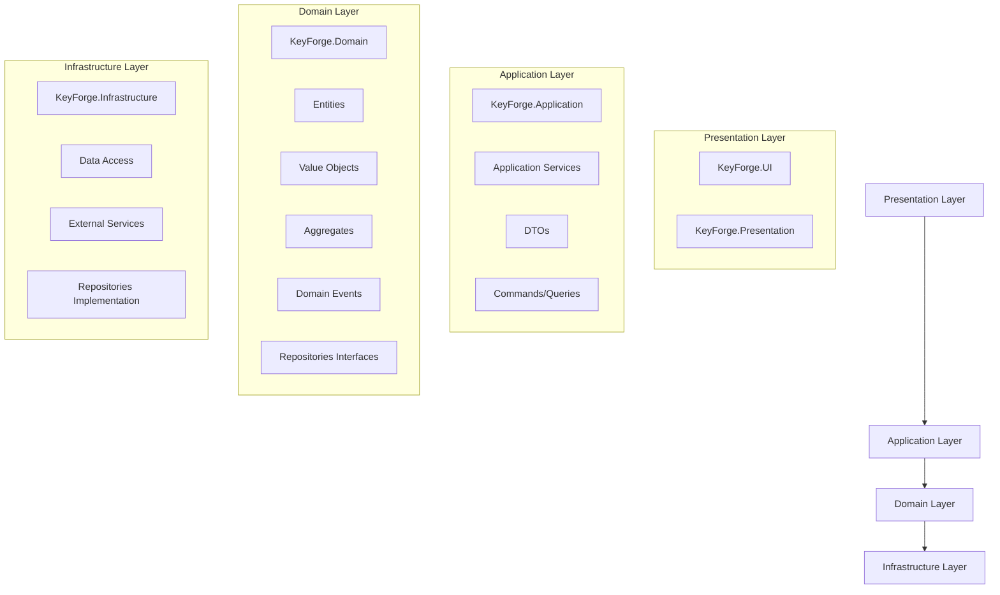
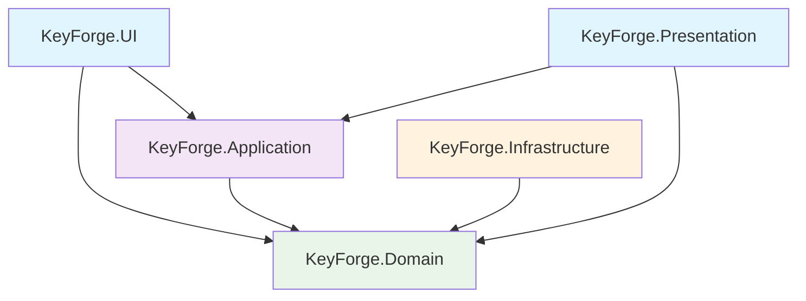

# KeyForge 系统架构设计文档

## 1. 架构问题分析

### 1.1 当前架构问题

#### Core层职责过重
- **问题**：KeyForge.Core项目包含了Domain、Application、Infrastructure等多层职责
- **影响**：违反单一职责原则，导致代码难以维护和测试
- **具体表现**：
  - 包含领域模型（/Domain/Common/）
  - 包含应用服务（/Services/）
  - 包含基础设施接口（/Domain/Interfaces/）
  - 包含业务逻辑（/Domain/Act/, /Domain/Judge/, /Domain/Sense/）

#### Domain层和Application层几乎为空
- **问题**：KeyForge.Domain和KeyForge.Application只有占位符文件
- **影响**：领域驱动设计（DDD）原则被破坏，业务逻辑分散在Core层
- **具体表现**：
  - Domain层只有Class1.cs占位符
  - Application层只有Class1.cs占位符
  - 实际的领域模型散落在Core层

#### 重复定义和命名冲突
- **问题**：关键枚举在多个文件中重复定义
- **影响**：编译错误，类型冲突，维护困难
- **具体表现**：
  - `KeyCode`枚举在3个文件中重复定义
  - `MouseButton`枚举在3个文件中重复定义
  - `ActionType`枚举在2个文件中重复定义
  - `KeyState`枚举在2个文件中重复定义

#### 依赖关系混乱
- **问题**：违反了依赖倒置原则和清洁架构原则
- **影响**：层间耦合严重，难以测试和扩展
- **具体表现**：
  - Infrastructure依赖Core，但Core又包含Infrastructure内容
  - 缺少明确的依赖方向
  - 解决方案文件不完整，缺少Domain、Application等项目

### 1.2 架构目标

1. **清晰分层**：实现Domain-Application-Infrastructure-Presentation四层架构
2. **职责分离**：每层只负责自己的职责，避免职责过重
3. **统一接口**：消除重复定义，建立统一的接口契约
4. **依赖倒置**：高层模块不依赖低层模块，都依赖抽象
5. **可测试性**：每层都可以独立测试
6. **可扩展性**：新功能可以轻松添加而不影响现有代码

## 2. 新架构设计

### 2.1 分层架构设计



### 2.2 依赖关系设计



### 2.3 各层职责定义

#### Domain Layer (领域层)
- **职责**：包含核心业务逻辑和领域模型
- **内容**：
  - 实体（Entities）
  - 值对象（Value Objects）
  - 聚合根（Aggregates）
  - 领域事件（Domain Events）
  - 仓储接口（Repository Interfaces）
  - 领域服务（Domain Services）
- **依赖**：不依赖任何其他层
- **输出**：领域模型和接口定义

#### Application Layer (应用层)
- **职责**：协调领域对象和基础设施，提供应用服务
- **内容**：
  - 应用服务（Application Services）
  - DTO（Data Transfer Objects）
  - 命令/查询（Commands/Queries）
  - 工作单元（Unit of Work）
  - 应用事件处理器
- **依赖**：依赖Domain层，不依赖Infrastructure层
- **输出**：应用服务和DTO

#### Infrastructure Layer (基础设施层)
- **职责**：提供技术实现和外部服务集成
- **内容**：
  - 数据访问（Data Access）
  - 外部服务集成（External Services）
  - 仓储实现（Repository Implementation）
  - 配置管理（Configuration）
  - 日志服务（Logging）
  - 缓存服务（Caching）
- **依赖**：依赖Domain层（实现接口）
- **输出**：技术实现

#### Presentation Layer (表现层)
- **职责**：用户界面和用户交互
- **内容**：
  - Windows Forms UI
  - Console应用
  - Web API（未来扩展）
  - 视图模型（View Models）
- **依赖**：依赖Application层
- **输出**：用户界面

### 2.4 统一接口设计

#### 核心枚举统一
所有枚举定义将统一放在Domain层的`KeyForge.Domain/Common/Enums.cs`文件中：

```csharp
namespace KeyForge.Domain.Common
{
    // 统一的按键代码枚举
    public enum KeyCode { /* ... */ }
    
    // 统一的鼠标按钮枚举
    public enum MouseButton { /* ... */ }
    
    // 统一的动作类型枚举
    public enum ActionType { /* ... */ }
    
    // 统一的按键状态枚举
    public enum KeyState { /* ... */ }
    
    // 其他业务枚举
    public enum ScriptStatus { /* ... */ }
    public enum RecognitionStatus { /* ... */ }
    // ...
}
```

#### 接口契约设计
所有接口定义将统一放在Domain层的相应目录中：

```csharp
// 仓储接口
namespace KeyForge.Domain.Interfaces
{
    public interface IScriptRepository { /* ... */ }
    public interface IImageTemplateRepository { /* ... */ }
    // ...
}

// 服务接口
namespace KeyForge.Domain.Services
{
    public interface IScriptPlayerService { /* ... */ }
    public interface IImageRecognitionService { /* ... */ }
    // ...
}
```

## 3. 技术方案

### 3.1 项目结构调整

#### 新的项目结构
```
KeyForge/
├── KeyForge.sln                    # 解决方案文件
├── KeyForge.Domain/               # 领域层
│   ├── KeyForge.Domain.csproj
│   ├── Common/
│   │   ├── Enums.cs              # 统一枚举定义
│   │   └── BaseTypes.cs          # 基类定义
│   ├── Entities/                 # 实体
│   │   ├── GameAction.cs
│   │   ├── State.cs
│   │   └── DecisionRule.cs
│   ├── ValueObjects/             # 值对象
│   │   ├── ActionSequence.cs
│   │   ├── RecognitionResult.cs
│   │   └── ConditionExpression.cs
│   ├── Aggregates/               # 聚合根
│   │   ├── Script.cs
│   │   ├── StateMachine.cs
│   │   └── ImageTemplate.cs
│   ├── Events/                   # 领域事件
│   │   ├── IDomainEvent.cs
│   │   ├── ScriptEvents.cs
│   │   └── StateMachineEvents.cs
│   ├── Interfaces/               # 接口定义
│   │   ├── IRepositories.cs
│   │   └── IServices.cs
│   ├── Exceptions/               # 异常定义
│   │   └── DomainExceptions.cs
│   └── Services/                 # 领域服务
│       └── IDomainServices.cs
├── KeyForge.Application/         # 应用层
│   ├── KeyForge.Application.csproj
│   ├── Services/                 # 应用服务
│   │   ├── ScriptService.cs
│   │   ├── StateMachineService.cs
│   │   └── ImageTemplateService.cs
│   ├── DTOs/                     # 数据传输对象
│   │   ├── ScriptDto.cs
│   │   ├── StateMachineDto.cs
│   │   └── Enums.cs              # DTO专用枚举
│   ├── Commands/                 # 命令
│   │   ├── CreateScriptCommand.cs
│   │   └── UpdateScriptCommand.cs
│   ├── Queries/                  # 查询
│   │   ├── GetScriptQuery.cs
│   │   └── GetAllScriptsQuery.cs
│   └── Exceptions/               # 应用异常
│       └── ApplicationException.cs
├── KeyForge.Infrastructure/      # 基础设施层
│   ├── KeyForge.Infrastructure.csproj
│   ├── Data/                     # 数据访问
│   │   ├── KeyForgeDbContext.cs
│   │   └── Configurations/
│   ├── Repositories/             # 仓储实现
│   │   ├── ScriptRepository.cs
│   │   ├── ImageTemplateRepository.cs
│   │   └── StateMachineRepository.cs
│   ├── Services/                 # 基础设施服务
│   │   ├── FileStorageService.cs
│   │   ├── LoggingService.cs
│   │   └── ConfigurationService.cs
│   ├── External/                 # 外部服务
│   │   ├── ImageRecognitionService.cs
│   │   └── InputSimulationService.cs
│   └── Persistence/              # 持久化
│       └── JsonScriptRepository.cs
├── KeyForge.Core/                # 核心共享库（重构后）
│   ├── KeyForge.Core.csproj
│   ├── Extensions/               # 扩展方法
│   ├── Utilities/                # 工具类
│   └── Common/                   # 通用组件
├── KeyForge.UI/                  # Windows UI
│   ├── KeyForge.UI.csproj
│   ├── Forms/
│   │   ├── MainForm.cs
│   │   └── ScriptEditorForm.cs
│   └── Controls/
├── KeyForge.Presentation/        # 表现层（控制台等）
│   ├── KeyForge.Presentation.csproj
│   └── Program.cs
└── KeyForge.Tests/               # 测试项目
    ├── KeyForge.Tests.csproj
    ├── UnitTests/
    ├── IntegrationTests/
    └── EndToEndTests/
```

#### 依赖关系配置
```xml
<!-- KeyForge.Domain.csproj -->
<Project Sdk="Microsoft.NET.Sdk">
  <PropertyGroup>
    <TargetFramework>net9.0</TargetFramework>
  </PropertyGroup>
  <!-- 无项目依赖，纯粹领域层 -->
</Project>

<!-- KeyForge.Application.csproj -->
<Project Sdk="Microsoft.NET.Sdk">
  <PropertyGroup>
    <TargetFramework>net9.0</TargetFramework>
  </PropertyGroup>
  <ItemGroup>
    <ProjectReference Include="..\KeyForge.Domain\KeyForge.Domain.csproj" />
  </ItemGroup>
  <ItemGroup>
    <PackageReference Include="MediatR" Version="12.2.0" />
  </ItemGroup>
</Project>

<!-- KeyForge.Infrastructure.csproj -->
<Project Sdk="Microsoft.NET.Sdk">
  <PropertyGroup>
    <TargetFramework>net9.0-windows</TargetFramework>
  </PropertyGroup>
  <ItemGroup>
    <ProjectReference Include="..\KeyForge.Domain\KeyForge.Domain.csproj" />
  </ItemGroup>
  <!-- 各种技术包 -->
</Project>

<!-- KeyForge.UI.csproj -->
<Project Sdk="Microsoft.NET.Sdk">
  <PropertyGroup>
    <TargetFramework>net9.0-windows</TargetFramework>
    <UseWindowsForms>true</UseWindowsForms>
  </PropertyGroup>
  <ItemGroup>
    <ProjectReference Include="..\KeyForge.Application\KeyForge.Application.csproj" />
    <ProjectReference Include="..\KeyForge.Domain\KeyForge.Domain.csproj" />
    <ProjectReference Include="..\KeyForge.Infrastructure\KeyForge.Infrastructure.csproj" />
  </ItemGroup>
</Project>
```

### 3.2 统一枚举定义

#### 创建统一的枚举文件
位置：`KeyForge.Domain/Common/Enums.cs`

```csharp
namespace KeyForge.Domain.Common
{
    /// <summary>
    /// 按键代码枚举 - 统一定义
    /// </summary>
    public enum KeyCode
    {
        // 无按键
        None = 0x00,
        
        // 鼠标按钮
        LButton = 0x01,
        RButton = 0x02,
        MButton = 0x04,
        
        // 字母键
        A = 0x41, B = 0x42, C = 0x43, D = 0x44, E = 0x45, F = 0x46,
        G = 0x47, H = 0x48, I = 0x49, J = 0x4A, K = 0x4B, L = 0x4C,
        M = 0x4D, N = 0x4E, O = 0x4F, P = 0x50, Q = 0x51, R = 0x52,
        S = 0x53, T = 0x54, U = 0x55, V = 0x56, W = 0x57, X = 0x58,
        Y = 0x59, Z = 0x5A,
        
        // 数字键
        D0 = 0x30, D1 = 0x31, D2 = 0x32, D3 = 0x33, D4 = 0x34,
        D5 = 0x35, D6 = 0x36, D7 = 0x37, D8 = 0x38, D9 = 0x39,
        
        // 功能键
        F1 = 0x70, F2 = 0x71, F3 = 0x72, F4 = 0x73, F5 = 0x74,
        F6 = 0x75, F7 = 0x76, F8 = 0x77, F9 = 0x78, F10 = 0x79,
        F11 = 0x7A, F12 = 0x7B,
        
        // 控制键
        Shift = 0x10, Control = 0x11, Alt = 0x12,
        Enter = 0x0D, Escape = 0x1B, Space = 0x20, Tab = 0x09,
        CapsLock = 0x14, NumLock = 0x90,
        
        // 方向键
        Up = 0x26, Down = 0x28, Left = 0x25, Right = 0x27,
        
        // 其他键
        Back = 0x08, Delete = 0x2E, Insert = 0x2D,
        Home = 0x24, End = 0x23, PageUp = 0x21, PageDown = 0x22,
        
        // 小键盘
        NumPad0 = 0x60, NumPad1 = 0x61, NumPad2 = 0x62, NumPad3 = 0x63,
        NumPad4 = 0x64, NumPad5 = 0x65, NumPad6 = 0x66, NumPad7 = 0x67,
        NumPad8 = 0x68, NumPad9 = 0x69, Multiply = 0x6A, Add = 0x6B,
        Subtract = 0x6D, Decimal = 0x6E, Divide = 0x6F
    }

    /// <summary>
    /// 鼠标按钮枚举 - 统一定义
    /// </summary>
    public enum MouseButton
    {
        None = 0,
        Left = 1,
        Right = 2,
        Middle = 3
    }

    /// <summary>
    /// 动作类型枚举 - 统一定义
    /// </summary>
    public enum ActionType
    {
        KeyDown = 0,
        KeyUp = 1,
        MouseMove = 2,
        MouseDown = 3,
        MouseUp = 4,
        Delay = 5,
        MouseClick = 6,
        MouseDoubleClick = 7,
        MouseRightClick = 8
    }

    /// <summary>
    /// 按键状态枚举 - 统一定义
    /// </summary>
    public enum KeyState
    {
        Press = 0,
        Release = 1
    }

    /// <summary>
    /// 脚本状态枚举
    /// </summary>
    public enum ScriptStatus
    {
        Draft = 0,
        Active = 1,
        Paused = 2,
        Stopped = 3,
        Error = 4
    }

    /// <summary>
    /// 识别状态枚举
    /// </summary>
    public enum RecognitionStatus
    {
        Success = 0,
        Failed = 1,
        Partial = 2,
        Timeout = 3
    }

    /// <summary>
    /// 识别方法枚举
    /// </summary>
    public enum RecognitionMethod
    {
        TemplateMatching = 0,
        FeatureMatching = 1,
        OCR = 2,
        ColorDetection = 3
    }

    /// <summary>
    /// 状态机状态枚举
    /// </summary>
    public enum StateMachineStatus
    {
        Draft = 0,
        Active = 1,
        Paused = 2,
        Stopped = 3,
        Error = 4
    }

    /// <summary>
    /// 模板类型枚举
    /// </summary>
    public enum TemplateType
    {
        Image = 0,
        Color = 1,
        Text = 2
    }

    /// <summary>
    /// 执行状态枚举
    /// </summary>
    public enum ExecutionStatus
    {
        Pending = 0,
        Running = 1,
        Completed = 2,
        Failed = 3,
        Cancelled = 4
    }
}
```

### 3.3 依赖注入配置

#### 创建统一的依赖注入配置
位置：`KeyForge.Infrastructure/DependencyInjection/ServiceRegistration.cs`

```csharp
using Microsoft.Extensions.DependencyInjection;
using KeyForge.Domain.Interfaces;
using KeyForge.Infrastructure.Repositories;
using KeyForge.Infrastructure.Services;
using KeyForge.Infrastructure.External;

namespace KeyForge.Infrastructure.DependencyInjection
{
    /// <summary>
    /// 服务注册扩展类
    /// </summary>
    public static class ServiceRegistration
    {
        /// <summary>
        /// 注册基础设施层服务
        /// </summary>
        public static IServiceCollection AddInfrastructure(this IServiceCollection services)
        {
            // 注册仓储
            services.AddScoped<IScriptRepository, ScriptRepository>();
            services.AddScoped<IImageTemplateRepository, ImageTemplateRepository>();
            services.AddScoped<IStateMachineRepository, StateMachineRepository>();
            
            // 注册领域服务实现
            services.AddScoped<IScriptPlayerService, ScriptPlayerService>();
            services.AddScoped<IImageRecognitionService, ImageRecognitionService>();
            services.AddScoped<IInputSimulationService, InputSimulationService>();
            
            // 注册基础设施服务
            services.AddScoped<IFileStorageService, FileStorageService>();
            services.AddScoped<ILoggingService, LoggingService>();
            services.AddScoped<IConfigurationService, ConfigurationService>();
            
            return services;
        }

        /// <summary>
        /// 注册应用层服务
        /// </summary>
        public static IServiceCollection AddApplication(this IServiceCollection services)
        {
            // 注册应用服务
            services.AddScoped<IScriptApplicationService, ScriptApplicationService>();
            services.AddScoped<IStateMachineApplicationService, StateMachineApplicationService>();
            services.AddScoped<IImageTemplateApplicationService, ImageTemplateApplicationService>();
            
            // 注册MediatR
            services.AddMediatR(cfg => 
            {
                cfg.RegisterServicesFromAssembly(typeof(ServiceRegistration).Assembly);
            });
            
            return services;
        }
    }
}
```

### 3.4 统一基类定义

#### 创建统一的基类文件
位置：`KeyForge.Domain/Common/BaseTypes.cs`

```csharp
using System;
using System.Collections.Generic;

namespace KeyForge.Domain.Common
{
    /// <summary>
    /// 领域实体基类
    /// </summary>
    public abstract class Entity
    {
        public Guid Id { get; protected set; }
        public DateTime CreatedAt { get; protected set; }
        public DateTime? UpdatedAt { get; protected set; }

        protected Entity()
        {
            Id = Guid.NewGuid();
            CreatedAt = DateTime.UtcNow;
        }

        protected Entity(Guid id)
        {
            Id = id;
            CreatedAt = DateTime.UtcNow;
        }

        public void MarkAsUpdated()
        {
            UpdatedAt = DateTime.UtcNow;
        }

        public override bool Equals(object obj)
        {
            if (obj is not Entity other)
                return false;

            if (ReferenceEquals(this, other))
                return true;

            if (GetType() != other.GetType())
                return false;

            if (Id == Guid.Empty || other.Id == Guid.Empty)
                return false;

            return Id == other.Id;
        }

        public override int GetHashCode()
        {
            return (GetType().ToString() + Id).GetHashCode();
        }

        public static bool operator ==(Entity left, Entity right)
        {
            if (ReferenceEquals(left, null) && ReferenceEquals(right, null))
                return true;

            if (ReferenceEquals(left, null) || ReferenceEquals(right, null))
                return false;

            return left.Equals(right);
        }

        public static bool operator !=(Entity left, Entity right)
        {
            return !(left == right);
        }
    }

    /// <summary>
    /// 领域聚合根基类
    /// </summary>
    public abstract class AggregateRoot : Entity
    {
        private readonly List<IDomainEvent> _domainEvents = new();

        public IReadOnlyCollection<IDomainEvent> DomainEvents => _domainEvents.AsReadOnly();

        protected void AddDomainEvent(IDomainEvent domainEvent)
        {
            _domainEvents.Add(domainEvent);
        }

        public void ClearDomainEvents()
        {
            _domainEvents.Clear();
        }
    }

    /// <summary>
    /// 值对象基类
    /// </summary>
    public abstract class ValueObject
    {
        protected abstract IEnumerable<object> GetEqualityComponents();

        public override bool Equals(object obj)
        {
            if (obj == null || obj.GetType() != GetType())
            {
                return false;
            }

            var other = (ValueObject)obj;

            return GetEqualityComponents().SequenceEqual(other.GetEqualityComponents());
        }

        public override int GetHashCode()
        {
            return GetEqualityComponents()
                .Aggregate(1, (current, obj) =>
                {
                    return current * 23 + (obj?.GetHashCode() ?? 0);
                });
        }

        public static bool operator ==(ValueObject left, ValueObject right)
        {
            if (ReferenceEquals(left, null) && ReferenceEquals(right, null))
                return true;

            if (ReferenceEquals(left, null) || ReferenceEquals(right, null))
                return false;

            return left.Equals(right);
        }

        public static bool operator !=(ValueObject left, ValueObject right)
        {
            return !(left == right);
        }
    }
}
```

## 4. 实施计划

### 4.1 重构步骤

#### 第一阶段：准备阶段
1. **备份现有代码**
2. **创建新的项目结构**
3. **更新解决方案文件**
4. **配置项目依赖关系**

#### 第二阶段：Domain层重构
1. **创建统一的枚举定义**
2. **移动实体到Domain层**
3. **移动值对象到Domain层**
4. **移动聚合根到Domain层**
5. **创建统一的接口定义**
6. **删除Core层中的重复定义**

#### 第三阶段：Application层重构
1. **创建应用服务**
2. **创建DTO和映射**
3. **实现命令查询分离**
4. **添加MediatR支持**

#### 第四阶段：Infrastructure层重构
1. **实现仓储模式**
2. **重构数据访问**
3. **重构外部服务集成**
4. **添加依赖注入配置**

#### 第五阶段：Core层清理
1. **删除Domain相关代码**
2. **删除Application相关代码**
3. **保留通用工具类**
4. **更新依赖关系**

#### 第六阶段：UI层更新
1. **更新引用**
2. **适配新的服务接口**
3. **测试功能完整性**

### 4.2 风险控制

#### 编译错误处理
1. **逐步迁移**：一次只迁移一个组件
2. **保持向后兼容**：使用适配器模式
3. **充分测试**：每个阶段都要进行编译测试

#### 功能完整性保证
1. **端到端测试**：确保重构后功能正常
2. **性能测试**：确保重构后性能没有下降
3. **回归测试**：确保没有引入新问题

### 4.3 验收标准

#### 架构验收标准
1. **分层清晰**：每层职责明确，无职责过重
2. **依赖正确**：遵循依赖倒置原则
3. **接口统一**：无重复定义，接口契约清晰
4. **可测试性**：每层都可以独立测试

#### 代码质量标准
1. **编译通过**：无编译错误
2. **测试覆盖**：单元测试覆盖率 > 80%
3. **代码规范**：符合C#编码规范
4. **文档完整**：有完整的架构文档和API文档

## 5. 总结

本架构设计文档为KeyForge项目提供了一个完整的重构方案，解决了当前架构中的所有问题：

1. **解决了Core层职责过重问题**：通过重新分层，每层职责明确
2. **解决了Domain层和Application层为空问题**：充实了这两层的内容
3. **解决了重复定义问题**：统一了所有枚举和接口定义
4. **解决了依赖关系混乱问题**：建立了清晰的依赖方向

通过这个架构重构，KeyForge项目将具备更好的可维护性、可扩展性和可测试性，为后续的功能开发和维护奠定了坚实的基础。