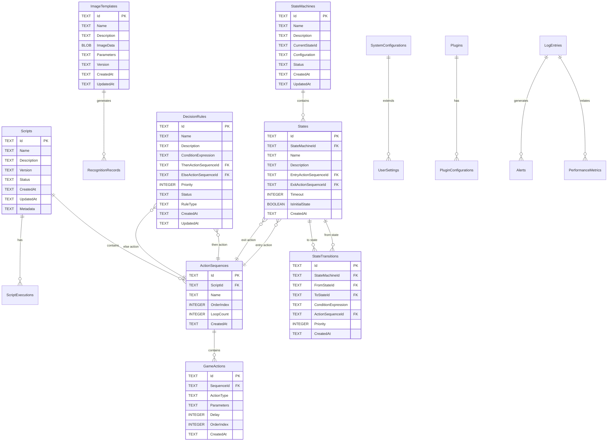

# KeyForge 数据库模式设计

## 1. 数据库架构概述

### 1.1 设计原则
- **领域驱动设计**：数据库设计基于DDD领域模型
- **规范化设计**：避免数据冗余，确保数据一致性
- **性能优化**：合理使用索引和查询优化
- **可扩展性**：支持未来功能的扩展
- **数据完整性**：使用外键约束和业务规则

### 1.2 数据库选择
- **主数据库**：SQLite（嵌入式、轻量级）
- **缓存层**：Redis（高性能缓存）
- **文件存储**：文件系统（图像模板和日志）

## 2. 数据库表结构设计

### 2.1 核心业务表

#### 2.1.1 脚本管理表

```sql
-- 脚本主表
CREATE TABLE Scripts (
    Id TEXT PRIMARY KEY,
    Name TEXT NOT NULL,
    Description TEXT,
    Version TEXT NOT NULL,
    Status TEXT NOT NULL CHECK (Status IN ('Draft', 'Active', 'Paused', 'Stopped', 'Error')),
    CreatedAt TEXT NOT NULL,
    UpdatedAt TEXT NOT NULL,
    Metadata TEXT,
    
    -- 索引
    CONSTRAINT idx_scripts_status CHECK (Status IS NOT NULL),
    CONSTRAINT idx_scripts_name CHECK (Name IS NOT NULL AND LENGTH(Name) >= 3 AND LENGTH(Name) <= 100)
);

-- 创建索引
CREATE INDEX idx_scripts_status ON Scripts(Status);
CREATE INDEX idx_scripts_created_at ON Scripts(CreatedAt);
CREATE INDEX idx_scripts_name ON Scripts(Name);

-- 操作序列表
CREATE TABLE ActionSequences (
    Id TEXT PRIMARY KEY,
    ScriptId TEXT NOT NULL,
    Name TEXT NOT NULL,
    OrderIndex INTEGER NOT NULL,
    LoopCount INTEGER DEFAULT 1 CHECK (LoopCount >= 1),
    CreatedAt TEXT NOT NULL,
    
    FOREIGN KEY (ScriptId) REFERENCES Scripts(Id) ON DELETE CASCADE,
    CONSTRAINT idx_action_sequences_script_id CHECK (ScriptId IS NOT NULL),
    CONSTRAINT idx_action_sequences_order CHECK (OrderIndex >= 0)
);

-- 创建索引
CREATE INDEX idx_action_sequences_script_id ON ActionSequences(ScriptId);
CREATE INDEX idx_action_sequences_order ON ActionSequences(OrderIndex);

-- 游戏操作表
CREATE TABLE GameActions (
    Id TEXT PRIMARY KEY,
    SequenceId TEXT NOT NULL,
    ActionType TEXT NOT NULL CHECK (ActionType IN ('Keyboard', 'Mouse', 'Delay', 'Custom')),
    Parameters TEXT NOT NULL,
    Delay INTEGER DEFAULT 0 CHECK (Delay >= 0),
    OrderIndex INTEGER NOT NULL,
    CreatedAt TEXT NOT NULL,
    
    FOREIGN KEY (SequenceId) REFERENCES ActionSequences(Id) ON DELETE CASCADE,
    CONSTRAINT idx_game_actions_sequence_id CHECK (SequenceId IS NOT NULL),
    CONSTRAINT idx_game_actions_action_type CHECK (ActionType IS NOT NULL)
);

-- 创建索引
CREATE INDEX idx_game_actions_sequence_id ON GameActions(SequenceId);
CREATE INDEX idx_game_actions_action_type ON GameActions(ActionType);
CREATE INDEX idx_game_actions_order ON GameActions(OrderIndex);

-- 脚本执行记录表
CREATE TABLE ScriptExecutions (
    Id TEXT PRIMARY KEY,
    ScriptId TEXT NOT NULL,
    Status TEXT NOT NULL CHECK (Status IN ('Running', 'Completed', 'Failed', 'Cancelled')),
    StartTime TEXT NOT NULL,
    EndTime TEXT,
    Duration INTEGER,
    ErrorMessage TEXT,
    ExecutionData TEXT,
    CreatedAt TEXT NOT NULL,
    
    FOREIGN KEY (ScriptId) REFERENCES Scripts(Id) ON DELETE CASCADE,
    CONSTRAINT idx_script_executions_script_id CHECK (ScriptId IS NOT NULL)
);

-- 创建索引
CREATE INDEX idx_script_executions_script_id ON ScriptExecutions(ScriptId);
CREATE INDEX idx_script_executions_status ON ScriptExecutions(Status);
CREATE INDEX idx_script_executions_start_time ON ScriptExecutions(StartTime);
```

#### 2.1.2 图像识别表

```sql
-- 图像模板表
CREATE TABLE ImageTemplates (
    Id TEXT PRIMARY KEY,
    Name TEXT NOT NULL,
    Description TEXT,
    ImageData BLOB NOT NULL,
    Parameters TEXT NOT NULL,
    Version TEXT NOT NULL,
    CreatedAt TEXT NOT NULL,
    UpdatedAt TEXT NOT NULL,
    
    CONSTRAINT idx_image_templates_name CHECK (Name IS NOT NULL AND LENGTH(Name) >= 3 AND LENGTH(Name) <= 100),
    CONSTRAINT idx_image_templates_version CHECK (Version IS NOT NULL)
);

-- 创建索引
CREATE INDEX idx_image_templates_name ON ImageTemplates(Name);
CREATE INDEX idx_image_templates_version ON ImageTemplates(Version);
CREATE INDEX idx_image_templates_created_at ON ImageTemplates(CreatedAt);

-- 图像识别记录表
CREATE TABLE RecognitionRecords (
    Id TEXT PRIMARY KEY,
    TemplateId TEXT NOT NULL,
    SourceImageHash TEXT NOT NULL,
    Status TEXT NOT NULL CHECK (Status IN ('Success', 'Failed', 'Partial')),
    Confidence REAL NOT NULL CHECK (Confidence >= 0 AND Confidence <= 1),
    LocationX INTEGER,
    LocationY INTEGER,
    ProcessingTime INTEGER NOT NULL,
    Method TEXT NOT NULL,
    ErrorMessage TEXT,
    CreatedAt TEXT NOT NULL,
    
    FOREIGN KEY (TemplateId) REFERENCES ImageTemplates(Id) ON DELETE CASCADE,
    CONSTRAINT idx_recognition_records_template_id CHECK (TemplateId IS NOT NULL)
);

-- 创建索引
CREATE INDEX idx_recognition_records_template_id ON RecognitionRecords(TemplateId);
CREATE INDEX idx_recognition_records_status ON RecognitionRecords(Status);
CREATE INDEX idx_recognition_records_confidence ON RecognitionRecords(Confidence);
CREATE INDEX idx_recognition_records_created_at ON RecognitionRecords(CreatedAt);

-- 图像预处理配置表
CREATE TABLE PreprocessingConfigs (
    Id TEXT PRIMARY KEY,
    Name TEXT NOT NULL,
    ConfigType TEXT NOT NULL CHECK (ConfigType IN ('Grayscale', 'Resize', 'Blur', 'Threshold', 'Custom')),
    Parameters TEXT NOT NULL,
    IsActive BOOLEAN DEFAULT TRUE,
    CreatedAt TEXT NOT NULL,
    UpdatedAt TEXT NOT NULL,
    
    CONSTRAINT idx_preprocessing_configs_name CHECK (Name IS NOT NULL)
);

-- 创建索引
CREATE INDEX idx_preprocessing_configs_name ON PreprocessingConfigs(Name);
CREATE INDEX idx_preprocessing_configs_config_type ON PreprocessingConfigs(ConfigType);
CREATE INDEX idx_preprocessing_configs_is_active ON PreprocessingConfigs(IsActive);
```

#### 2.1.3 决策引擎表

```sql
-- 决策规则表
CREATE TABLE DecisionRules (
    Id TEXT PRIMARY KEY,
    Name TEXT NOT NULL,
    Description TEXT,
    ConditionExpression TEXT NOT NULL,
    ThenActionSequenceId TEXT,
    ElseActionSequenceId TEXT,
    Priority INTEGER DEFAULT 0,
    Status TEXT NOT NULL CHECK (Status IN ('Active', 'Inactive', 'Draft')),
    RuleType TEXT NOT NULL CHECK (RuleType IN ('Simple', 'Complex', 'MachineLearning')),
    CreatedAt TEXT NOT NULL,
    UpdatedAt TEXT NOT NULL,
    
    FOREIGN KEY (ThenActionSequenceId) REFERENCES ActionSequences(Id) ON DELETE SET NULL,
    FOREIGN KEY (ElseActionSequenceId) REFERENCES ActionSequences(Id) ON DELETE SET NULL,
    CONSTRAINT idx_decision_rules_name CHECK (Name IS NOT NULL AND LENGTH(Name) >= 3 AND LENGTH(Name) <= 100)
);

-- 创建索引
CREATE INDEX idx_decision_rules_name ON DecisionRules(Name);
CREATE INDEX idx_decision_rules_status ON DecisionRules(Status);
CREATE INDEX idx_decision_rules_priority ON DecisionRules(Priority);
CREATE INDEX idx_decision_rules_rule_type ON DecisionRules(RuleType);

-- 状态机表
CREATE TABLE StateMachines (
    Id TEXT PRIMARY KEY,
    Name TEXT NOT NULL,
    Description TEXT,
    CurrentStateId TEXT,
    Configuration TEXT NOT NULL,
    Status TEXT NOT NULL CHECK (Status IN ('Active', 'Inactive', 'Error')),
    CreatedAt TEXT NOT NULL,
    UpdatedAt TEXT NOT NULL,
    
    CONSTRAINT idx_state_machines_name CHECK (Name IS NOT NULL AND LENGTH(Name) >= 3 AND LENGTH(Name) <= 100)
);

-- 创建索引
CREATE INDEX idx_state_machines_name ON StateMachines(Name);
CREATE INDEX idx_state_machines_status ON StateMachines(Status);

-- 状态表
CREATE TABLE States (
    Id TEXT PRIMARY KEY,
    StateMachineId TEXT NOT NULL,
    Name TEXT NOT NULL,
    Description TEXT,
    EntryActionSequenceId TEXT,
    ExitActionSequenceId TEXT,
    Timeout INTEGER,
    IsInitialState BOOLEAN DEFAULT FALSE,
    CreatedAt TEXT NOT NULL,
    
    FOREIGN KEY (StateMachineId) REFERENCES StateMachines(Id) ON DELETE CASCADE,
    FOREIGN KEY (EntryActionSequenceId) REFERENCES ActionSequences(Id) ON DELETE SET NULL,
    FOREIGN KEY (ExitActionSequenceId) REFERENCES ActionSequences(Id) ON DELETE SET NULL,
    CONSTRAINT idx_states_name CHECK (Name IS NOT NULL)
);

-- 创建索引
CREATE INDEX idx_states_state_machine_id ON States(StateMachineId);
CREATE INDEX idx_states_name ON States(Name);
CREATE INDEX idx_states_is_initial ON States(IsInitialState);

-- 状态转换表
CREATE TABLE StateTransitions (
    Id TEXT PRIMARY KEY,
    StateMachineId TEXT NOT NULL,
    FromStateId TEXT NOT NULL,
    ToStateId TEXT NOT NULL,
    ConditionExpression TEXT,
    ActionSequenceId TEXT,
    Priority INTEGER DEFAULT 0,
    CreatedAt TEXT NOT NULL,
    
    FOREIGN KEY (StateMachineId) REFERENCES StateMachines(Id) ON DELETE CASCADE,
    FOREIGN KEY (FromStateId) REFERENCES States(Id) ON DELETE CASCADE,
    FOREIGN KEY (ToStateId) REFERENCES States(Id) ON DELETE CASCADE,
    FOREIGN KEY (ActionSequenceId) REFERENCES ActionSequences(Id) ON DELETE SET NULL,
    CONSTRAINT idx_state_transitions_from_to CHECK (FromStateId IS NOT NULL AND ToStateId IS NOT NULL)
);

-- 创建索引
CREATE INDEX idx_state_transitions_state_machine_id ON StateTransitions(StateMachineId);
CREATE INDEX idx_state_transitions_from_state_id ON StateTransitions(FromStateId);
CREATE INDEX idx_state_transitions_to_state_id ON StateTransitions(ToStateId);
```

#### 2.1.4 系统管理表

```sql
-- 系统配置表
CREATE TABLE SystemConfigurations (
    Id TEXT PRIMARY KEY,
    Key TEXT UNIQUE NOT NULL,
    Value TEXT NOT NULL,
    ValueType TEXT NOT NULL CHECK (ValueType IN ('String', 'Integer', 'Boolean', 'Double', 'Json', 'DateTime')),
    Description TEXT,
    IsEncrypted BOOLEAN DEFAULT FALSE,
    IsReadOnly BOOLEAN DEFAULT FALSE,
    CreatedAt TEXT NOT NULL,
    UpdatedAt TEXT NOT NULL,
    
    CONSTRAINT idx_system_configurations_key CHECK (Key IS NOT NULL AND LENGTH(Key) >= 1),
    CONSTRAINT idx_system_configurations_value CHECK (Value IS NOT NULL)
);

-- 创建索引
CREATE INDEX idx_system_configurations_key ON SystemConfigurations(Key);
CREATE INDEX idx_system_configurations_value_type ON SystemConfigurations(ValueType);
CREATE INDEX idx_system_configurations_is_encrypted ON SystemConfigurations(IsEncrypted);

-- 用户设置表
CREATE TABLE UserSettings (
    Id TEXT PRIMARY KEY,
    UserId TEXT NOT NULL,
    SettingKey TEXT NOT NULL,
    SettingValue TEXT NOT NULL,
    ValueType TEXT NOT NULL CHECK (ValueType IN ('String', 'Integer', 'Boolean', 'Double', 'Json')),
    CreatedAt TEXT NOT NULL,
    UpdatedAt TEXT NOT NULL,
    
    CONSTRAINT idx_user_settings_user_key UNIQUE (UserId, SettingKey),
    CONSTRAINT idx_user_settings_user_id CHECK (UserId IS NOT NULL)
);

-- 创建索引
CREATE INDEX idx_user_settings_user_id ON UserSettings(UserId);
CREATE INDEX idx_user_settings_setting_key ON UserSettings(SettingKey);

-- 插件管理表
CREATE TABLE Plugins (
    Id TEXT PRIMARY KEY,
    Name TEXT NOT NULL,
    Version TEXT NOT NULL,
    Description TEXT,
    FilePath TEXT NOT NULL,
    Configuration TEXT,
    Status TEXT NOT NULL CHECK (Status IN ('Installed', 'Active', 'Inactive', 'Error')),
    IsBuiltin BOOLEAN DEFAULT FALSE,
    CreatedAt TEXT NOT NULL,
    UpdatedAt TEXT NOT NULL,
    
    CONSTRAINT idx_plugins_name_version UNIQUE (Name, Version),
    CONSTRAINT idx_plugins_name CHECK (Name IS NOT NULL)
);

-- 创建索引
CREATE INDEX idx_plugins_name ON Plugins(Name);
CREATE INDEX idx_plugins_status ON Plugins(Status);
CREATE INDEX idx_plugins_is_builtin ON Plugins(IsBuiltin);
```

#### 2.1.5 监控和日志表

```sql
-- 日志条目表
CREATE TABLE LogEntries (
    Id TEXT PRIMARY KEY,
    Timestamp TEXT NOT NULL,
    Level TEXT NOT NULL CHECK (Level IN ('Debug', 'Info', 'Warn', 'Error', 'Fatal')),
    Message TEXT NOT NULL,
    Exception TEXT,
    Context TEXT,
    Source TEXT,
    UserId TEXT,
    SessionId TEXT,
    CreatedAt TEXT NOT NULL,
    
    CONSTRAINT idx_log_entries_timestamp CHECK (Timestamp IS NOT NULL),
    CONSTRAINT idx_log_entries_level CHECK (Level IS NOT NULL),
    CONSTRAINT idx_log_entries_message CHECK (Message IS NOT NULL AND LENGTH(Message) >= 1)
);

-- 创建索引
CREATE INDEX idx_log_entries_timestamp ON LogEntries(Timestamp);
CREATE INDEX idx_log_entries_level ON LogEntries(Level);
CREATE INDEX idx_log_entries_source ON LogEntries(Source);
CREATE INDEX idx_log_entries_user_id ON LogEntries(UserId);
CREATE INDEX idx_log_entries_session_id ON LogEntries(SessionId);

-- 性能指标表
CREATE TABLE PerformanceMetrics (
    Id TEXT PRIMARY KEY,
    MetricName TEXT NOT NULL,
    MetricValue REAL NOT NULL,
    MetricType TEXT NOT NULL CHECK (MetricType IN ('Counter', 'Gauge', 'Histogram', 'Summary')),
    Timestamp TEXT NOT NULL,
    Tags TEXT,
    CreatedAt TEXT NOT NULL,
    
    CONSTRAINT idx_performance_metrics_name_timestamp UNIQUE (MetricName, Timestamp),
    CONSTRAINT idx_performance_metrics_name CHECK (MetricName IS NOT NULL)
);

-- 创建索引
CREATE INDEX idx_performance_metrics_name ON PerformanceMetrics(MetricName);
CREATE INDEX idx_performance_metrics_timestamp ON PerformanceMetrics(Timestamp);
CREATE INDEX idx_performance_metrics_metric_type ON PerformanceMetrics(MetricType);

-- 告警记录表
CREATE TABLE Alerts (
    Id TEXT PRIMARY KEY,
    AlertLevel TEXT NOT NULL CHECK (AlertLevel IN ('Info', 'Warning', 'Error', 'Critical')),
    AlertType TEXT NOT NULL,
    Message TEXT NOT NULL,
    Details TEXT,
    Status TEXT NOT NULL CHECK (Status IN ('Active', 'Acknowledged', 'Resolved')),
    Source TEXT,
    CreatedAt TEXT NOT NULL,
    AcknowledgedAt TEXT,
    ResolvedAt TEXT,
    ResolvedBy TEXT,
    
    CONSTRAINT idx_alerts_message CHECK (Message IS NOT NULL AND LENGTH(Message) >= 1)
);

-- 创建索引
CREATE INDEX idx_alerts_level ON Alerts(AlertLevel);
CREATE INDEX idx_alerts_type ON Alerts(AlertType);
CREATE INDEX idx_alerts_status ON Alerts(Status);
CREATE INDEX idx_alerts_created_at ON Alerts(CreatedAt);
```

### 2.2 关系图



## 3. Entity Framework Core 配置

### 3.1 实体配置

#### 3.1.1 脚本相关实体配置

```csharp
// 脚本实体配置
public class ScriptConfiguration : IEntityTypeConfiguration<Script>
{
    public void Configure(EntityTypeBuilder<Script> builder)
    {
        builder.ToTable("Scripts");
        builder.HasKey(s => s.Id);
        builder.Property(s => s.Id).ValueGeneratedNever();
        
        // 属性配置
        builder.Property(s => s.Name)
            .IsRequired()
            .HasMaxLength(100);
            
        builder.Property(s => s.Description)
            .HasMaxLength(500);
            
        builder.Property(s => s.Version)
            .IsRequired()
            .HasMaxLength(20);
            
        builder.Property(s => s.Status)
            .IsRequired()
            .HasMaxLength(20)
            .HasConversion<string>();
            
        builder.Property(s => s.CreatedAt)
            .IsRequired();
            
        builder.Property(s => s.UpdatedAt)
            .IsRequired();
            
        builder.Property(s => s.Metadata)
            .HasColumnType("TEXT");
        
        // 关系配置
        builder.HasMany(s => s.ActionSequences)
            .WithOne()
            .HasForeignKey("ScriptId")
            .OnDelete(DeleteBehavior.Cascade);
            
        builder.HasMany(s => s.ExecutionRecords)
            .WithOne()
            .HasForeignKey("ScriptId")
            .OnDelete(DeleteBehavior.Cascade);
        
        // 索引配置
        builder.HasIndex(s => s.Status)
            .HasDatabaseName("idx_scripts_status");
            
        builder.HasIndex(s => s.CreatedAt)
            .HasDatabaseName("idx_scripts_created_at");
            
        builder.HasIndex(s => s.Name)
            .HasDatabaseName("idx_scripts_name");
    }
}

// 操作序列实体配置
public class ActionSequenceConfiguration : IEntityTypeConfiguration<ActionSequence>
{
    public void Configure(EntityTypeBuilder<ActionSequence> builder)
    {
        builder.ToTable("ActionSequences");
        builder.HasKey(s => s.Id);
        builder.Property(s => s.Id).ValueGeneratedNever();
        
        // 属性配置
        builder.Property(s => s.ScriptId)
            .IsRequired();
            
        builder.Property(s => s.Name)
            .IsRequired()
            .HasMaxLength(100);
            
        builder.Property(s => s.OrderIndex)
            .IsRequired();
            
        builder.Property(s => s.LoopCount)
            .IsRequired()
            .HasDefaultValue(1);
            
        builder.Property(s => s.CreatedAt)
            .IsRequired();
        
        // 关系配置
        builder.HasOne<Script>()
            .WithMany(s => s.ActionSequences)
            .HasForeignKey("ScriptId")
            .OnDelete(DeleteBehavior.Cascade);
            
        builder.HasMany(s => s.Actions)
            .WithOne()
            .HasForeignKey("SequenceId")
            .OnDelete(DeleteBehavior.Cascade);
        
        // 索引配置
        builder.HasIndex("ScriptId")
            .HasDatabaseName("idx_action_sequences_script_id");
            
        builder.HasIndex(s => s.OrderIndex)
            .HasDatabaseName("idx_action_sequences_order");
    }
}

// 游戏操作实体配置
public class GameActionConfiguration : IEntityTypeConfiguration<GameAction>
{
    public void Configure(EntityTypeBuilder<GameAction> builder)
    {
        builder.ToTable("GameActions");
        builder.HasKey(a => a.Id);
        builder.Property(a => a.Id).ValueGeneratedNever();
        
        // 属性配置
        builder.Property(a => a.SequenceId)
            .IsRequired();
            
        builder.Property(a => a.ActionType)
            .IsRequired()
            .HasMaxLength(50)
            .HasConversion<string>();
            
        builder.Property(a => a.Parameters)
            .IsRequired()
            .HasColumnType("TEXT");
            
        builder.Property(a => a.Delay)
            .IsRequired()
            .HasDefaultValue(0);
            
        builder.Property(a => a.OrderIndex)
            .IsRequired();
            
        builder.Property(a => a.CreatedAt)
            .IsRequired();
        
        // 关系配置
        builder.HasOne<ActionSequence>()
            .WithMany(s => s.Actions)
            .HasForeignKey("SequenceId")
            .OnDelete(DeleteBehavior.Cascade);
        
        // 索引配置
        builder.HasIndex("SequenceId")
            .HasDatabaseName("idx_game_actions_sequence_id");
            
        builder.HasIndex(a => a.ActionType)
            .HasDatabaseName("idx_game_actions_action_type");
            
        builder.HasIndex(a => a.OrderIndex)
            .HasDatabaseName("idx_game_actions_order");
            
        // 继承配置
        builder.HasDiscriminator<string>("ActionType")
            .HasValue<KeyboardAction>("Keyboard")
            .HasValue<MouseAction>("Mouse")
            .HasValue<DelayAction>("Delay")
            .HasValue<CustomAction>("Custom");
    }
}
```

#### 3.1.2 图像识别实体配置

```csharp
// 图像模板实体配置
public class ImageTemplateConfiguration : IEntityTypeConfiguration<ImageTemplate>
{
    public void Configure(EntityTypeBuilder<ImageTemplate> builder)
    {
        builder.ToTable("ImageTemplates");
        builder.HasKey(t => t.Id);
        builder.Property(t => t.Id).ValueGeneratedNever();
        
        // 属性配置
        builder.Property(t => t.Name)
            .IsRequired()
            .HasMaxLength(100);
            
        builder.Property(t => t.Description)
            .HasMaxLength(500);
            
        builder.Property(t => t.ImageData)
            .IsRequired();
            
        builder.Property(t => t.Parameters)
            .IsRequired()
            .HasColumnType("TEXT");
            
        builder.Property(t => t.Version)
            .IsRequired()
            .HasMaxLength(20);
            
        builder.Property(t => t.CreatedAt)
            .IsRequired();
            
        builder.Property(t => t.UpdatedAt)
            .IsRequired();
        
        // 关系配置
        builder.HasMany(t => t.RecognitionRecords)
            .WithOne()
            .HasForeignKey("TemplateId")
            .OnDelete(DeleteBehavior.Cascade);
        
        // 索引配置
        builder.HasIndex(t => t.Name)
            .HasDatabaseName("idx_image_templates_name");
            
        builder.HasIndex(t => t.Version)
            .HasDatabaseName("idx_image_templates_version");
            
        builder.HasIndex(t => t.CreatedAt)
            .HasDatabaseName("idx_image_templates_created_at");
    }
}

// 识别记录实体配置
public class RecognitionRecordConfiguration : IEntityTypeConfiguration<RecognitionRecord>
{
    public void Configure(EntityTypeBuilder<RecognitionRecord> builder)
    {
        builder.ToTable("RecognitionRecords");
        builder.HasKey(r => r.Id);
        builder.Property(r => r.Id).ValueGeneratedNever();
        
        // 属性配置
        builder.Property(r => r.TemplateId)
            .IsRequired();
            
        builder.Property(r => r.SourceImageHash)
            .IsRequired()
            .HasMaxLength(64);
            
        builder.Property(r => r.Status)
            .IsRequired()
            .HasMaxLength(20)
            .HasConversion<string>();
            
        builder.Property(r => r.Confidence)
            .IsRequired();
            
        builder.Property(r => r.LocationX);
            
        builder.Property(r => r.LocationY);
            
        builder.Property(r => r.ProcessingTime)
            .IsRequired();
            
        builder.Property(r => r.Method)
            .IsRequired()
            .HasMaxLength(50)
            .HasConversion<string>();
            
        builder.Property(r => r.ErrorMessage)
            .HasMaxLength(1000);
            
        builder.Property(r => r.CreatedAt)
            .IsRequired();
        
        // 关系配置
        builder.HasOne<ImageTemplate>()
            .WithMany(t => t.RecognitionRecords)
            .HasForeignKey("TemplateId")
            .OnDelete(DeleteBehavior.Cascade);
        
        // 索引配置
        builder.HasIndex("TemplateId")
            .HasDatabaseName("idx_recognition_records_template_id");
            
        builder.HasIndex(r => r.Status)
            .HasDatabaseName("idx_recognition_records_status");
            
        builder.HasIndex(r => r.Confidence)
            .HasDatabaseName("idx_recognition_records_confidence");
            
        builder.HasIndex(r => r.CreatedAt)
            .HasDatabaseName("idx_recognition_records_created_at");
    }
}
```

#### 3.1.3 决策引擎实体配置

```csharp
// 决策规则实体配置
public class DecisionRuleConfiguration : IEntityTypeConfiguration<DecisionRule>
{
    public void Configure(EntityTypeBuilder<DecisionRule> builder)
    {
        builder.ToTable("DecisionRules");
        builder.HasKey(r => r.Id);
        builder.Property(r => r.Id).ValueGeneratedNever();
        
        // 属性配置
        builder.Property(r => r.Name)
            .IsRequired()
            .HasMaxLength(100);
            
        builder.Property(r => r.Description)
            .HasMaxLength(500);
            
        builder.Property(r => r.ConditionExpression)
            .IsRequired()
            .HasColumnType("TEXT");
            
        builder.Property(r => r.ThenActionSequenceId);
            
        builder.Property(r => r.ElseActionSequenceId);
            
        builder.Property(r => r.Priority)
            .IsRequired()
            .HasDefaultValue(0);
            
        builder.Property(r => r.Status)
            .IsRequired()
            .HasMaxLength(20)
            .HasConversion<string>();
            
        builder.Property(r => r.RuleType)
            .IsRequired()
            .HasMaxLength(50)
            .HasConversion<string>();
            
        builder.Property(r => r.CreatedAt)
            .IsRequired();
            
        builder.Property(r => r.UpdatedAt)
            .IsRequired();
        
        // 关系配置
        builder.HasOne(r => r.ThenAction)
            .WithMany()
            .HasForeignKey("ThenActionSequenceId")
            .OnDelete(DeleteBehavior.SetNull);
            
        builder.HasOne(r => r.ElseAction)
            .WithMany()
            .HasForeignKey("ElseActionSequenceId")
            .OnDelete(DeleteBehavior.SetNull);
        
        // 索引配置
        builder.HasIndex(r => r.Name)
            .HasDatabaseName("idx_decision_rules_name");
            
        builder.HasIndex(r => r.Status)
            .HasDatabaseName("idx_decision_rules_status");
            
        builder.HasIndex(r => r.Priority)
            .HasDatabaseName("idx_decision_rules_priority");
            
        builder.HasIndex(r => r.RuleType)
            .HasDatabaseName("idx_decision_rules_rule_type");
    }
}

// 状态机实体配置
public class StateMachineConfiguration : IEntityTypeConfiguration<StateMachine>
{
    public void Configure(EntityTypeBuilder<StateMachine> builder)
    {
        builder.ToTable("StateMachines");
        builder.HasKey(m => m.Id);
        builder.Property(m => m.Id).ValueGeneratedNever();
        
        // 属性配置
        builder.Property(m => m.Name)
            .IsRequired()
            .HasMaxLength(100);
            
        builder.Property(m => m.Description)
            .HasMaxLength(500);
            
        builder.Property(m => m.CurrentStateId);
            
        builder.Property(m => m.Configuration)
            .IsRequired()
            .HasColumnType("TEXT");
            
        builder.Property(m => m.Status)
            .IsRequired()
            .HasMaxLength(20)
            .HasConversion<string>();
            
        builder.Property(m => m.CreatedAt)
            .IsRequired();
            
        builder.Property(m => m.UpdatedAt)
            .IsRequired();
        
        // 关系配置
        builder.HasMany(m => m.States)
            .WithOne(s => s.StateMachine)
            .HasForeignKey("StateMachineId")
            .OnDelete(DeleteBehavior.Cascade);
            
        builder.HasMany(m => m.Transitions)
            .WithOne(t => t.StateMachine)
            .HasForeignKey("StateMachineId")
            .OnDelete(DeleteBehavior.Cascade);
        
        // 索引配置
        builder.HasIndex(m => m.Name)
            .HasDatabaseName("idx_state_machines_name");
            
        builder.HasIndex(m => m.Status)
            .HasDatabaseName("idx_state_machines_status");
    }
}
```

### 3.2 值对象转换器

```csharp
// 值对象转换器基类
public abstract class ValueObjectConverter<TValueObject> : ValueConverter<TValueObject, string>
    where TValueObject : ValueObject
{
    protected ValueObjectConverter(ConverterMappingHints mappingHints = null)
        : base(
            convertToProviderExpression: value => ConvertToString(value),
            convertFromProviderExpression: value => ConvertFromString(value),
            mappingHints: mappingHints)
    {
    }
    
    protected abstract string ConvertToString(TValueObject value);
    protected abstract TValueObject ConvertFromString(string value);
}

// 脚本状态转换器
public class ScriptStatusConverter : ValueObjectConverter<ScriptStatus>
{
    public ScriptStatusConverter() : base() { }
    
    protected override string ConvertToString(ScriptStatus value) => value.ToString();
    protected override ScriptStatus ConvertFromString(string value) => Enum.Parse<ScriptStatus>(value);
}

// 识别状态转换器
public class RecognitionStatusConverter : ValueObjectConverter<RecognitionStatus>
{
    public RecognitionStatusConverter() : base() { }
    
    protected override string ConvertToString(RecognitionStatus value) => value.ToString();
    protected override RecognitionStatus ConvertFromString(string value) => Enum.Parse<RecognitionStatus>(value);
}

// 置信度转换器
public class ConfidenceScoreConverter : ValueConverter<ConfidenceScore, double>
{
    public ConfidenceScoreConverter() : base(
        convertToProviderExpression: value => value.Value,
        convertFromProviderExpression: value => new ConfidenceScore(value))
    {
    }
}

// 时间戳转换器
public class TimestampConverter : ValueConverter<Timestamp, string>
{
    public TimestampConverter() : base(
        convertToProviderExpression: value => value.Value.ToString("O"),
        convertFromProviderExpression: value => new Timestamp(DateTimeOffset.Parse(value, null, DateTimeStyles.RoundtripKind)))
    {
    }
}

// 持续时间转换器
public class DurationConverter : ValueConverter<Duration, long>
{
    public DurationConverter() : base(
        convertToProviderExpression: value => value.Value.TotalMilliseconds,
        convertFromProviderExpression: value => new Duration(TimeSpan.FromMilliseconds(value)))
    {
    }
}

// JSON 转换器
public class JsonConverter<T> : ValueConverter<T, string>
    where T : class
{
    public JsonConverter() : base(
        convertToProviderExpression: value => JsonSerializer.Serialize(value, (JsonSerializerOptions?)null),
        convertFromProviderExpression: value => JsonSerializer.Deserialize<T>(value, (JsonSerializerOptions?)null))
    {
    }
}
```

## 4. 仓储模式实现

### 4.1 仓储接口定义

#### 4.1.1 基础仓储接口

```csharp
// 基础仓储接口
public interface IRepository<T, TId> where T : Entity<TId>
{
    Task<T?> GetByIdAsync(TId id);
    Task<IEnumerable<T>> GetAllAsync();
    Task<IEnumerable<T>> FindAsync(Expression<Func<T, bool>> predicate);
    Task AddAsync(T entity);
    Task AddRangeAsync(IEnumerable<T> entities);
    void Update(T entity);
    void Remove(T entity);
    void RemoveRange(IEnumerable<T> entities);
    Task<int> SaveChangesAsync();
    Task<bool> ExistsAsync(TId id);
    Task<int> CountAsync(Expression<Func<T, bool>>? predicate = null);
}

// 查询仓储接口
public interface IQueryRepository<T, TId> where T : Entity<TId>
{
    Task<T?> GetByIdAsync(TId id);
    Task<IEnumerable<T>> GetAllAsync();
    Task<IEnumerable<T>> FindAsync(Expression<Func<T, bool>> predicate);
    Task<T?> FirstOrDefaultAsync(Expression<Func<T, bool>> predicate);
    Task<bool> AnyAsync(Expression<Func<T, bool>> predicate);
    Task<int> CountAsync(Expression<Func<T, bool>>? predicate = null);
    Task<IEnumerable<T>> GetPagedAsync(int page, int pageSize, Expression<Func<T, bool>>? predicate = null);
    Task<IEnumerable<T>> GetOrderedAsync<TKey>(Expression<Func<T, TKey>> keySelector, bool ascending = true);
}

// 命令仓储接口
public interface ICommandRepository<T, TId> where T : Entity<TId>
{
    Task AddAsync(T entity);
    Task AddRangeAsync(IEnumerable<T> entities);
    void Update(T entity);
    void Remove(T entity);
    void RemoveRange(IEnumerable<T> entities);
    Task<int> SaveChangesAsync();
}
```

#### 4.1.2 具体仓储接口

```csharp
// 脚本仓储接口
public interface IScriptRepository : IRepository<Script, ScriptId>
{
    Task<IEnumerable<Script>> GetByStatusAsync(ScriptStatus status);
    Task<IEnumerable<Script>> GetByNameAsync(string name);
    Task<Script?> GetWithDetailsAsync(ScriptId id);
    Task<IEnumerable<ScriptExecution>> GetExecutionsAsync(ScriptId scriptId);
    Task<bool> NameExistsAsync(string name, ScriptId? excludeId = null);
}

// 图像模板仓储接口
public interface IImageTemplateRepository : IRepository<ImageTemplate, ImageTemplateId>
{
    Task<IEnumerable<ImageTemplate>> GetByNameAsync(string name);
    Task<ImageTemplate?> GetWithRecordsAsync(ImageTemplateId id);
    Task<IEnumerable<RecognitionRecord>> GetRecognitionRecordsAsync(ImageTemplateId templateId);
    Task<bool> NameExistsAsync(string name, ImageTemplateId? excludeId = null);
    Task<IEnumerable<ImageTemplate>> GetByRecognitionMethodAsync(RecognitionMethod method);
}

// 决策规则仓储接口
public interface IDecisionRuleRepository : IRepository<DecisionRule, RuleId>
{
    Task<IEnumerable<DecisionRule>> GetByStatusAsync(RuleStatus status);
    Task<IEnumerable<DecisionRule>> GetByPriorityAsync(int minPriority, int maxPriority);
    Task<DecisionRule?> GetWithActionsAsync(RuleId id);
    Task<IEnumerable<DecisionRule>> GetByRuleTypeAsync(RuleType type);
    Task<bool> NameExistsAsync(string name, RuleId? excludeId = null);
}

// 状态机仓储接口
public interface IStateMachineRepository : IRepository<StateMachine, StateMachineId>
{
    Task<IEnumerable<StateMachine>> GetByStatusAsync(StateMachineStatus status);
    Task<StateMachine?> GetWithDetailsAsync(StateMachineId id);
    Task<StateMachine?> GetByNameAsync(string name);
    Task<bool> NameExistsAsync(string name, StateMachineId? excludeId = null);
}

// 日志仓储接口
public interface ILogEntryRepository : IRepository<LogEntry, LogId>
{
    Task<IEnumerable<LogEntry>> GetByLevelAsync(LogLevel level);
    Task<IEnumerable<LogEntry>> GetByTimeRangeAsync(DateTimeOffset startTime, DateTimeOffset endTime);
    Task<IEnumerable<LogEntry>> GetBySourceAsync(string source);
    Task<IEnumerable<LogEntry>> GetByUserIdAsync(string userId);
    Task<IEnumerable<LogEntry>> GetBySessionIdAsync(string sessionId);
    Task<int> GetCountByLevelAsync(LogLevel level);
    Task CleanupOldLogsAsync(DateTimeOffset cutoffDate);
}
```

### 4.2 仓储实现

#### 4.2.1 基础仓储实现

```csharp
// 基础仓储实现
public abstract class BaseRepository<T, TId, TDbContext> : IRepository<T, TId>
    where T : Entity<TId>
    where TDbContext : DbContext
{
    protected readonly TDbContext _context;
    protected readonly DbSet<T> _dbSet;
    protected readonly ILogger<BaseRepository<T, TId, TDbContext>> _logger;
    
    protected BaseRepository(TDbContext context, ILogger<BaseRepository<T, TId, TDbContext>> logger)
    {
        _context = context;
        _dbSet = context.Set<T>();
        _logger = logger;
    }
    
    public virtual async Task<T?> GetByIdAsync(TId id)
    {
        try
        {
            return await _dbSet.FindAsync(id);
        }
        catch (Exception ex)
        {
            _logger.LogError(ex, "Error getting entity by ID {Id}", id);
            throw;
        }
    }
    
    public virtual async Task<IEnumerable<T>> GetAllAsync()
    {
        try
        {
            return await _dbSet.ToListAsync();
        }
        catch (Exception ex)
        {
            _logger.LogError(ex, "Error getting all entities");
            throw;
        }
    }
    
    public virtual async Task<IEnumerable<T>> FindAsync(Expression<Func<T, bool>> predicate)
    {
        try
        {
            return await _dbSet.Where(predicate).ToListAsync();
        }
        catch (Exception ex)
        {
            _logger.LogError(ex, "Error finding entities with predicate");
            throw;
        }
    }
    
    public virtual async Task AddAsync(T entity)
    {
        try
        {
            await _dbSet.AddAsync(entity);
            _logger.LogDebug("Entity added: {EntityType} {Id}", typeof(T).Name, entity.Id);
        }
        catch (Exception ex)
        {
            _logger.LogError(ex, "Error adding entity");
            throw;
        }
    }
    
    public virtual async Task AddRangeAsync(IEnumerable<T> entities)
    {
        try
        {
            await _dbSet.AddRangeAsync(entities);
            _logger.LogDebug("Added {Count} entities of type {EntityType}", 
                entities.Count(), typeof(T).Name);
        }
        catch (Exception ex)
        {
            _logger.LogError(ex, "Error adding entities range");
            throw;
        }
    }
    
    public virtual void Update(T entity)
    {
        try
        {
            _dbSet.Update(entity);
            _logger.LogDebug("Entity updated: {EntityType} {Id}", typeof(T).Name, entity.Id);
        }
        catch (Exception ex)
        {
            _logger.LogError(ex, "Error updating entity");
            throw;
        }
    }
    
    public virtual void Remove(T entity)
    {
        try
        {
            _dbSet.Remove(entity);
            _logger.LogDebug("Entity removed: {EntityType} {Id}", typeof(T).Name, entity.Id);
        }
        catch (Exception ex)
        {
            _logger.LogError(ex, "Error removing entity");
            throw;
        }
    }
    
    public virtual void RemoveRange(IEnumerable<T> entities)
    {
        try
        {
            _dbSet.RemoveRange(entities);
            _logger.LogDebug("Removed {Count} entities of type {EntityType}", 
                entities.Count(), typeof(T).Name);
        }
        catch (Exception ex)
        {
            _logger.LogError(ex, "Error removing entities range");
            throw;
        }
    }
    
    public virtual async Task<int> SaveChangesAsync()
    {
        try
        {
            return await _context.SaveChangesAsync();
        }
        catch (Exception ex)
        {
            _logger.LogError(ex, "Error saving changes");
            throw;
        }
    }
    
    public virtual async Task<bool> ExistsAsync(TId id)
    {
        try
        {
            return await _dbSet.AnyAsync(e => e.Id.Equals(id));
        }
        catch (Exception ex)
        {
            _logger.LogError(ex, "Error checking entity existence");
            throw;
        }
    }
    
    public virtual async Task<int> CountAsync(Expression<Func<T, bool>>? predicate = null)
    {
        try
        {
            return predicate == null 
                ? await _dbSet.CountAsync()
                : await _dbSet.CountAsync(predicate);
        }
        catch (Exception ex)
        {
            _logger.LogError(ex, "Error counting entities");
            throw;
        }
    }
}
```

#### 4.2.2 具体仓储实现

```csharp
// 脚本仓储实现
public class ScriptRepository : BaseRepository<Script, ScriptId, KeyForgeDbContext>, IScriptRepository
{
    public ScriptRepository(KeyForgeDbContext context, ILogger<ScriptRepository> logger)
        : base(context, logger)
    {
    }
    
    public async Task<IEnumerable<Script>> GetByStatusAsync(ScriptStatus status)
    {
        try
        {
            return await _dbSet
                .Where(s => s.Status == status)
                .OrderBy(s => s.Name)
                .ToListAsync();
        }
        catch (Exception ex)
        {
            _logger.LogError(ex, "Error getting scripts by status {Status}", status);
            throw;
        }
    }
    
    public async Task<IEnumerable<Script>> GetByNameAsync(string name)
    {
        try
        {
            return await _dbSet
                .Where(s => s.Name.Value.Contains(name))
                .OrderBy(s => s.Name)
                .ToListAsync();
        }
        catch (Exception ex)
        {
            _logger.LogError(ex, "Error getting scripts by name {Name}", name);
            throw;
        }
    }
    
    public async Task<Script?> GetWithDetailsAsync(ScriptId id)
    {
        try
        {
            return await _dbSet
                .Include(s => s.ActionSequences)
                .ThenInclude(a => a.Actions)
                .FirstOrDefaultAsync(s => s.Id == id);
        }
        catch (Exception ex)
        {
            _logger.LogError(ex, "Error getting script with details for ID {Id}", id);
            throw;
        }
    }
    
    public async Task<IEnumerable<ScriptExecution>> GetExecutionsAsync(ScriptId scriptId)
    {
        try
        {
            return await _context.ScriptExecutions
                .Where(e => e.ScriptId == scriptId)
                .OrderByDescending(e => e.StartTime)
                .ToListAsync();
        }
        catch (Exception ex)
        {
            _logger.LogError(ex, "Error getting script executions for script ID {ScriptId}", scriptId);
            throw;
        }
    }
    
    public async Task<bool> NameExistsAsync(string name, ScriptId? excludeId = null)
    {
        try
        {
            var query = _dbSet.Where(s => s.Name.Value == name);
            
            if (excludeId.HasValue)
            {
                query = query.Where(s => s.Id != excludeId.Value);
            }
            
            return await query.AnyAsync();
        }
        catch (Exception ex)
        {
            _logger.LogError(ex, "Error checking if script name exists: {Name}", name);
            throw;
        }
    }
}

// 图像模板仓储实现
public class ImageTemplateRepository : BaseRepository<ImageTemplate, ImageTemplateId, KeyForgeDbContext>, IImageTemplateRepository
{
    public ImageTemplateRepository(KeyForgeDbContext context, ILogger<ImageTemplateRepository> logger)
        : base(context, logger)
    {
    }
    
    public async Task<IEnumerable<ImageTemplate>> GetByNameAsync(string name)
    {
        try
        {
            return await _dbSet
                .Where(t => t.Name.Value.Contains(name))
                .OrderBy(t => t.Name)
                .ToListAsync();
        }
        catch (Exception ex)
        {
            _logger.LogError(ex, "Error getting image templates by name {Name}", name);
            throw;
        }
    }
    
    public async Task<ImageTemplate?> GetWithRecordsAsync(ImageTemplateId id)
    {
        try
        {
            return await _dbSet
                .Include(t => t.RecognitionRecords)
                .FirstOrDefaultAsync(t => t.Id == id);
        }
        catch (Exception ex)
        {
            _logger.LogError(ex, "Error getting image template with records for ID {Id}", id);
            throw;
        }
    }
    
    public async Task<IEnumerable<RecognitionRecord>> GetRecognitionRecordsAsync(ImageTemplateId templateId)
    {
        try
        {
            return await _context.RecognitionRecords
                .Where(r => r.TemplateId == templateId)
                .OrderByDescending(r => r.CreatedAt)
                .ToListAsync();
        }
        catch (Exception ex)
        {
            _logger.LogError(ex, "Error getting recognition records for template ID {TemplateId}", templateId);
            throw;
        }
    }
    
    public async Task<bool> NameExistsAsync(string name, ImageTemplateId? excludeId = null)
    {
        try
        {
            var query = _dbSet.Where(t => t.Name.Value == name);
            
            if (excludeId.HasValue)
            {
                query = query.Where(t => t.Id != excludeId.Value);
            }
            
            return await query.AnyAsync();
        }
        catch (Exception ex)
        {
            _logger.LogError(ex, "Error checking if image template name exists: {Name}", name);
            throw;
        }
    }
    
    public async Task<IEnumerable<ImageTemplate>> GetByRecognitionMethodAsync(RecognitionMethod method)
    {
        try
        {
            return await _dbSet
                .Where(t => t.Parameters.Method == method)
                .OrderBy(t => t.Name)
                .ToListAsync();
        }
        catch (Exception ex)
        {
            _logger.LogError(ex, "Error getting image templates by recognition method {Method}", method);
            throw;
        }
    }
}
```

### 4.3 工作单元模式

#### 4.3.1 工作单元接口

```csharp
// 工作单元接口
public interface IUnitOfWork : IDisposable
{
    IScriptRepository Scripts { get; }
    IImageTemplateRepository ImageTemplates { get; }
    IDecisionRuleRepository DecisionRules { get; }
    IStateMachineRepository StateMachines { get; }
    ILogEntryRepository LogEntries { get; }
    ISystemConfigurationRepository Configurations { get; }
    
    Task<int> SaveChangesAsync();
    Task BeginTransactionAsync();
    Task CommitTransactionAsync();
    Task RollbackTransactionAsync();
}

// 工作单元实现
public class UnitOfWork : IUnitOfWork
{
    private readonly KeyForgeDbContext _context;
    private readonly ILogger<UnitOfWork> _logger;
    private IDbContextTransaction? _transaction;
    
    public UnitOfWork(KeyForgeDbContext context, ILogger<UnitOfWork> logger)
    {
        _context = context;
        _logger = logger;
        
        Scripts = new ScriptRepository(context, logger);
        ImageTemplates = new ImageTemplateRepository(context, logger);
        DecisionRules = new DecisionRuleRepository(context, logger);
        StateMachines = new StateMachineRepository(context, logger);
        LogEntries = new LogEntryRepository(context, logger);
        Configurations = new SystemConfigurationRepository(context, logger);
    }
    
    public IScriptRepository Scripts { get; }
    public IImageTemplateRepository ImageTemplates { get; }
    public IDecisionRuleRepository DecisionRules { get; }
    public IStateMachineRepository StateMachines { get; }
    public ILogEntryRepository LogEntries { get; }
    public ISystemConfigurationRepository Configurations { get; }
    
    public async Task<int> SaveChangesAsync()
    {
        try
        {
            // 更新时间戳
            UpdateTimestamps();
            
            var result = await _context.SaveChangesAsync();
            _logger.LogDebug("Saved {Count} changes to database", result);
            
            return result;
        }
        catch (Exception ex)
        {
            _logger.LogError(ex, "Error saving changes to database");
            throw;
        }
    }
    
    public async Task BeginTransactionAsync()
    {
        try
        {
            _transaction = await _context.Database.BeginTransactionAsync();
            _logger.LogDebug("Database transaction started");
        }
        catch (Exception ex)
        {
            _logger.LogError(ex, "Error beginning database transaction");
            throw;
        }
    }
    
    public async Task CommitTransactionAsync()
    {
        try
        {
            if (_transaction != null)
            {
                await _transaction.CommitAsync();
                await _transaction.DisposeAsync();
                _transaction = null;
                _logger.LogDebug("Database transaction committed");
            }
        }
        catch (Exception ex)
        {
            _logger.LogError(ex, "Error committing database transaction");
            throw;
        }
    }
    
    public async Task RollbackTransactionAsync()
    {
        try
        {
            if (_transaction != null)
            {
                await _transaction.RollbackAsync();
                await _transaction.DisposeAsync();
                _transaction = null;
                _logger.LogDebug("Database transaction rolled back");
            }
        }
        catch (Exception ex)
        {
            _logger.LogError(ex, "Error rolling back database transaction");
            throw;
        }
    }
    
    private void UpdateTimestamps()
    {
        var entries = _context.ChangeTracker.Entries<BaseEntity>();
        
        foreach (var entry in entries)
        {
            switch (entry.State)
            {
                case EntityState.Added:
                    entry.Entity.CreatedAt = Timestamp.Now;
                    entry.Entity.UpdatedAt = Timestamp.Now;
                    break;
                    
                case EntityState.Modified:
                    entry.Entity.UpdatedAt = Timestamp.Now;
                    break;
            }
        }
    }
    
    public void Dispose()
    {
        _transaction?.Dispose();
        _context.Dispose();
    }
}
```

## 5. 数据库迁移和初始化

### 5.1 数据库迁移配置

```csharp
// 数据库迁移配置
public static class DatabaseMigration
{
    public static void MigrateDatabase(this IApplicationBuilder app, ILogger<Program> logger)
    {
        using var scope = app.ApplicationServices.CreateScope();
        var context = scope.ServiceProvider.GetRequiredService<KeyForgeDbContext>();
        
        try
        {
            logger.LogInformation("Applying database migrations...");
            
            // 应用迁移
            context.Database.Migrate();
            
            logger.LogInformation("Database migrations applied successfully");
        }
        catch (Exception ex)
        {
            logger.LogError(ex, "Error applying database migrations");
            throw;
        }
    }
    
    public static async Task InitializeDatabaseAsync(this IServiceProvider services, ILogger<Program> logger)
    {
        using var scope = services.CreateScope();
        var context = scope.ServiceProvider.GetRequiredService<KeyForgeDbContext>();
        
        try
        {
            logger.LogInformation("Initializing database...");
            
            // 初始化基础数据
            await InitializeDefaultDataAsync(context);
            
            logger.LogInformation("Database initialized successfully");
        }
        catch (Exception ex)
        {
            logger.LogError(ex, "Error initializing database");
            throw;
        }
    }
    
    private static async Task InitializeDefaultDataAsync(KeyForgeDbContext context)
    {
        // 初始化系统配置
        await InitializeSystemConfigurationsAsync(context);
        
        // 初始化默认预处理配置
        await InitializePreprocessingConfigsAsync(context);
        
        await context.SaveChangesAsync();
    }
    
    private static async Task InitializeSystemConfigurationsAsync(KeyForgeDbContext context)
    {
        var configurations = new List<SystemConfiguration>
        {
            new SystemConfiguration(
                "General.ApplicationName",
                "KeyForge",
                "Application name",
                false),
            new SystemConfiguration(
                "General.Version",
                "1.0.0",
                "Application version",
                false),
            new SystemConfiguration(
                "Recognition.DefaultConfidenceThreshold",
                "0.8",
                "Default confidence threshold for image recognition",
                false),
            new SystemConfiguration(
                "Recognition.DefaultTimeout",
                "5000",
                "Default timeout for image recognition in milliseconds",
                false),
            new SystemConfiguration(
                "Execution.DefaultDelay",
                "100",
                "Default delay between actions in milliseconds",
                false),
            new SystemConfiguration(
                "Logging.DefaultLevel",
                "Information",
                "Default logging level",
                false),
            new SystemConfiguration(
                "Performance.EnableMetrics",
                "true",
                "Enable performance metrics collection",
                false)
        };
        
        foreach (var config in configurations)
        {
            if (!await context.SystemConfigurations.AnyAsync(c => c.Key == config.Key))
            {
                await context.SystemConfigurations.AddAsync(config);
            }
        }
    }
    
    private static async Task InitializePreprocessingConfigsAsync(KeyForgeDbContext context)
    {
        var configs = new List<PreprocessingConfig>
        {
            new PreprocessingConfig(
                "Grayscale Basic",
                PreprocessingConfigType.Grayscale,
                "{}",
                true),
            new PreprocessingConfig(
                "Resize 800x600",
                PreprocessingConfigType.Resize,
                "{\"width\": 800, \"height\": 600}",
                true),
            new PreprocessingConfig(
                "Blur 3x3",
                PreprocessingConfigType.Blur,
                "{\"kernelSize\": 3}",
                true),
            new PreprocessingConfig(
                "Threshold 128",
                PreprocessingConfigType.Threshold,
                "{\"threshold\": 128}",
                true)
        };
        
        foreach (var config in configs)
        {
            if (!await context.PreprocessingConfigs.AnyAsync(c => c.Name == config.Name))
            {
                await context.PreprocessingConfigs.AddAsync(config);
            }
        }
    }
}
```

### 5.2 数据库种子数据

```csharp
// 数据库种子数据
public static class DatabaseSeeder
{
    public static async Task SeedSampleDataAsync(KeyForgeDbContext context)
    {
        // 种子示例脚本
        await SeedSampleScriptsAsync(context);
        
        // 种子示例图像模板
        await SeedSampleImageTemplatesAsync(context);
        
        // 种子示例决策规则
        await SeedSampleDecisionRulesAsync(context);
        
        await context.SaveChangesAsync();
    }
    
    private static async Task SeedSampleScriptsAsync(KeyForgeDbContext context)
    {
        var sampleScripts = new List<Script>
        {
            new Script(
                new ScriptName("Hello World"),
                new ScriptDescription("A simple hello world script"),
                ScriptVersion.Initial),
            new Script(
                new ScriptName("Auto Clicker"),
                new ScriptDescription("Automatic mouse clicking script"),
                ScriptVersion.Initial),
            new Script(
                new ScriptName("Keyboard Spammer"),
                new ScriptDescription("Automatic keyboard input script"),
                ScriptVersion.Initial)
        };
        
        foreach (var script in sampleScripts)
        {
            if (!await context.Scripts.AnyAsync(s => s.Name == script.Name))
            {
                await context.Scripts.AddAsync(script);
            }
        }
    }
    
    private static async Task SeedSampleImageTemplatesAsync(KeyForgeDbContext context)
    {
        var sampleTemplates = new List<ImageTemplate>
        {
            new ImageTemplate(
                new TemplateName("Start Button"),
                new TemplateDescription("Game start button template"),
                new ImageData(Array.Empty<byte>(), "start_button.png"),
                new RecognitionParameters(
                    RecognitionMethod.TemplateMatching,
                    0.8,
                    null,
                    new PreprocessingParameters())),
            new ImageTemplate(
                new TemplateName("OK Button"),
                new TemplateDescription("OK button template"),
                new ImageData(Array.Empty<byte>(), "ok_button.png"),
                new RecognitionParameters(
                    RecognitionMethod.TemplateMatching,
                    0.8,
                    null,
                    new PreprocessingParameters()))
        };
        
        foreach (var template in sampleTemplates)
        {
            if (!await context.ImageTemplates.AnyAsync(t => t.Name == template.Name))
            {
                await context.ImageTemplates.AddAsync(template);
            }
        }
    }
    
    private static async Task SeedSampleDecisionRulesAsync(KeyForgeDbContext context)
    {
        var sampleRules = new List<DecisionRule>
        {
            new DecisionRule(
                new RuleName("Health Check"),
                new ConditionExpression("health < 50"),
                null,
                null,
                1,
                RuleStatus.Active,
                RuleType.Simple),
            new DecisionRule(
                new RuleName("Mana Check"),
                new ConditionExpression("mana < 30"),
                null,
                null,
                2,
                RuleStatus.Active,
                RuleType.Simple)
        };
        
        foreach (var rule in sampleRules)
        {
            if (!await context.DecisionRules.AnyAsync(r => r.Name == rule.Name))
            {
                await context.DecisionRules.AddAsync(rule);
            }
        }
    }
}
```

## 6. 数据库性能优化

### 6.1 查询优化

```csharp
// 查询优化服务
public static class QueryOptimization
{
    // 分页查询优化
    public static async Task<PagedResult<T>> GetPagedAsync<T>(
        this IQueryable<T> query,
        int page,
        int pageSize,
        CancellationToken cancellationToken = default)
    {
        var totalCount = await query.CountAsync(cancellationToken);
        
        var items = await query
            .Skip((page - 1) * pageSize)
            .Take(pageSize)
            .ToListAsync(cancellationToken);
            
        return new PagedResult<T>(items, totalCount, page, pageSize);
    }
    
    // 只查询必要字段
    public static IQueryable<TProjection> SelectFields<T, TProjection>(
        this IQueryable<T> query,
        Expression<Func<T, TProjection>> selector)
    {
        return query.Select(selector);
    }
    
    // 条件查询
    public static IQueryable<T> WhereIf<T>(
        this IQueryable<T> query,
        bool condition,
        Expression<Func<T, bool>> predicate)
    {
        return condition ? query.Where(predicate) : query;
    }
    
    // 多条件查询
    public static IQueryable<T> WhereIf<T>(
        this IQueryable<T> query,
        bool condition,
        Expression<Func<T, bool>> truePredicate,
        Expression<Func<T, bool>> falsePredicate)
    {
        return condition ? query.Where(truePredicate) : query.Where(falsePredicate);
    }
    
    // 包含查询优化
    public static IQueryable<T> IncludeMultiple<T>(
        this IQueryable<T> query,
        params Expression<Func<T, object>>[] includes)
        where T : class
    {
        return includes.Aggregate(query, (current, include) => current.Include(include));
    }
    
    // 异步流查询
    public static async IAsyncEnumerable<T> AsAsyncEnumerable<T>(
        this IQueryable<T> query,
        [EnumeratorCancellation] CancellationToken cancellationToken = default)
    {
        await foreach (var item in query.AsAsyncEnumerable().WithCancellation(cancellationToken))
        {
            yield return item;
        }
    }
}

// 分页结果
public record PagedResult<T>(
    IReadOnlyList<T> Items,
    int TotalCount,
    int Page,
    int PageSize)
{
    public int TotalPages => (int)Math.Ceiling(TotalCount / (double)PageSize);
    public bool HasPrevious => Page > 1;
    public bool HasNext => Page < TotalPages;
}
```

### 6.2 缓存策略

```csharp
// 缓存策略服务
public class CacheStrategyService
{
    private readonly ICacheService _cache;
    private readonly ILogger<CacheStrategyService> _logger;
    
    public CacheStrategyService(ICacheService cache, ILogger<CacheStrategyService> logger)
    {
        _cache = cache;
        _logger = logger;
    }
    
    // 获取缓存数据
    public async Task<T> GetOrSetAsync<T>(
        string key,
        Func<Task<T>> factory,
        TimeSpan? expiration = null,
        CancellationToken cancellationToken = default)
    {
        try
        {
            // 尝试从缓存获取
            var cachedValue = await _cache.GetAsync<T>(key);
            if (cachedValue != null)
            {
                _logger.LogDebug("Cache hit for key: {Key}", key);
                return cachedValue;
            }
            
            // 缓存未命中，从数据源获取
            _logger.LogDebug("Cache miss for key: {Key}", key);
            var value = await factory();
            
            // 设置缓存
            await _cache.SetAsync(key, value, expiration);
            
            return value;
        }
        catch (Exception ex)
        {
            _logger.LogError(ex, "Error getting cached value for key: {Key}", key);
            throw;
        }
    }
    
    // 移除缓存
    public async Task RemoveAsync(string key)
    {
        try
        {
            await _cache.RemoveAsync(key);
            _logger.LogDebug("Cache removed for key: {Key}", key);
        }
        catch (Exception ex)
        {
            _logger.LogError(ex, "Error removing cache for key: {Key}", key);
            throw;
        }
    }
    
    // 批量移除缓存
    public async Task RemoveAsync(IEnumerable<string> keys)
    {
        try
        {
            var tasks = keys.Select(key => RemoveAsync(key));
            await Task.WhenAll(tasks);
            _logger.LogDebug("Cache removed for {Count} keys", keys.Count());
        }
        catch (Exception ex)
        {
            _logger.LogError(ex, "Error removing cache for multiple keys");
            throw;
        }
    }
    
    // 按模式移除缓存
    public async Task RemoveByPatternAsync(string pattern)
    {
        try
        {
            // 注意：Redis支持模式匹配，其他缓存可能需要自定义实现
            await _cache.RemoveByPatternAsync(pattern);
            _logger.LogDebug("Cache removed for pattern: {Pattern}", pattern);
        }
        catch (Exception ex)
        {
            _logger.LogError(ex, "Error removing cache for pattern: {Pattern}", pattern);
            throw;
        }
    }
}
```

## 7. 数据库备份和恢复

### 7.1 备份策略

```csharp
// 数据库备份服务
public class DatabaseBackupService
{
    private readonly KeyForgeDbContext _context;
    private readonly ILogger<DatabaseBackupService> _logger;
    private readonly IOptions<DatabaseOptions> _options;
    
    public DatabaseBackupService(
        KeyForgeDbContext context,
        ILogger<DatabaseBackupService> logger,
        IOptions<DatabaseOptions> options)
    {
        _context = context;
        _logger = logger;
        _options = options;
    }
    
    // 创建备份
    public async Task<string> CreateBackupAsync(string backupName = null)
    {
        try
        {
            backupName ??= $"keyforge_backup_{DateTime.Now:yyyyMMdd_HHmmss}.db";
            var backupPath = Path.Combine(_options.Value.BackupPath, backupName);
            
            // 确保备份目录存在
            Directory.CreateDirectory(_options.Value.BackupPath);
            
            // 使用SQLite的备份API
            using var sourceConnection = _context.Database.GetDbConnection();
            using var backupConnection = new SqliteConnection($"Data Source={backupPath}");
            
            await sourceConnection.OpenAsync();
            await backupConnection.OpenAsync();
            
            using var backup = new SqliteBackup(backupConnection, "main", sourceConnection, "main");
            await backup.StepAsync();
            
            _logger.LogInformation("Database backup created: {BackupPath}", backupPath);
            
            return backupPath;
        }
        catch (Exception ex)
        {
            _logger.LogError(ex, "Error creating database backup");
            throw;
        }
    }
    
    // 恢复备份
    public async Task RestoreBackupAsync(string backupPath)
    {
        try
        {
            if (!File.Exists(backupPath))
            {
                throw new FileNotFoundException("Backup file not found", backupPath);
            }
            
            // 关闭所有连接
            await _context.Database.CloseConnectionAsync();
            
            // 使用SQLite的恢复API
            using var backupConnection = new SqliteConnection($"Data Source={backupPath}");
            using var targetConnection = _context.Database.GetDbConnection();
            
            await backupConnection.OpenAsync();
            await targetConnection.OpenAsync();
            
            using var backup = new SqliteBackup(targetConnection, "main", backupConnection, "main");
            await backup.StepAsync();
            
            _logger.LogInformation("Database restored from backup: {BackupPath}", backupPath);
        }
        catch (Exception ex)
        {
            _logger.LogError(ex, "Error restoring database backup");
            throw;
        }
    }
    
    // 清理旧备份
    public async Task CleanupOldBackupsAsync(int retentionDays = 30)
    {
        try
        {
            var cutoffDate = DateTime.Now.AddDays(-retentionDays);
            var backupFiles = Directory.GetFiles(_options.Value.BackupPath, "keyforge_backup_*.db");
            
            foreach (var file in backupFiles)
            {
                var fileInfo = new FileInfo(file);
                if (fileInfo.CreationTime < cutoffDate)
                {
                    File.Delete(file);
                    _logger.LogDebug("Deleted old backup: {BackupFile}", file);
                }
            }
        }
        catch (Exception ex)
        {
            _logger.LogError(ex, "Error cleaning up old backups");
            throw;
        }
    }
    
    // 获取备份列表
    public async Task<IEnumerable<BackupInfo>> GetBackupListAsync()
    {
        try
        {
            var backupFiles = Directory.GetFiles(_options.Value.BackupPath, "keyforge_backup_*.db");
            
            var backups = backupFiles.Select(file =>
            {
                var fileInfo = new FileInfo(file);
                return new BackupInfo
                {
                    FileName = Path.GetFileName(file),
                    FilePath = file,
                    Size = fileInfo.Length,
                    CreatedAt = fileInfo.CreationTime
                };
            }).OrderByDescending(b => b.CreatedAt);
            
            return await Task.FromResult(backups);
        }
        catch (Exception ex)
        {
            _logger.LogError(ex, "Error getting backup list");
            throw;
        }
    }
}

// 备份信息
public record BackupInfo
{
    public string FileName { get; init; }
    public string FilePath { get; init; }
    public long Size { get; init; }
    public DateTime CreatedAt { get; init; }
}
```

## 8. 总结

KeyForge系统的数据库设计采用DDD设计模式，结合SQLite的轻量级特性和Entity Framework Core的ORM功能，提供了完整的数据持久化解决方案。

### 8.1 设计亮点
- **领域驱动设计**：数据库设计基于DDD领域模型
- **规范化设计**：合理的表结构和关系设计
- **性能优化**：完善的索引和查询优化
- **数据完整性**：完整的外键约束和业务规则
- **可扩展性**：支持未来功能的扩展

### 8.2 技术优势
- **SQLite**：轻量级、嵌入式、高性能
- **Entity Framework Core**：现代化的ORM框架
- **仓储模式**：清晰的数据访问抽象
- **工作单元**：事务管理和数据一致性
- **迁移管理**：自动化的数据库版本管理

### 8.3 实施建议
- **分阶段实施**：按照优先级分阶段实施数据库功能
- **性能监控**：监控数据库性能指标
- **备份策略**：制定完整的备份和恢复策略
- **索引优化**：根据查询模式优化索引
- **定期维护**：定期清理和维护数据库

这个数据库设计为KeyForge系统提供了坚实的数据基础，能够满足当前的业务需求，并支持未来的功能扩展和性能优化。