# KeyForge 架构图和组件关系图

## 1. 系统整体架构图

### 1.1 Clean Architecture 分层架构

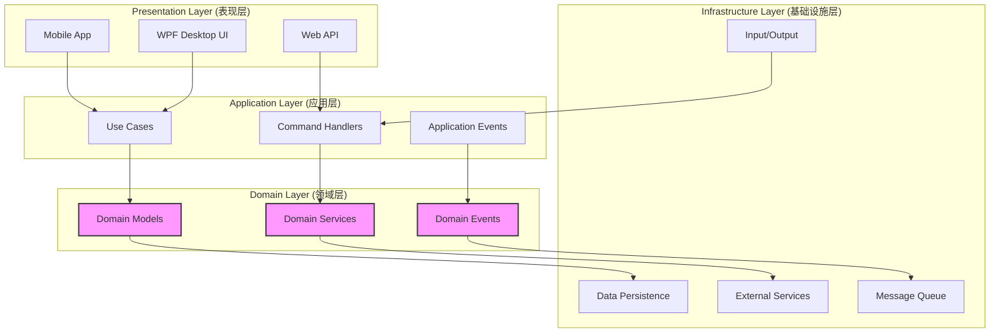

### 1.2 DDD 边界上下文架构

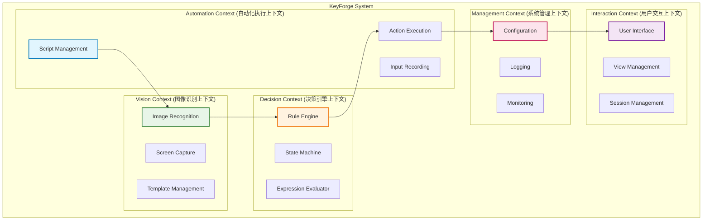

## 2. Sense-Judge-Act 闭环架构

### 2.1 闭环架构图

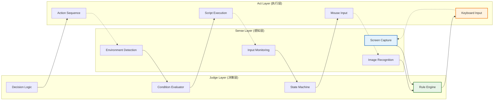

### 2.2 闭环数据流

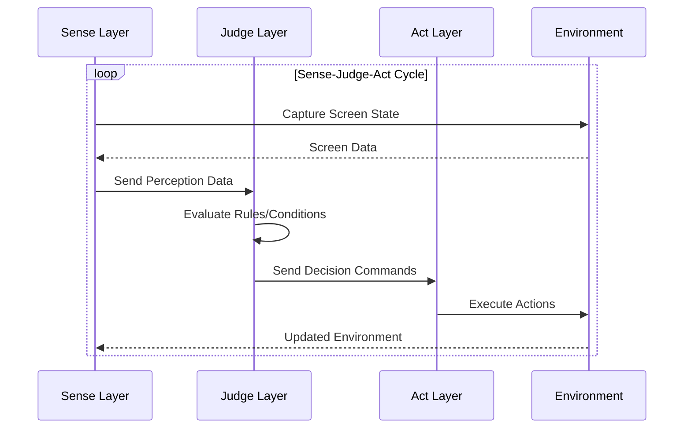

## 3. 组件关系和依赖图

### 3.1 核心组件依赖关系

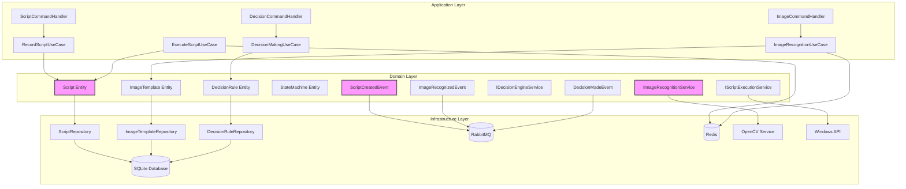

### 3.2 消息流和事件传播

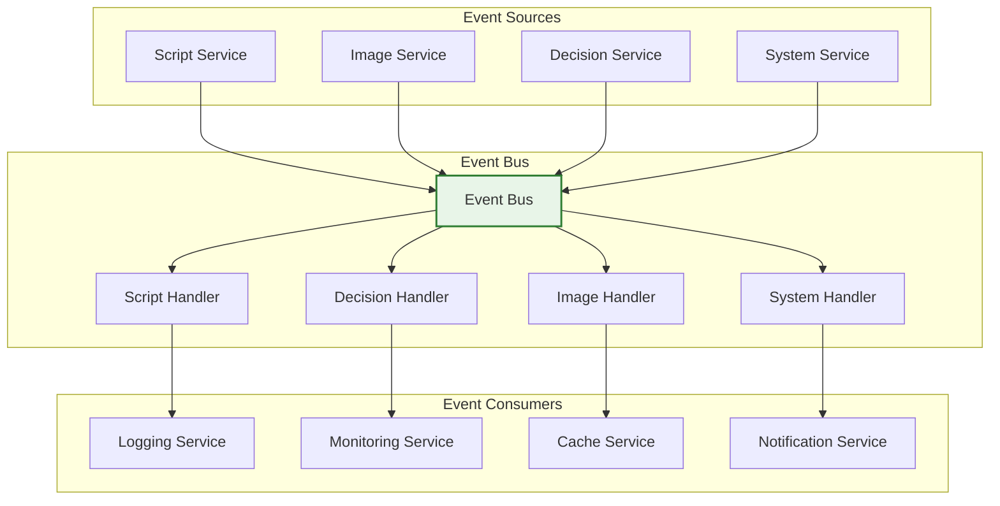

## 4. 数据流设计

### 4.1 脚本执行数据流

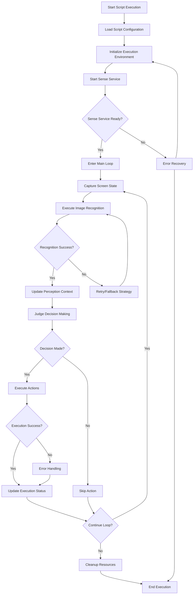

### 4.2 图像识别数据流

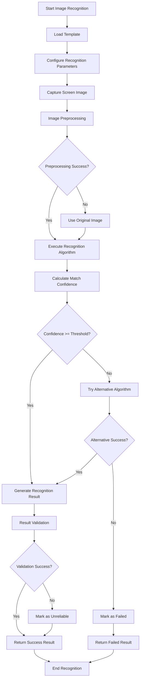

### 4.3 决策引擎数据流

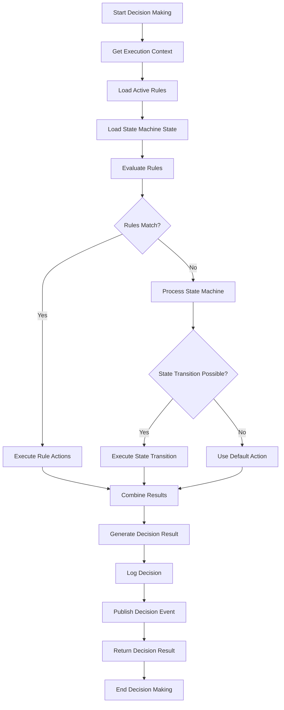

## 5. 部署架构图

### 5.1 容器化部署架构

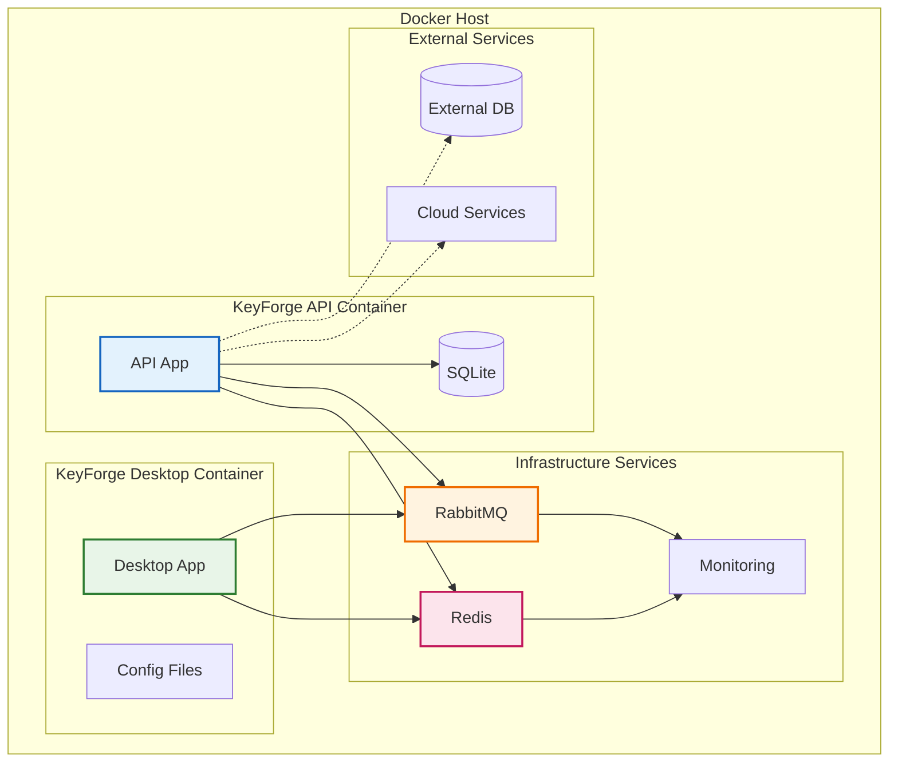

### 5.2 生产环境部署架构

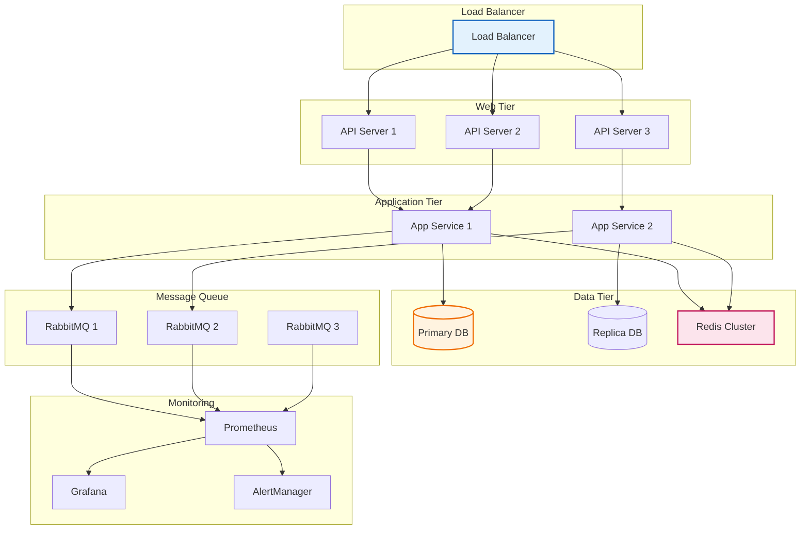

## 6. 安全架构图

### 6.1 安全组件架构

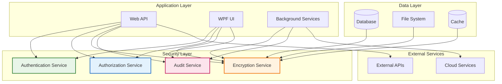

### 6.2 数据加密流程

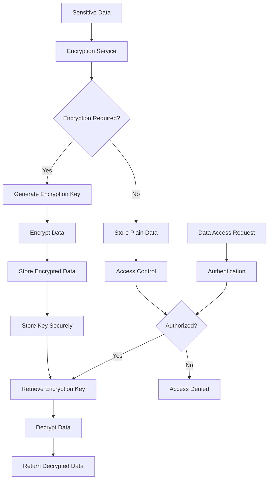

## 7. 监控和日志架构

### 7.1 监控系统架构

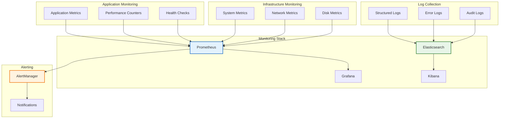

### 7.2 日志处理流程

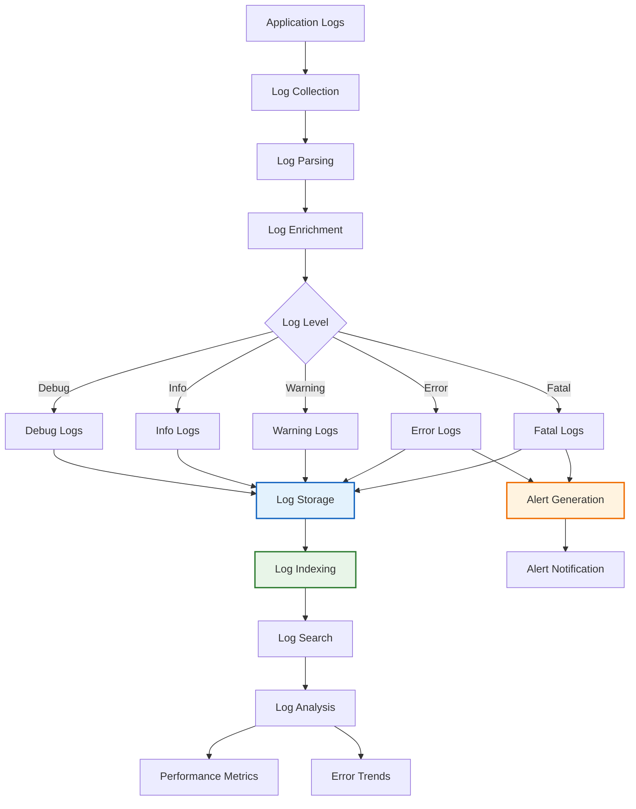

## 8. 扩展和插件架构

### 8.1 插件系统架构

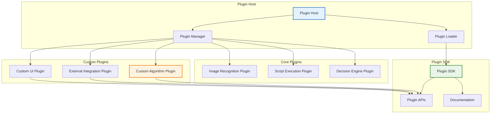

### 8.2 扩展点架构

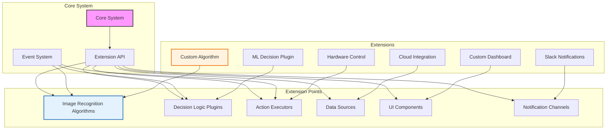

## 9. 性能优化架构

### 9.1 性能优化组件

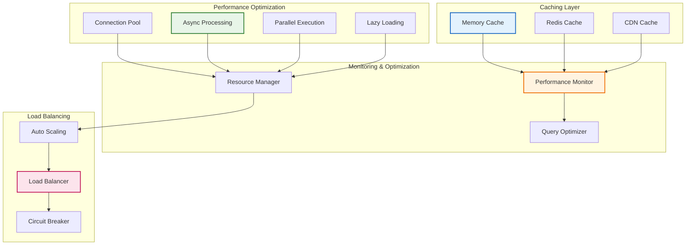

### 9.2 查询优化流程

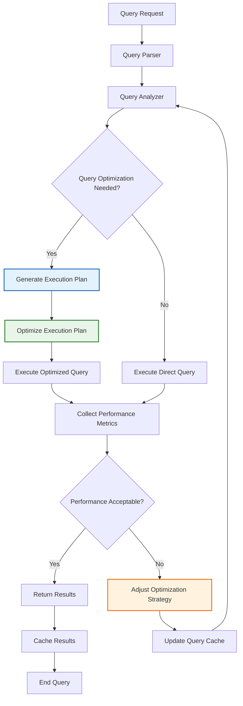

## 10. 故障恢复架构

### 10.1 故障恢复组件

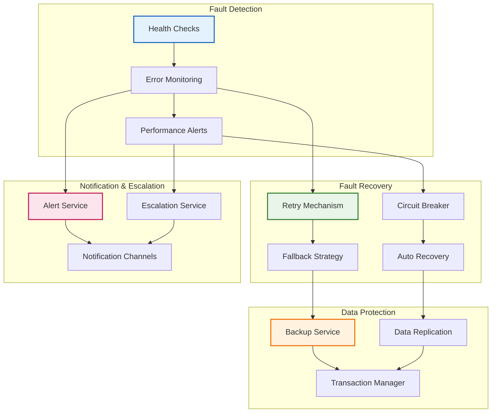

### 10.2 故障恢复流程

```mermaid
flowchart TD
    A[System Running] --> B[Fault Detected]
    B --> C{Fault Type?}
    
    C -->|Hardware Failure| D[Hardware Recovery]
    C -->|Software Failure| E[Software Recovery]
    C -->|Network Failure| F[Network Recovery]
    C -->|Data Corruption| G[Data Recovery]
    
    D --> H[Replace Hardware]
    E --> I[Restart Service]
    F --> J[Switch Network]
    G --> K[Restore Backup]
    
    H --> L[Test Recovery]
    I --> L
    J --> L
    K --> L
    
    L --> M{Recovery Successful?}
    
    M -->|Yes| N[Resume Normal Operations]
    M -->|No| O[Escalate to Manual Recovery]
    
    N --> P[Update System Status]
    O --> Q[Notify Administrators]
    
    P --> R[End Recovery Process]
    Q --> S[Manual Intervention]
    
    style D fill:#e3f2fd,stroke:#1565c0,stroke-width:2px
    style E fill:#e8f5e8,stroke:#2e7d32,stroke-width:2px
    style F fill:#fff3e0,stroke:#ef6c00,stroke-width:2px
    style G fill:#fce4ec,stroke:#c2185b,stroke-width:2px
```

## 11. 总结

KeyForge系统的架构设计充分考虑了系统的复杂性、可扩展性和可维护性。通过这些架构图，我们可以清晰地看到系统的各个组件、它们之间的关系以及数据流。

### 11.1 架构亮点
- **清晰的分层架构**：Clean Architecture确保了系统的可维护性
- **领域驱动设计**：DDD模式使业务逻辑更加清晰
- **Sense-Judge-Act闭环**：智能化的决策和执行流程
- **模块化设计**：高度模块化的组件便于扩展和维护
- **完整的监控体系**：全方位的系统监控和故障恢复

### 11.2 技术优势
- **现代化技术栈**：基于.NET 6.0+的最新技术
- **高性能**：优化的图像识别和执行性能
- **高可用性**：完整的故障恢复和备份机制
- **可扩展性**：支持插件和第三方扩展
- **安全性**：完整的安全架构和数据保护

### 11.3 实施建议
- **分阶段实施**：按照优先级分阶段实施各个模块
- **持续优化**：根据实际使用情况持续优化系统性能
- **监控告警**：建立完整的监控和告警体系
- **文档维护**：保持架构文档的及时更新
- **团队培训**：确保团队理解架构设计理念

这些架构图为KeyForge系统的开发和维护提供了清晰的指导，帮助团队理解系统的整体结构和各个组件之间的关系。