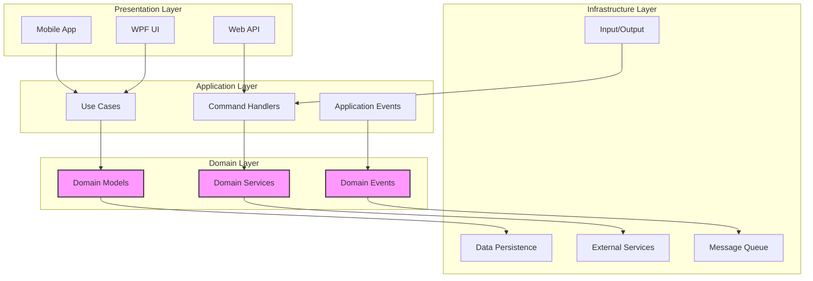
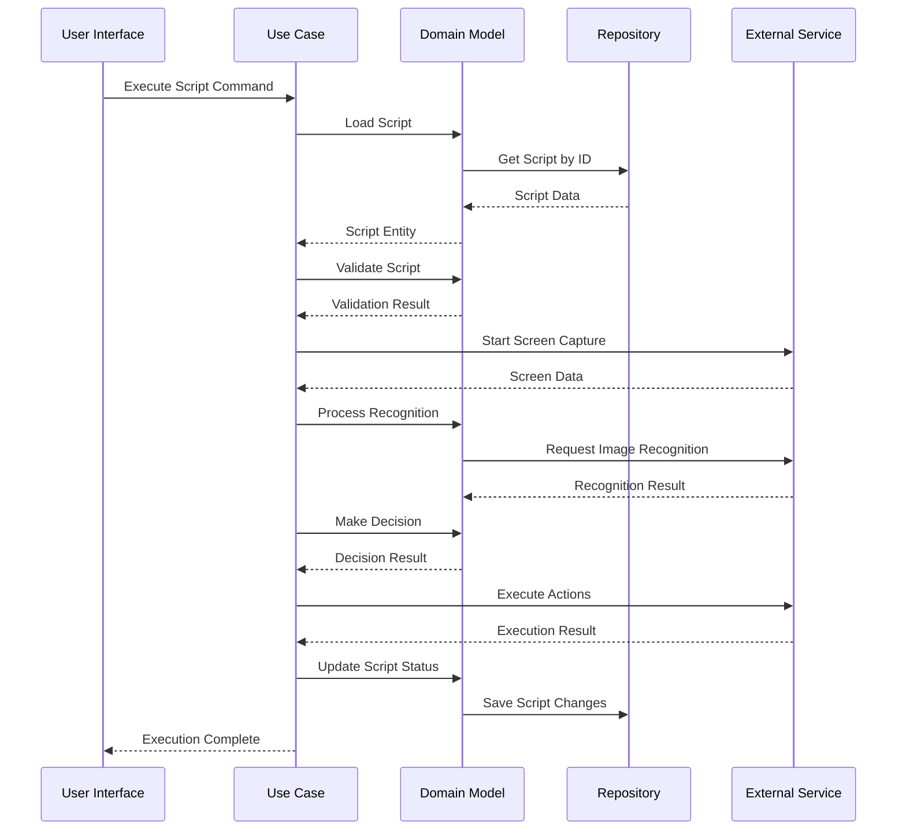

# KeyForge 系统架构设计

## 1. 执行摘要

### 1.1 架构概述
KeyForge采用基于领域驱动设计（DDD）的清洁架构，结合Sense-Judge-Act闭环模式，实现高精度、智能化的游戏自动化按键脚本系统。系统通过模块化设计确保可扩展性、可测试性和可维护性。

### 1.2 架构原则
- **单一职责原则**：每个组件都有明确的职责边界
- **依赖倒置原则**：高层模块不依赖低层模块，都依赖抽象
- **开闭原则**：对扩展开放，对修改关闭
- **接口隔离原则**：使用专门的接口而不是通用接口
- **里氏替换原则**：子类必须能够替换其基类

## 2. 系统架构设计

### 2.1 Clean Architecture 分层结构

```
┌─────────────────────────────────────────────────────────────────┐
│                        表现层 (Presentation)                     │
│  ┌─────────────────┐  ┌─────────────────┐  ┌─────────────────┐   │
│  │   WPF Desktop   │  │   Web API       │  │   Mobile App    │   │
│  │   Interface     │  │   Interface     │  │   Interface     │   │
│  └─────────────────┘  └─────────────────┘  └─────────────────┘   │
└─────────────────────────────────────────────────────────────────┘
                              │
                              ▼
┌─────────────────────────────────────────────────────────────────┐
│                        应用层 (Application)                     │
│  ┌─────────────────┐  ┌─────────────────┐  ┌─────────────────┐   │
│  │   Use Cases     │  │   Application   │  │   Command       │   │
│  │   Services      │  │   Events        │  │   Handlers      │   │
│  └─────────────────┘  └─────────────────┘  └─────────────────┘   │
└─────────────────────────────────────────────────────────────────┘
                              │
                              ▼
┌─────────────────────────────────────────────────────────────────┐
│                        领域层 (Domain)                           │
│  ┌─────────────────┐  ┌─────────────────┐  ┌─────────────────┐   │
│  │   Domain        │  │   Domain        │  │   Domain        │   │
│  │   Models        │  │   Services      │  │   Events        │   │
│  └─────────────────┘  └─────────────────┘  └─────────────────┘   │
└─────────────────────────────────────────────────────────────────┘
                              │
                              ▼
┌─────────────────────────────────────────────────────────────────┐
│                      基础设施层 (Infrastructure)                │
│  ┌─────────────────┐  ┌─────────────────┐  ┌─────────────────┐   │
│  │   Data          │  │   External      │  │   Message       │   │
│  │   Persistence   │  │   Services      │  │   Queue         │   │
│  └─────────────────┘  └─────────────────┘  └─────────────────┘   │
└─────────────────────────────────────────────────────────────────┘
```

### 2.2 DDD 边界上下文设计

#### 2.2.1 自动化执行上下文 (Automation Context)
**职责**：负责按键操作的录制、回放和管理
**核心领域对象**：
- Script（脚本实体）
- ActionSequence（操作序列值对象）
- GameAction（游戏操作抽象基类）
- KeyboardAction（键盘操作值对象）
- MouseAction（鼠标操作值对象）

**领域服务**：
- IScriptExecutor（脚本执行器）
- IInputRecorder（输入录制器）
- IActionValidator（操作验证器）

#### 2.2.2 图像识别上下文 (Vision Context)
**职责**：负责屏幕捕获、图像识别和UI元素检测
**核心领域对象**：
- ImageTemplate（图像模板实体）
- RecognitionResult（识别结果值对象）
- ScreenCapture（屏幕捕获值对象）
- RecognitionParameters（识别参数值对象）

**领域服务**：
- IImageRecognitionService（图像识别服务）
- IScreenCaptureService（屏幕捕获服务）
- ITemplateManager（模板管理器）

#### 2.2.3 决策引擎上下文 (Decision Context)
**职责**：负责业务逻辑判断和决策制定
**核心领域对象**：
- DecisionRule（决策规则实体）
- ConditionExpression（条件表达式值对象）
- StateMachine（状态机实体）
- State（状态值对象）
- Transition（状态转换值对象）

**领域服务**：
- IRuleEngine（规则引擎）
- IStateMachineEngine（状态机引擎）
- IExpressionEvaluator（表达式求值器）

#### 2.2.4 系统管理上下文 (Management Context)
**职责**：负责系统配置、监控和维护
**核心领域对象**：
- SystemConfiguration（系统配置实体）
- LogEntry（日志条目值对象）
- PerformanceMetrics（性能指标值对象）
- UserSettings（用户设置值对象）

**领域服务**：
- IConfigurationService（配置服务）
- ILoggingService（日志服务）
- IMonitoringService（监控服务）

#### 2.2.5 用户交互上下文 (Interaction Context)
**职责**：负责用户界面和交互体验
**核心领域对象**：
- UserSession（用户会话实体）
- ViewConfiguration（视图配置值对象）
- UIState（界面状态值对象）

**领域服务**：
- IUserInterfaceService（用户界面服务）
- IViewManager（视图管理器）

### 2.3 Sense-Judge-Act 闭环架构

```
┌─────────────────────────────────────────────────────────────────┐
│                        Sense (感知层)                           │
│  ┌─────────────────┐  ┌─────────────────┐  ┌─────────────────┐   │
│  │   Screen        │  │   Image         │  │   Input         │   │
│  │   Capture       │  │   Recognition   │  │   Monitoring    │   │
│  └─────────────────┘  └─────────────────┘  └─────────────────┘   │
└─────────────────────────────────────────────────────────────────┘
                              │
                              ▼
┌─────────────────────────────────────────────────────────────────┐
│                        Judge (决策层)                           │
│  ┌─────────────────┐  ┌─────────────────┐  ┌─────────────────┐   │
│  │   Rule          │  │   State         │  │   Condition     │   │
│  │   Engine        │  │   Machine       │  │   Evaluator     │   │
│  └─────────────────┘  └─────────────────┘  └─────────────────┘   │
└─────────────────────────────────────────────────────────────────┘
                              │
                              ▼
┌─────────────────────────────────────────────────────────────────┐
│                        Act (执行层)                             │
│  ┌─────────────────┐  ┌─────────────────┐  ┌─────────────────┐   │
│  │   Keyboard      │  │   Mouse         │  │   Script         │   │
│  │   Input         │  │   Input         │  │   Execution      │   │
│  └─────────────────┘  └─────────────────┘  └─────────────────┘   │
└─────────────────────────────────────────────────────────────────┘
```

#### 2.3.1 Sense (感知层)
**职责**：实时感知游戏状态和环境变化
**组件**：
- ScreenCaptureService：屏幕捕获服务
- ImageRecognitionService：图像识别服务
- InputMonitoringService：输入监控服务

**接口设计**：
```csharp
public interface ISenseService
{
    Task<PerceptionResult> GetPerceptionAsync(PerceptionRequest request);
    event EventHandler<PerceptionEvent> OnPerceptionChanged;
}
```

#### 2.3.2 Judge (决策层)
**职责**：基于感知结果做出智能决策
**组件**：
- RuleEngine：规则引擎
- StateMachineEngine：状态机引擎
- ConditionEvaluator：条件求值器

**接口设计**：
```csharp
public interface IJudgeService
{
    Task<DecisionResult> MakeDecisionAsync(DecisionRequest request);
    event EventHandler<DecisionEvent> OnDecisionMade;
}
```

#### 2.3.3 Act (执行层)
**职责**：执行决策结果和操作指令
**组件**：
- KeyboardInputService：键盘输入服务
- MouseInputService：鼠标输入服务
- ScriptExecutionService：脚本执行服务

**接口设计**：
```csharp
public interface IActService
{
    Task<ExecutionResult> ExecuteActionAsync(ActionRequest request);
    event EventHandler<ExecutionEvent> OnActionExecuted;
}
```

## 3. 组件设计和依赖关系

### 3.1 核心组件架构图



### 3.2 依赖注入设计

```csharp
// 依赖注入容器配置
public class DependencyInjection
{
    public static IServiceCollection AddKeyForgeServices(this IServiceCollection services)
    {
        // 领域层服务
        services.AddScoped<IScriptExecutor, ScriptExecutor>();
        services.AddScoped<IImageRecognitionService, ImageRecognitionService>();
        services.AddScoped<IRuleEngine, RuleEngine>();
        
        // 应用层服务
        services.AddScoped<IRecordScriptUseCase, RecordScriptUseCase>();
        services.AddScoped<IImageTriggerUseCase, ImageTriggerUseCase>();
        services.AddScoped<IDecisionMakingUseCase, DecisionMakingUseCase>();
        
        // 基础设施层服务
        services.AddScoped<IScriptRepository, ScriptRepository>();
        services.AddScoped<IImageTemplateRepository, ImageTemplateRepository>();
        services.AddScoped<IRuleRepository, RuleRepository>();
        
        // Sense-Judge-Act 服务
        services.AddScoped<ISenseService, SenseService>();
        services.AddScoped<IJudgeService, JudgeService>();
        services.AddScoped<IActService, ActService>();
        
        return services;
    }
}
```

### 3.3 消息流和事件设计

#### 3.3.1 事件总线架构

```csharp
public interface IEventBus
{
    Task PublishAsync<TEvent>(TEvent @event) where TEvent : IEvent;
    Task SubscribeAsync<TEvent>(Func<TEvent, Task> handler) where TEvent : IEvent;
    Task UnsubscribeAsync<TEvent>(Func<TEvent, Task> handler) where TEvent : IEvent;
}

public class InMemoryEventBus : IEventBus
{
    private readonly Dictionary<Type, List<Func<IEvent, Task>>> _handlers = new();
    
    public async Task PublishAsync<TEvent>(TEvent @event) where TEvent : IEvent
    {
        var eventType = typeof(TEvent);
        if (_handlers.ContainsKey(eventType))
        {
            foreach (var handler in _handlers[eventType])
            {
                await handler(@event);
            }
        }
    }
    
    public Task SubscribeAsync<TEvent>(Func<TEvent, Task> handler) where TEvent : IEvent
    {
        var eventType = typeof(TEvent);
        if (!_handlers.ContainsKey(eventType))
        {
            _handlers[eventType] = new List<Func<IEvent, Task>>();
        }
        
        _handlers[eventType].Add(e => handler((TEvent)e));
        return Task.CompletedTask;
    }
    
    public Task UnsubscribeAsync<TEvent>(Func<TEvent, Task> handler) where TEvent : IEvent
    {
        var eventType = typeof(TEvent);
        if (_handlers.ContainsKey(eventType))
        {
            _handlers[eventType].RemoveAll(h => h.Target == handler.Target);
        }
        return Task.CompletedTask;
    }
}
```

#### 3.3.2 领域事件定义

```csharp
// 基础领域事件
public abstract class DomainEvent : IEvent
{
    public EventId Id { get; } = EventId.New();
    public Timestamp OccurredOn { get; } = Timestamp.Now;
    public abstract string EventType { get; }
}

// 脚本相关事件
public class ScriptRecordedEvent : DomainEvent
{
    public ScriptId ScriptId { get; }
    public Timestamp RecordedAt { get; }
    
    public ScriptRecordedEvent(ScriptId scriptId)
    {
        ScriptId = scriptId;
        RecordedAt = Timestamp.Now;
    }
    
    public override string EventType => "ScriptRecorded";
}

public class ScriptExecutedEvent : DomainEvent
{
    public ScriptId ScriptId { get; }
    public ExecutionResult Result { get; }
    public Duration ExecutionTime { get; }
    
    public ScriptExecutedEvent(ScriptId scriptId, ExecutionResult result, Duration executionTime)
    {
        ScriptId = scriptId;
        Result = result;
        ExecutionTime = executionTime;
    }
    
    public override string EventType => "ScriptExecuted";
}

// 图像识别事件
public class ImageRecognizedEvent : DomainEvent
{
    public ImageTemplateId TemplateId { get; }
    public RecognitionResult Result { get; }
    public ScreenRegion Region { get; }
    
    public ImageRecognizedEvent(ImageTemplateId templateId, RecognitionResult result, ScreenRegion region)
    {
        TemplateId = templateId;
        Result = result;
        Region = region;
    }
    
    public override string EventType => "ImageRecognized";
}

// 决策事件
public class DecisionMadeEvent : DomainEvent
{
    public DecisionResult Result { get; }
    public ExecutionContext Context { get; }
    
    public DecisionMadeEvent(DecisionResult result, ExecutionContext context)
    {
        Result = result;
        Context = context;
    }
    
    public override string EventType => "DecisionMade";
}
```

## 4. 数据流设计

### 4.1 脚本执行数据流

```
开始
  ↓
[用户启动脚本]
  ↓
[加载脚本配置] → [配置验证失败] → [显示错误]
  ↓
[初始化执行环境]
  ↓
[启动Sense服务] → [初始化失败] → [错误恢复]
  ↓
[进入主循环]
  ↓
┌─────────────────────────────────────┐
│  [捕获屏幕状态]                     │
│  ↓                                  │
│  [执行图像识别] → [识别失败] → [重试] │
│  ↓                                  │
│  [更新感知上下文]                   │
│  ↓                                  │
│  [Judge决策] → [决策失败] → [备用策略]│
│  ↓                                  │
│  [Act执行操作] → [执行失败] → [错误处理]│
│  ↓                                  │
│  [更新执行状态]                     │
│  ↓                                  │
│  [检查继续条件] → [条件不满足] → [退出]│
└─────────────────────────────────────┘
  ↓
[清理资源]
  ↓
结束
```

### 4.2 事件驱动数据流



## 5. 性能和可扩展性设计

### 5.1 性能优化策略

#### 5.1.1 图像识别优化
- **多线程处理**：使用并行处理提高识别速度
- **结果缓存**：缓存识别结果避免重复计算
- **区域识别**：只识别特定区域减少计算量
- **算法选择**：根据场景选择最优识别算法

#### 5.1.2 内存管理
- **对象池**：重用频繁创建的对象
- **资源释放**：及时释放不再使用的资源
- **内存监控**：实时监控内存使用情况

#### 5.1.3 响应时间优化
- **异步处理**：使用async/await避免阻塞
- **批量处理**：批量处理多个操作
- **预加载**：预加载常用资源

### 5.2 可扩展性设计

#### 5.2.1 插件架构
```csharp
public interface IPlugin
{
    string Name { get; }
    string Version { get; }
    Task InitializeAsync(IPluginContext context);
    Task ExecuteAsync(PluginParameters parameters);
    Task ShutdownAsync();
}

public class PluginManager
{
    private readonly List<IPlugin> _plugins = new();
    
    public async Task LoadPluginAsync(string pluginPath)
    {
        var assembly = Assembly.LoadFrom(pluginPath);
        var pluginTypes = assembly.GetTypes()
            .Where(t => typeof(IPlugin).IsAssignableFrom(t))
            .Where(t => !t.IsAbstract);
        
        foreach (var pluginType in pluginTypes)
        {
            var plugin = (IPlugin)Activator.CreateInstance(pluginType);
            await plugin.InitializeAsync(new PluginContext());
            _plugins.Add(plugin);
        }
    }
}
```

#### 5.2.2 配置驱动设计
- **动态配置**：支持运行时配置更新
- **环境配置**：支持不同环境的配置
- **配置验证**：验证配置的有效性

## 6. 安全设计

### 6.1 输入验证
- **参数验证**：验证所有输入参数
- **类型安全**：使用强类型避免类型错误
- **边界检查**：检查数组和集合的边界

### 6.2 错误处理
- **异常处理**：全局异常处理机制
- **错误恢复**：自动错误恢复策略
- **日志记录**：详细错误日志记录

### 6.3 权限控制
- **用户认证**：用户身份验证
- **权限检查**：操作权限验证
- **审计日志**：操作审计记录

## 7. 监控和日志

### 7.1 性能监控
```csharp
public class PerformanceMonitor
{
    private readonly ILogger<PerformanceMonitor> _logger;
    private readonly ConcurrentDictionary<string, PerformanceCounter> _counters = new();
    
    public void IncrementCounter(string name, double value = 1)
    {
        var counter = _counters.GetOrAdd(name, _ => new PerformanceCounter(name));
        counter.Increment(value);
        
        _logger.LogInformation("Performance metric {Name}: {Value}", name, counter.Value);
    }
    
    public void RecordTiming(string name, TimeSpan duration)
    {
        IncrementCounter($"{name}_ms", duration.TotalMilliseconds);
    }
}
```

### 7.2 结构化日志
```csharp
public class StructuredLogger
{
    private readonly ILogger<StructuredLogger> _logger;
    
    public void LogScriptExecution(ScriptId scriptId, ExecutionResult result)
    {
        _logger.LogInformation("Script execution completed: {ScriptId}, Status: {Status}, Duration: {Duration}ms",
            scriptId.Value,
            result.Status,
            result.ExecutionTime.TotalMilliseconds);
    }
    
    public void LogImageRecognition(ImageTemplateId templateId, RecognitionResult result)
    {
        _logger.LogInformation("Image recognition completed: {TemplateId}, Status: {Status}, Confidence: {Confidence}",
            templateId.Value,
            result.Status,
            result.Confidence.Value);
    }
}
```

## 8. 部署架构

### 8.1 开发环境
- **本地开发**：使用Visual Studio或Rider
- **容器化**：Docker容器支持
- **测试环境**：自动化测试环境

### 8.2 生产环境
- **Windows服务**：作为Windows服务运行
- **进程管理**：使用Topshelf或类似框架
- **监控集成**：集成监控系统

### 8.3 配置管理
- **环境配置**：支持多环境配置
- **敏感信息**：加密存储敏感信息
- **配置更新**：支持配置热更新

## 9. 总结

KeyForge系统采用现代化的架构设计，结合了DDD、Clean Architecture和Sense-Judge-Act模式，确保系统的高可用性、可扩展性和可维护性。系统通过模块化设计和事件驱动架构，能够很好地应对复杂的业务需求和技术挑战。

### 9.1 架构亮点
- **清晰的分层架构**：遵循Clean Architecture原则
- **领域驱动设计**：清晰的业务逻辑封装
- **事件驱动**：松耦合的组件通信
- **可扩展性**：支持插件和第三方扩展
- **高性能**：优化的图像识别和执行性能

### 9.2 技术优势
- **现代化技术栈**：基于.NET 6.0+的最新技术
- **类型安全**：使用C#的强类型特性
- **异步编程**：充分利用async/await
- **依赖注入**：松耦合的组件设计
- **测试友好**：支持单元测试和集成测试