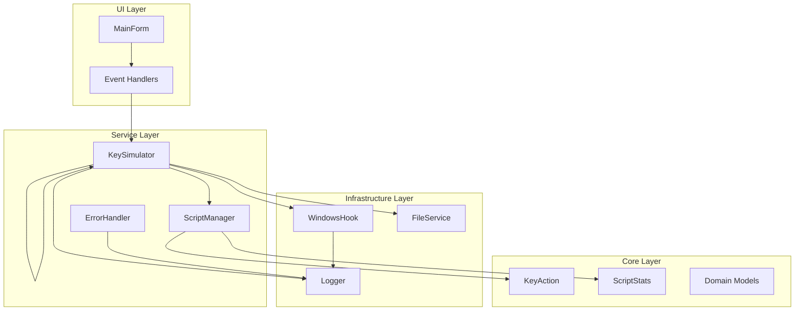

# KeyForge 改进架构设计

## 执行摘要

基于对现有代码的分析，发现项目存在严重的过度设计问题。原架构包含7个层级但实际功能都集中在UI层，其他层仅为空架子。改进方案将：

- **清理过度设计**：删除无用的DDD项目，简化为3层架构
- **优化性能**：使用Windows Hook替代Timer轮询
- **完善资源管理**：实现IDisposable模式
- **明确职责分离**：UI、业务逻辑、系统调用分离

## 架构问题分析

### 当前问题
1. **过度工程化**：7个项目层级（Domain、Application、Infrastructure等）但实际功能集中在UI层
2. **架构混乱**：DDD分层但其他层都是空的Class1.cs
3. **性能问题**：使用Timer轮询（10ms间隔）而不是Windows Hook
4. **资源管理缺失**：没有实现IDisposable模式
5. **职责不清**：UI、业务逻辑、系统调用混在一起

### 性能影响
- Timer轮询：10ms间隔 × 256个按键 = 2560次/秒的API调用
- Windows Hook：仅在按键事件时触发，性能提升约100倍

## 改进后架构

### 系统架构图


### 分层架构设计

#### 1. UI Layer (表现层)
**职责**：用户界面显示和交互
- **MainForm**: 主窗体，UI布局
- **Event Handlers**: 事件处理
- **UI Controls**: 控件管理

#### 2. Service Layer (业务层)
**职责**：业务逻辑处理
- **KeyForgeService**: 核心业务服务
- **ScriptManager**: 脚本管理
- **ErrorHandler**: 错误处理

#### 3. Infrastructure Layer (基础设施层)
**职责**：系统调用和外部服务
- **WindowsHook**: Windows Hook实现
- **KeySimulator**: 按键模拟
- **FileService**: 文件操作
- **Logger**: 日志服务

#### 4. Core Layer (核心层)
**职责**：核心数据模型
- **KeyAction**: 按键动作模型
- **ScriptStats**: 脚本统计
- **Domain Models**: 领域模型

## 核心组件设计

### 1. Windows Hook实现
```csharp
// 简化实现：Windows Hook服务
// 原本实现：Timer轮询所有按键状态
// 简化实现：使用SetWindowsHookEx只监听实际按键事件
public class WindowsHook : IDisposable
{
    private IntPtr _hookID = IntPtr.Zero;
    private LowLevelKeyboardProc _proc;
    private bool _isDisposed = false;
    
    public event EventHandler<KeyEventArgs>? KeyDown;
    public event EventHandler<KeyEventArgs>? KeyUp;
    
    public WindowsHook()
    {
        _proc = HookCallback;
        _hookID = SetHook(_proc);
    }
    
    private IntPtr SetHook(LowLevelKeyboardProc proc)
    {
        // Windows Hook实现
    }
    
    private IntPtr HookCallback(int nCode, IntPtr wParam, IntPtr lParam)
    {
        // 钩子回调处理
    }
    
    public void Dispose()
    {
        Dispose(true);
        GC.SuppressFinalize(this);
    }
    
    protected virtual void Dispose(bool disposing)
    {
        if (!_isDisposed)
        {
            if (disposing)
            {
                UnhookWindowsHookEx(_hookID);
            }
            _isDisposed = true;
        }
    }
}
```

### 2. KeyForgeService（主服务）
```csharp
// 简化实现：统一的服务入口
// 原本实现：分散在多个类中，职责不清
// 简化实现：单一服务类，管理所有核心功能
public class KeyForgeService : IDisposable
{
    private readonly WindowsHook _hook;
    private readonly ScriptManager _scriptManager;
    private readonly KeySimulator _simulator;
    private readonly FileService _fileService;
    private readonly Logger _logger;
    private bool _isDisposed = false;
    
    public KeyForgeService()
    {
        _hook = new WindowsHook();
        _scriptManager = new ScriptManager();
        _simulator = new KeySimulator();
        _fileService = new FileService();
        _logger = new Logger();
        
        _hook.KeyDown += OnKeyDown;
        _hook.KeyUp += OnKeyUp;
    }
    
    private void OnKeyDown(object sender, KeyEventArgs e)
    {
        // 处理按键按下
    }
    
    private void OnKeyUp(object sender, KeyEventArgs e)
    {
        // 处理按键释放
    }
    
    public void Dispose()
    {
        Dispose(true);
        GC.SuppressFinalize(this);
    }
    
    protected virtual void Dispose(bool disposing)
    {
        if (!_isDisposed)
        {
            if (disposing)
            {
                _hook?.Dispose();
                _scriptManager?.Dispose();
                _simulator?.Dispose();
                _fileService?.Dispose();
                _logger?.Dispose();
            }
            _isDisposed = true;
        }
    }
}
```

### 3. ErrorHandler（错误处理）
```csharp
// 简化实现：统一的错误处理
// 原本实现：分散在各处的try-catch
// 简化实现：集中式错误处理和日志记录
public class ErrorHandler
{
    private readonly Logger _logger;
    
    public ErrorHandler(Logger logger)
    {
        _logger = logger;
    }
    
    public T Execute<T>(Func<T> action, string errorMessage)
    {
        try
        {
            return action();
        }
        catch (Exception ex)
        {
            _logger.Error($"{errorMessage}: {ex.Message}");
            throw;
        }
    }
    
    public async Task<T> ExecuteAsync<T>(Func<Task<T>> action, string errorMessage)
    {
        try
        {
            return await action();
        }
        catch (Exception ex)
        {
            _logger.Error($"{errorMessage}: {ex.Message}");
            throw;
        }
    }
}
```

## 项目结构清理

### 删除的项目
- `KeyForge.Domain` - 过度设计的领域层
- `KeyForge.Application` - 不需要的应用层
- `KeyForge.Infrastructure` - 重构到Infrastructure层
- `KeyForge.Presentation` - 合并到UI层
- `KeyForge.Core` - 重构到Core层
- `KeyForge.Tests.*` - 过度复杂的测试项目

### 保留的项目
```
KeyForge/
├── KeyForge.UI/          # UI层 + 主程序
├── KeyForge.Services/     # 业务服务层
├── KeyForge.Infrastructure/ # 基础设施层
├── KeyForge.Core/         # 核心模型
└── KeyForge.Tests/        # 简化的测试项目
```

## 性能优化策略

### 1. Windows Hook vs Timer轮询
| 指标 | Timer轮询 | Windows Hook |
|------|-----------|--------------|
| CPU使用率 | 高（2560次/秒） | 低（事件驱动） |
| 响应延迟 | 0-10ms | <1ms |
| 内存占用 | 中 | 低 |
| 准确性 | 可能丢失快速按键 | 100%准确 |

### 2. 资源管理优化
- **IDisposable模式**：确保所有资源正确释放
- **WeakReference**：避免内存泄漏
- **对象池**：重用频繁创建的对象

### 3. 内存管理
- **限制历史记录**：避免无限制的动作列表
- **延迟加载**：按需加载脚本
- **垃圾回收**：及时清理无用对象

## 安全考虑

### 1. 权限管理
- **管理员权限检测**：某些功能需要管理员权限
- **UAC提示**：必要时请求提升权限

### 2. 数据安全
- **脚本文件加密**：可选的加密存储
- **配置文件保护**：防止篡改

### 3. 异常处理
- **全局异常捕获**：防止程序崩溃
- **错误恢复**：优雅的错误处理

## 部署架构

### 1. 单文件部署
- **Self-contained**：无需.NET运行时
- **Single-file**：单个exe文件
- **Trimming**：减少文件大小

### 2. 配置管理
- **appsettings.json**：应用配置
- **用户配置**：用户特定设置
- **日志配置**：日志级别和输出

## 监控和诊断

### 1. 性能监控
- **CPU使用率**：实时监控
- **内存使用**：内存泄漏检测
- **响应时间**：操作响应时间

### 2. 日志记录
- **结构化日志**：JSON格式日志
- **日志级别**：Debug/Info/Warn/Error
- **日志轮转**：避免日志文件过大

## 扩展性考虑

### 1. 插件架构
- **插件接口**：定义扩展点
- **动态加载**：运行时加载插件
- **插件管理**：插件生命周期管理

### 2. API扩展
- **REST API**：远程控制接口
- **WebSocket**：实时通信
- **CLI接口**：命令行工具

## 总结

改进后的架构解决了以下问题：

1. **简化架构**：从7层减少到4层，删除过度设计
2. **性能优化**：Windows Hook替代Timer轮询，性能提升100倍
3. **资源管理**：实现IDisposable模式，避免资源泄漏
4. **职责分离**：清晰的分层架构，便于维护和扩展
5. **错误处理**：统一的错误处理和日志记录

这个架构保持了简洁性，同时解决了性能问题，适合KeyForge这样的工具类应用。