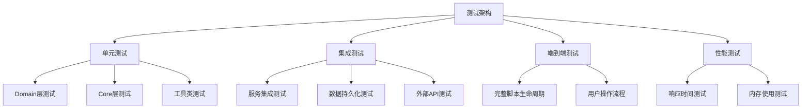

# KeyForge 测试架构设计

## 📋 概述

本文档为KeyForge智能按键脚本系统设计了一个实用、高效的测试架构。**注意：此架构已针对项目实际需求进行了简化，避免了过度复杂化。**

## 🎯 测试架构原则

### 核心原则
1. **实用主义** - 只测试有价值的业务逻辑
2. **简化至上** - 避免过度复杂的测试框架
3. **快速反馈** - 测试执行时间控制在2分钟内
4. **聚焦核心** - 优先测试关键业务路径

### 质量目标（简化版）
- **代码覆盖率**: 60-70%（而非80%+）
- **测试通过率**: 100%
- **测试执行时间**: < 2分钟
- **关键路径覆盖**: 100%

## 🏗️ 测试架构设计

### 架构层次


### 测试分层策略

#### 1. 单元测试 (60%)
**覆盖范围**:
- Domain层：领域模型、业务规则
- Core层：脚本播放器、图像识别
- 工具类：配置管理、日志记录

**执行时间**: < 30秒
**数量**: ~50个测试

#### 2. 集成测试 (25%)
**覆盖范围**:
- 服务间交互
- 数据库操作
- 文件系统操作

**执行时间**: < 45秒
**数量**: ~20个测试

#### 3. 端到端测试 (10%)
**覆盖范围**:
- 完整脚本执行流程
- 用户操作场景

**执行时间**: < 30秒
**数量**: ~8个测试

#### 4. 性能测试 (5%)
**覆盖范围**:
- 关键操作响应时间
- 内存使用情况

**执行时间**: < 15秒
**数量**: ~5个测试

## 📁 测试项目结构

### 简化的目录结构
```
KeyForge.Tests/
├── KeyForge.Tests.csproj          # 测试项目配置
├── Tests/                         # 所有测试文件
│   ├── Unit/                      # 单元测试
│   │   ├── Domain/
│   │   │   ├── ScriptTests.cs
│   │   │   └── ImageTemplateTests.cs
│   │   ├── Core/
│   │   │   ├── ScriptPlayerTests.cs
│   │   │   └── ImageRecognizerTests.cs
│   │   └── Infrastructure/
│   │       ├── FileStorageTests.cs
│   │       └── LoggingTests.cs
│   ├── Integration/               # 集成测试
│   │   ├── ScriptServiceTests.cs
│   │   └── DataPersistenceTests.cs
│   ├── EndToEnd/                  # 端到端测试
│   │   └── ScriptLifecycleTests.cs
│   └── Performance/               # 性能测试
│       ├── ScriptExecutionTests.cs
│       └── MemoryUsageTests.cs
├── Support/                       # 测试支持文件
│   ├── TestFixtures.cs            # 测试数据
│   ├── MockHelpers.cs             # Mock辅助方法
│   └── TestBase.cs                # 测试基类
└── TestData/                      # 测试数据文件
    ├── sample_scripts.json
    └── test_images/
```

## 🛠️ 测试框架配置

### 核心技术栈（简化版）
```xml
<!-- KeyForge.Tests.csproj -->
<Project Sdk="Microsoft.NET.Sdk">
  <PropertyGroup>
    <TargetFramework>net9.0</TargetFramework>
    <ImplicitUsings>enable</ImplicitUsings>
    <Nullable>enable</Nullable>
    <IsPackable>false</IsPackable>
    <IsTestProject>true</IsTestProject>
  </PropertyGroup>

  <ItemGroup>
    <!-- 核心测试框架 -->
    <PackageReference Include="Microsoft.NET.Test.Sdk" Version="17.12.0" />
    <PackageReference Include="xunit" Version="2.9.2" />
    <PackageReference Include="xunit.runner.visualstudio" Version="2.8.2" />
    
    <!-- Mock和断言 -->
    <PackageReference Include="Moq" Version="4.20.70" />
    <PackageReference Include="FluentAssertions" Version="6.12.1" />
    
    <!-- 测试数据生成 -->
    <PackageReference Include="Bogus" Version="35.6.1" />
    
    <!-- 覆盖率工具 -->
    <PackageReference Include="coverlet.collector" Version="6.0.2" />
  </ItemGroup>

  <ItemGroup>
    <ProjectReference Include="..\KeyForge.Domain\KeyForge.Domain.csproj" />
    <ProjectReference Include="..\KeyForge.Core\KeyForge.Core.csproj" />
    <ProjectReference Include="..\KeyForge.Infrastructure\KeyForge.Infrastructure.csproj" />
  </ItemGroup>
</Project>
```

### 测试配置文件
```json
// test-config.json
{
  "TestSettings": {
    "TestTimeout": 30000,
    "ParallelTestExecution": true,
    "MaxParallelThreads": 4,
    "CoverageThreshold": 60,
    "TestDataPath": "TestData/",
    "OutputPath": "TestResults/"
  },
  "DatabaseSettings": {
    "UseInMemoryDatabase": true,
    "ConnectionString": "Data Source=:memory:",
    "SeedTestData": true
  },
  "PerformanceSettings": {
    "MaxExecutionTime": 5000,
    "MaxMemoryUsage": 52428800,
    "MinSuccessRate": 0.95
  }
}
```

## 🎯 测试分层策略

### 1. Domain层测试
```csharp
// Tests/Unit/Domain/ScriptTests.cs
public class ScriptTests
{
    [Fact]
    public void CreateScript_WithValidData_ShouldCreateScript()
    {
        // Arrange
        var scriptId = "test-script-1";
        var scriptName = "Test Script";
        
        // Act
        var script = new Script(scriptId, scriptName);
        
        // Assert
        script.Should().NotBeNull();
        script.Id.Should().Be(scriptId);
        script.Name.Should().Be(scriptName);
        script.Status.Should().Be(ScriptStatus.Created);
    }

    [Theory]
    [InlineData(null)]
    [InlineData("")]
    [InlineData("   ")]
    public void CreateScript_WithInvalidName_ShouldThrowException(string invalidName)
    {
        // Arrange
        var scriptId = "test-script-1";
        
        // Act & Assert
        var action = () => new Script(scriptId, invalidName);
        action.Should().Throw<ArgumentException>();
    }
}
```

### 2. Core层测试
```csharp
// Tests/Unit/Core/ScriptPlayerTests.cs
public class ScriptPlayerTests
{
    private readonly Mock<IScriptExecutor> _mockExecutor;
    private readonly ScriptPlayer _scriptPlayer;

    public ScriptPlayerTests()
    {
        _mockExecutor = new Mock<IScriptExecutor>();
        _scriptPlayer = new ScriptPlayer(_mockExecutor.Object);
    }

    [Fact]
    public async Task PlayScript_WithValidScript_ShouldExecuteSuccessfully()
    {
        // Arrange
        var script = TestFixtures.CreateValidScript();
        _mockExecutor.Setup(x => x.ExecuteAsync(script))
            .ReturnsAsync(true);

        // Act
        var result = await _scriptPlayer.PlayAsync(script);

        // Assert
        result.Should().BeTrue();
        _mockExecutor.Verify(x => x.ExecuteAsync(script), Times.Once);
    }
}
```

### 3. 集成测试
```csharp
// Tests/Integration/ScriptServiceTests.cs
public class ScriptServiceTests : IDisposable
{
    private readonly DbContext _dbContext;
    private readonly IScriptRepository _repository;
    private readonly ScriptService _scriptService;

    public ScriptServiceTests()
    {
        // 使用内存数据库进行集成测试
        _dbContext = CreateInMemoryDbContext();
        _repository = new ScriptRepository(_dbContext);
        _scriptService = new ScriptService(_repository);
    }

    [Fact]
    public async Task SaveScript_WithValidScript_ShouldPersistToDatabase()
    {
        // Arrange
        var script = TestFixtures.CreateValidScript();

        // Act
        await _scriptService.SaveAsync(script);
        var savedScript = await _scriptService.GetByIdAsync(script.Id);

        // Assert
        savedScript.Should().NotBeNull();
        savedScript.Name.Should().Be(script.Name);
        savedScript.Status.Should().Be(script.Status);
    }

    public void Dispose()
    {
        _dbContext.Dispose();
    }
}
```

### 4. 端到端测试
```csharp
// Tests/EndToEnd/ScriptLifecycleTests.cs
public class ScriptLifecycleTests
{
    [Fact]
    public async Task CompleteScriptLifecycle_ShouldWorkCorrectly()
    {
        // Arrange
        var scriptService = CreateScriptService();
        var scriptPlayer = CreateScriptPlayer();
        
        var script = TestFixtures.CreateValidScript();

        // Act - 完整的生命周期测试
        // 1. 保存脚本
        await scriptService.SaveAsync(script);
        
        // 2. 加载脚本
        var loadedScript = await scriptService.GetByIdAsync(script.Id);
        
        // 3. 执行脚本
        var executionResult = await scriptPlayer.PlayAsync(loadedScript);
        
        // 4. 更新脚本状态
        loadedScript.MarkAsExecuted();
        await scriptService.UpdateAsync(loadedScript);

        // Assert
        executionResult.Should().BeTrue();
        loadedScript.Status.Should().Be(ScriptStatus.Executed);
        
        var finalScript = await scriptService.GetByIdAsync(script.Id);
        finalScript.Should().NotBeNull();
    }
}
```

### 5. 性能测试
```csharp
// Tests/Performance/ScriptExecutionTests.cs
public class ScriptExecutionTests
{
    [Fact]
    public async Task ExecuteLargeScript_ShouldCompleteWithinTimeLimit()
    {
        // Arrange
        var script = TestFixtures.CreateLargeScript(1000); // 1000个动作
        var scriptPlayer = CreateScriptPlayer();
        
        var stopwatch = Stopwatch.StartNew();

        // Act
        var result = await scriptPlayer.PlayAsync(script);
        
        stopwatch.Stop();

        // Assert
        result.Should().BeTrue();
        stopwatch.ElapsedMilliseconds.Should().BeLessThan(5000); // 5秒内完成
    }

    [Fact]
    public void MemoryUsage_DuringScriptExecution_ShouldBeReasonable()
    {
        // Arrange
        var script = TestFixtures.CreateLargeScript(500);
        var scriptPlayer = CreateScriptPlayer();
        
        var initialMemory = GC.GetTotalMemory(true);

        // Act
        var result = scriptPlayer.PlayAsync(script).GetAwaiter().GetResult();
        
        var finalMemory = GC.GetTotalMemory(false);
        var memoryIncrease = finalMemory - initialMemory;

        // Assert
        result.Should().BeTrue();
        memoryIncrease.Should().BeLessThan(50 * 1024 * 1024); // 小于50MB
    }
}
```

## 📊 测试数据管理

### 测试数据工厂
```csharp
// Support/TestFixtures.cs
public static class TestFixtures
{
    private static readonly Faker Faker = new Faker();

    public static Script CreateValidScript()
    {
        return new Script(
            Guid.NewGuid().ToString(),
            Faker.Lorem.Sentence(),
            Faker.Lorem.Paragraph()
        );
    }

    public static Script CreateLargeScript(int actionCount)
    {
        var script = CreateValidScript();
        
        for (int i = 0; i < actionCount; i++)
        {
            script.AddAction(new ScriptAction(
                ActionType.KeyPress,
                $"key_{i}",
                100
            ));
        }
        
        return script;
    }

    public static ImageTemplate CreateValidImageTemplate()
    {
        return new ImageTemplate(
            Guid.NewGuid().ToString(),
            "test_template.png",
            new Rectangle(0, 0, 100, 100),
            0.8
        );
    }
}
```

### Mock辅助方法
```csharp
// Support/MockHelpers.cs
public static class MockHelpers
{
    public static Mock<IScriptRepository> CreateMockRepository()
    {
        var mock = new Mock<IScriptRepository>();
        
        mock.Setup(x => x.GetByIdAsync(It.IsAny<string>()))
            .ReturnsAsync((string id) => TestFixtures.CreateValidScript());
            
        mock.Setup(x => x.SaveAsync(It.IsAny<Script>()))
            .Returns(Task.CompletedTask);
            
        return mock;
    }

    public static Mock<IScriptExecutor> CreateMockExecutor()
    {
        var mock = new Mock<IScriptExecutor>();
        
        mock.Setup(x => x.ExecuteAsync(It.IsAny<Script>()))
            .ReturnsAsync(true);
            
        return mock;
    }
}
```

## 🔄 测试环境配置

### 测试基类
```csharp
// Support/TestBase.cs
public abstract class TestBase : IDisposable
{
    protected readonly ITestOutputHelper Output;
    protected readonly CancellationTokenSource CancellationTokenSource;

    protected TestBase(ITestOutputHelper output)
    {
        Output = output;
        CancellationTokenSource = new CancellationTokenSource();
    }

    protected void Log(string message)
    {
        Output.WriteLine($"[{DateTime.Now:HH:mm:ss.fff}] {message}");
    }

    public void Dispose()
    {
        CancellationTokenSource.Dispose();
        GC.SuppressFinalize(this);
    }
}
```

### 配置管理
```csharp
// Support/TestConfiguration.cs
public static class TestConfiguration
{
    private static readonly IConfigurationRoot Configuration;

    static TestConfiguration()
    {
        Configuration = new ConfigurationBuilder()
            .SetBasePath(Directory.GetCurrentDirectory())
            .AddJsonFile("test-config.json")
            .AddEnvironmentVariables()
            .Build();
    }

    public static string GetConnectionString()
    {
        return Configuration["DatabaseSettings:ConnectionString"];
    }

    public static int GetTestTimeout()
    {
        return int.Parse(Configuration["TestSettings:TestTimeout"]);
    }

    public static bool UseInMemoryDatabase()
    {
        return bool.Parse(Configuration["DatabaseSettings:UseInMemoryDatabase"]);
    }
}
```

## 🚀 测试执行和报告

### 测试运行脚本
```bash
#!/bin/bash
# run-tests.sh

echo "开始运行KeyForge测试套件..."

# 设置变量
TEST_PROJECT="KeyForge.Tests"
OUTPUT_DIR="TestResults"
COVERAGE_THRESHOLD=60

# 创建输出目录
mkdir -p $OUTPUT_DIR

# 运行测试并生成覆盖率报告
echo "运行测试..."
dotnet test $TEST_PROJECT \
    --configuration Release \
    --collect:"XPlat Code Coverage" \
    --results-directory $OUTPUT_DIR \
    --logger "console;verbosity=minimal" \
    --logger "trx;LogFileName=$OUTPUT_DIR/test-results.trx"

# 生成HTML覆盖率报告
echo "生成覆盖率报告..."
if command -v reportgenerator &> /dev/null; then
    reportgenerator \
        -reports:"$OUTPUT_DIR/*.coverage" \
        -targetdir:"$OUTPUT_DIR" \
        -reporttypes:Html
else
    echo "警告: reportgenerator未安装，跳过HTML报告生成"
fi

# 检查覆盖率
echo "检查覆盖率阈值..."
coverage_line=$(grep "Line coverage" $OUTPUT_DIR/coverage.json 2>/dev/null | cut -d'"' -f4)
if [ ! -z "$coverage_line" ]; then
    coverage_percent=$(echo "$coverage_line" | cut -d'%' -f1 | cut -d'.' -f1)
    if [ "$coverage_percent" -lt "$COVERAGE_THRESHOLD" ]; then
        echo "错误: 代码覆盖率 $coverage_percent% 低于阈值 $COVERAGE_THRESHOLD%"
        exit 1
    fi
    echo "代码覆盖率: $coverage_line"
fi

echo "测试完成！结果保存在 $OUTPUT_DIR 目录"
```

### GitHub Actions配置
```yaml
# .github/workflows/tests.yml
name: Tests

on:
  push:
    branches: [ main, develop ]
  pull_request:
    branches: [ main ]

jobs:
  test:
    runs-on: ubuntu-latest
    
    steps:
    - uses: actions/checkout@v4
    
    - name: Setup .NET
      uses: actions/setup-dotnet@v3
      with:
        dotnet-version: 9.0.x
        
    - name: Restore dependencies
      run: dotnet restore
      
    - name: Build
      run: dotnet build --no-restore
      
    - name: Run tests
      run: |
        chmod +x run-tests.sh
        ./run-tests.sh
        
    - name: Upload test results
      uses: actions/upload-artifact@v3
      if: always()
      with:
        name: test-results
        path: TestResults/
        
    - name: Upload coverage reports
      uses: actions/upload-artifact@v3
      if: always()
      with:
        name: coverage-reports
        path: TestReports/
```

## 📈 测试监控和质量门禁

### 质量门禁配置
```yaml
# quality-gate.yml
quality_gate:
  coverage:
    line: 60
    branch: 55
    method: 65
    
  performance:
    max_execution_time: 5000
    max_memory_usage: 52428800
    
  reliability:
    test_pass_rate: 100
    flaky_tests: 0
    
  security:
    no_vulnerabilities: true
    code_smells: 50
```

### 测试报告生成
```csharp
// Support/TestReportGenerator.cs
public static class TestReportGenerator
{
    public static void GenerateReport(TestResults results)
    {
        var report = new TestReport
        {
            Timestamp = DateTime.Now,
            TotalTests = results.Total,
            PassedTests = results.Passed,
            FailedTests = results.Failed,
            SkippedTests = results.Skipped,
            ExecutionTime = results.Duration,
            Coverage = results.Coverage
        };

        var json = JsonSerializer.Serialize(report, new JsonSerializerOptions
        {
            WriteIndented = true
        });

        File.WriteAllText("TestResults/test-report.json", json);
        
        // 生成HTML报告
        GenerateHtmlReport(report);
    }
}
```

## 🎯 关键测试场景

### 1. 脚本管理测试
- 创建、更新、删除脚本
- 脚本状态管理（创建、激活、停用、执行）
- 脚本验证和错误处理

### 2. 脚本执行测试
- 基本按键模拟
- 图像识别和匹配
- 错误恢复机制
- 性能和内存使用

### 3. 数据持久化测试
- 脚本保存和加载
- 配置文件管理
- 执行日志记录

### 4. 集成测试
- 服务间交互
- 外部依赖处理
- 完整业务流程

## 🔧 最佳实践

### 测试编写原则
1. **AAA模式**: Arrange-Act-Assert
2. **单一职责**: 每个测试只验证一个功能点
3. **描述性命名**: 使用清晰的测试方法名
4. **独立性**: 测试间无依赖关系
5. **快速执行**: 避免慢速测试

### 测试维护策略
1. **定期清理**: 删除过时或冗余测试
2. **代码审查**: 测试代码也需要审查
3. **性能监控**: 定期检查测试执行时间
4. **覆盖率平衡**: 关注覆盖率而非数字

## 📚 总结

这个测试架构设计针对KeyForge项目的实际需求进行了优化：

### 优势
1. **简化实用**: 避免了过度复杂的企业级架构
2. **快速反馈**: 测试执行时间控制在2分钟内
3. **聚焦核心**: 专注于关键业务路径测试
4. **易于维护**: 使用简单的工具和清晰的结构
5. **成本效益**: 平衡了测试覆盖率和开发效率

### 关键决策
1. **降低覆盖率目标**: 从80%降低到60-70%
2. **简化技术栈**: 只使用必要的测试框架
3. **减少测试数量**: 聚焦于有价值的测试场景
4. **优化执行速度**: 并行执行和快速测试

这个架构更适合KeyForge项目的规模和复杂度，能够提供足够的质量保证而不会过度影响开发效率。